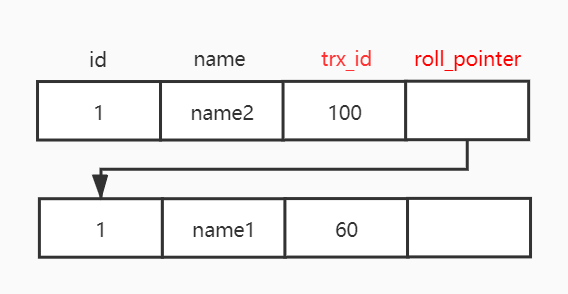

## SQL基础

SQL数据库指的是关系型数据库，数据以表格的形式存储，每一列表示数据的一种属性，每一行代表一个数据实体

NoSQL数据库是指非关系型数据库，存储方式可以是JSON文档、哈希表或其他方式

### MySQL的连表查询

- 内连接（INNER JOIN）：返回两个表中匹配的记录
- 左连接（LEFT JOIN）：返回左表中的所有记录，以及右表中匹配的记录
- 右连接（RIGHT JOIN）：返回右表中的所有记录，以及左表中匹配的记录
- 全连接（FULL JOIN）：返回两个表中的所有记录，匹配的记录合并在一起

### 如何避免重复插入数据

1. 使用唯一索引（UNIQUE INDEX）：在需要唯一性的字段上创建唯一索引，数据库会自动阻止重复插入
   ```sql
    CREATE TABLE users (
         id INT PRIMARY KEY,
         email VARCHAR(255) UNIQUE
    );
   ```
2. 使用INSERT IGNORE语句：如果插入的数据违反唯一性约束，数据库会忽略该插入操作
   ```sql
   INSERT IGNORE INTO users (id, email) VALUES (1, 'example@example.com');
   ```
3. 使用ON DUPLICATE KEY UPDATE语句：如果插入的数据违反唯一性约束，可以更新已有记录
   ```sql
   INSERT INTO users (id, email) ON DUPLICATE KEY UPDATE email = VALUES(email);
   ```

### MySQL的字段类型

- 整数类型：
  - TINYINT（1字节），SMALLINT（2字节），MEDIUMINT（3字节），INT（4字节），BIGINT（8字节）
  - 自增主键一般使用BIGINT UNSIGNED
- 布尔类型：
  - BOOLEAN（通常映射为TINYINT(1)）
- 小数类型：
  - FLOAT（4字节），DOUBLE（8字节），DECIMAL（可变长度，精确存储）
  - 金额使用DECIMAL类型，避免浮点数精度问题
- 字符串类型：
  - CHAR（定长），VARCHAR（变长），TEXT（64KB/大文本），MEDIUMTEXT（16MB），LONGTEXT（4GB）
- 二进制类型：
  - BINARY（定长），VARBINARY（变长），BLOB（64KB/大二进制对象），MEDIUMBLOB（16MB），LONGBLOB（4GB）
- 日期时间类型：
  - DATE（日期YYYY-MM-DD），DATETIME（YYYY-MM-DD HH:MM:SS），TIMESTAMP，TIME（HH:MM:SS），YEAR（YYYY）
  - DATETIME无时区范围大，一般用于业务时间，TIMESTAMP有时区范围有限，一般用于创建/更新时间
- 枚举类型：
  - ENUM（预定义的字符串集合），SET（预定义的字符串集合，可多选）
- JSON类型：用于存储JSON格式的数据
- GIS类型：用于存储地理空间数据，如POINT、LINESTRING、POLYGON等

```sql
CREATE TABLE demo_example (
    -- 1. 整数类型
    id BIGINT UNSIGNED NOT NULL AUTO_INCREMENT PRIMARY KEY,
    age TINYINT UNSIGNED DEFAULT 0,
    score INT DEFAULT 0,
    big_number BIGINT,

    -- 2. 定点数 / 金额
    salary DECIMAL(10, 2) DEFAULT 0.00,

    -- 3. 浮点数
    ratio FLOAT,
    accuracy DOUBLE,

    -- 4. 字符串类型
    username VARCHAR(255) NOT NULL,
    password_hash CHAR(64) NOT NULL, -- 固定长度

    -- 5. 长文本
    description TEXT,
    long_description LONGTEXT,

    -- 6. 二进制类型
    avatar VARBINARY(1024),   -- 小图片二进制
    raw_blob LONGBLOB,        -- 超大文件二进制

    -- 7. ENUM 示例
    status ENUM('active', 'inactive', 'blocked') DEFAULT 'active',

    -- 8. JSON 字段
    profile JSON,
    config JSON,

    -- 9. 日期时间类型
    birth_date DATE,
    login_time TIME,
    signup_at DATETIME DEFAULT CURRENT_TIMESTAMP,
    updated_at TIMESTAMP DEFAULT CURRENT_TIMESTAMP 
                              ON UPDATE CURRENT_TIMESTAMP,

    -- 10. 虚拟列（从 JSON 中提取字段）
    config_version VARCHAR(20) AS (config->>"$.version") STORED,

    -- 11. 布尔字段（MySQL 使用 TINYINT）
    is_deleted TINYINT(1) DEFAULT 0
);
```

### CHAR和VARCHAR的区别

- CHAR是定长字符串类型，VARCHAR是变长字符串类型
- CHAR在存储时会将数据补齐到指定长度，适合存储长度固定的数据，如国家代码、性别等
- VARCHAR根据实际存储的数据长度来分配空间，适合存储长度不固定的数据，如姓名、地址等

```sql
CREATE TABLE example (
    char_column CHAR(10),       -- 定长字符串，长度为10
    varchar_column VARCHAR(50)  -- 变长字符串，最大长度为50（字符数，不是字节数）
);
```

例如：IPv4地址是32位的二进制数，但是通常表示为4个十进制数（0-255）用点分隔开，总长度不超过15个字符，因此使用VARCHAR(15)更合适

### IN和EXISTS的区别

- IN操作符用于检查一个值是否在一个给定的列表或子查询结果中，适合处理较小的数据集
- EXISTS操作符用于检查子查询是否返回至少一行数据，适合处理较大的数据集，尤其是当子查询结果集较大时

```sql
-- 使用IN
SELECT * FROM employees WHERE department_id IN (1, 2, 3);

-- 使用EXISTS
SELECT * FROM employees e WHERE EXISTS (
    SELECT 1 FROM departments d WHERE d.id = e.department_id AND d.location = 'NY'
);
```

### MySQL的基本函数

数值函数：

- ABS(x)：绝对值
- CEIL(x)：向上取整
- FLOOR(x)：向下取整
- ROUND(x, d)：四舍五入到d位小数
- TRUNCATE(x, d)：截断到d位小数
- MOD(x, y)：返回x除以y的余数
- POWER(x, y)：返回x的y次幂
- SQRT(x)：返回x的平方根
- RAND()：返回0到1之间的随机浮点数

字符串函数：

- LENGTH(s)：返回字符串s的长度（字节数）
- CHAR_LENGTH(s)：返回字符串s的长度（字符数）
- CONCAT(s1, s2, ...)：连接多个字符串
- SUBSTRING(s, pos, len)：从字符串s的pos位置开始，截取len长度的子字符串
- UPPER(s)/LOWER(s)：将字符串s转换为大写或小写
- TRIM(s)：去除字符串s两端的空格
- LTRIM(s)/RTRIM(s)：去除字符串s左侧或右侧的空格
- REPLACE(s, from_str, to_str)：将字符串s中的from_str替换为to_str
- LEFT(s, n)/RIGHT(s, n)：返回字符串s的左侧或右侧n个字符
- INSTR(s, substr)：返回子字符串substr在字符串s中首次出现的位置

日期函数：

- NOW()：返回当前的日期和时间
- CURDATE()：返回当前的日期
- CURTIME()：返回当前的时间
- DATE_FORMAT(date, format)：按照指定格式format返回日期date的字符串表示
- DATE_DIFF(date1, date2)：返回date1和date2之间的天数差
- TIME_DIFF(time1, time2)：返回time1和time2之间的时间差
- DATE_ADD(date, INTERVAL expr unit)：在date上加上指定的时间间隔
- DATE_SUB(date, INTERVAL expr unit)：在date上减去指定的时间间隔
- YEAR(date)/MONTH(date)/DAY(date)：返回日期date的年份、月份或天数部分
- UNIX_TIMESTAMP(date)：将日期date转换为Unix时间戳（秒数）

聚合函数（一般用于GROUP BY）：

- COUNT(column)：计算指定列的非NULL值的数量
- SUM(column)：计算指定列的总和
- AVG(column)：计算指定列的平均值
- MIN(column)：返回指定列的最小值
- MAX(column)：返回指定列的最大值
- GROUP_CONCAT(column)：将分组内的值连接成一个字符串

条件/逻辑函数：

- IF(condition, true_value, false_value)：根据条件返回不同的值
- IFNULL(value, default_value)：如果value为NULL，返回default_value，否则返回value
- NULLIF(value1, value2)：如果value1等于value2，返回NULL，否则返回value1
- CASE WHEN condition1 THEN result1 WHEN condition2 THEN result2 ELSE resultN END：多条件判断

JSON函数：

- JSON_EXTRACT(json_doc, path)：从JSON文档中提取指定路径的值，或者使用`->`操作符
- JSON_SET(json_doc, path, value)：设置JSON文档中指定路径的值
- JSON_REMOVE(json_doc, path)：删除JSON文档中指定路径的值
- JSON_ARRAY(value1, value2, ...)：创建一个JSON数组
- JSON_OBJECT(key1, value1, key2, value2, ...)：创建一个JSON对象
- JSON_MERGE_PRESERVE(json1, json2)：合并两个JSON文档

其他函数：

- COALESCE(value1, value2, ...)：返回第一个非NULL的值
- CONVERT(value, type)：将value转换为指定的type类型
- CAST(value AS type)：将value转换为指定的type类型
- UUID()：生成一个唯一的UUID字符串
- MD5(str)：返回字符串str的MD5哈希值
- SHA2(str, hash_length)：返回字符串str的SHA-2哈希值，hash_length可以是224、256、384或512
- PASSWORD(str)：返回字符串str的加密哈希值（用于用户密码存储）

### 外键约束

外键约束（Foreign Key Constraint）用于保证两个表之间的数据一致性，确保数据关系的完整性

外键约束确保一张表中的某个字段的值必须来自于另一张表（或同一张表）中的值，通过外键约束，可以防止插入无效的引用数据，或者删除被引用的数据

外键约束解决的问题：

1. 不能引用不存在的记录
   - 例如用户数据在`user`表，订单在`orders`表，`orders.user_id → users.id`
   - 外键约束确保如果`orders.user_id = 123`，那么`users.id = 123`必须存在，否则插入失败
2. 删除/更新主表数据时行为可控
   - 防止出现删除用户后，订单里出现无用户状态，或是更新用户ID后订单无法关联

外键基本定义：

```sql
CREATE TABLE orders (
    id INT PRIMARY KEY,
    user_id INT,
    amount DECIMAL(10, 2),
    FOREIGN KEY (user_id) REFERENCES users(id) 
        ON DELETE CASCADE 
        ON UPDATE CASCADE
);
```

- `ON DELETE CASCADE`：删除用户之后，自动删除该用户的所有订单
- `ON UPDATE CASCADE`：更新用户ID之后，自动更新订单中的`user_id`

外键的问题：

- 性能开销：外键约束会增加插入、更新、删除操作的开销，因为数据库需要检查和维护外键关系
- 复杂性：外键约束增加了数据库设计的复杂性，可能导致循环依赖等问题
- 迁移困难：在进行数据库迁移或数据导入时，外键约束可能导致操作失败，需要临时禁用外键约束

### SQL查询的执行顺序

```sql
1. FROM          -- 找表
2. ON            -- 连接条件
3. JOIN          -- 表连接
4. WHERE         -- 过滤行（不能用聚合函数）
5. GROUP BY      -- 分组
6. HAVING        -- 过滤组（可以用聚合函数）
7. SELECT        -- 返回字段（定义表达式）
8. DISTINCT      -- 去重
9. ORDER BY      -- 排序
10. LIMIT        -- 限制返回的行
```

- `WHERE`不能使用聚合函数，而`HAVING`可以使用聚合函数，因为`WHERE`是在分组之前执行的，而`HAVING`是在分组之后执行的
  ```sql
  WHERE COUNT(*) > 1   ❌
  HAVING COUNT(*) > 1   ✔️
  ```
- `ORDER BY`中的字段必须在`SELECT`中出现，除非使用列的别名或位置索引，因为`ORDER BY`是在`SELECT`之后执行的
  ```sql
  SELECT name, age FROM users ORDER BY age;   ✔️
  ```
- `WHERE`中不能使用`SELECT`别名，因为`WHERE`是在`SELECT`之前执行的
  ```sql
  SELECT salary * 12 AS annual
  WHERE annual > 30000    ❌
  ```

## 数据库三大范式

- 第一范式：字段不可再分，表中的列只含有原子性(不可再分)的值
- 第二范式：非主键字段依赖主键，满足第一范式且没有部分依赖
- 第三范式：非主键字段没有相互依赖，满足第二范式且没有传递依赖

## 存储引擎

### MySQL存储引擎

存储引擎是用来管理**表数据、索引、事务、锁**等底层实现的模块，即管理表的数据是怎么存储、怎么索引、怎么加锁、怎么处理事务等功能的组件

MySQL支持多种存储引擎，不同的引擎在性能、事务、安全性、并发性能上有区别：

- InnoDB
  - MySQL默认的事务型引擎，实现了四个标准的隔离级别，默认的隔离级别是可重复读，支持外键、表级锁和行级锁
  - 主索引是聚簇索引（数据与主键一起存储），直接在索引中保存数据，避免在磁盘中读取，对性能有很大提升
  - 崩溃恢复能力强（Redo/Undo日志），适用于业务系统、OLTP、高并发数据库

- MyISAM
  - 适用于读取数据为主，或表比较小、可以容忍修复操作的情况
  - 不支持事务，不支持外键，不支持行级锁，查询快但写入慢
  - 适用于读多写少的系统，如数据仓库、OLAP系统，现在用的很少

- Menmory
  - 数据存储在RAM中，读写速度快，但数据不持久化，断电数据丢失
  - 适用于临时表、缓存数据等场景

- ARCHIVE
  - 只支持插入和查询操作，不支持更新和删除，压缩存储，节省空间
  - 适合存储归档日志类数据

存储引擎比较：

1. 事务：InnoDB是事务型的，支持事务、回滚、崩溃修复MyISAM强调性能，查询更快，但是不支持事务
2. 索引：InnoDB使用的聚簇索引，MyISAM使用的是非聚簇索引
3. 并发：MyISAM只支持表级锁，InnoDB还支持行级锁
4. 外键：InnoDB支持外键
5. 备份：InnoDB支持在线热备份
6. 崩溃恢复：MyISAM崩溃后损坏的概率比InnoDB高，恢复也更慢
7. 其它：MyISAM支持压缩表和空间数据索引

### PostgreSQL存储引擎

MySQL的存储引擎是可插拔的，可以根据不同的应用场景选择不同的存储引擎，而PostgreSQL不像MySQL那样有可切换的存储引擎，而是提供一个统一的存储引擎架构

其底层由heap table（默认表访问方法）、WAL系统、MVCC、多种索引方法、TOAST、大buffer pool等模块共同构成PostgreSQL的存储层，所有表都统一采用同一个存储引擎体系，不允许像MySQL那样自由选择不同引擎

- 表访问方法（Table Access Method）
  - PostgreSQL的表底层实现是由Table Access Method控制的，可以理解为PostgreSQL的存储引擎
  - PostgreSQL的默认表访问方法是heap table，支持MVCC和多种索引方法
  - heap table是无序存储的，即数据插入时没有特定的顺序，数据插入时直接追加到表的末尾
- 日志系统WAL（Write Ahead Logging）
  - WAL是事务安全和崩溃恢复的核心
  - 所有对数据的修改操作都会先记录到WAL日志中，然后再应用到数据文件中
  - 如果数据库崩溃，可以通过WAL日志进行恢复，保证数据的一致性和完整性
- 多版本并发控制（MVCC）
  - Tuple 版本直接存储在表中，行更新产生新版本，旧版本标记为死tuple，VACUUM 负责清理
  - 与MySQL InnoDB（undo log+版本链）完全不同
- 共享缓冲区（Shared Buffer Pool）
  - PostgreSQL使用共享缓冲区缓存数据页，减少磁盘I/O，提高性能
  - 与MySQL InnoDB的Buffer Pool类似，但实现细节不同
- 索引访问方法
  - PostgreSQL支持多种索引方法，如B-tree（默认）、Hash、GIN（适合JSON/array）、GiST（适合空间、全文）等
  - 每种索引方法适用于不同的查询场景，提供灵活的索引选择
- 大字段存储机制TOAST
  - 大字段会被拆分成多个小块存储在单独的TOAST表中，主表只存储指向TOAST表的引用
  - 这样可以提高大字段的存取效率，避免影响普通查询性能

### 主要区别

1. 是否支持多存储引擎
   - MySQL：支持多存储引擎（可切换），每个表可选择不同引擎
   - PostgreSQL：只有统一的存储引擎（不可切换）
     - 所有表使用同一个 heap-based 存储系统
     - 不存在“每表切换 storage engine”的概念

2. 存储引擎架构设计理念
   - MySQL：插件式（pluggable），存储引擎可被替换，不同表行为差异大
   - PostgreSQL：一体化（monolithic unified engine），所有表行为一致，功能统一

3. MVCC 实现方式完全不同
   - MySQL（InnoDB）：Undo Log+版本链
     - Multi-version存在undo日志
     - 更新不写新行，而是更新页并在undo中保存旧版本
   - PostgreSQL：多版本直接存储在表文件里
     - 每次UPDATE都插入新tuple
     - 旧tuple变“dead tuple”
     - 依靠VACUUM清理

4. 表数据存储结构不同
   - MySQL InnoDB：聚簇索引（Clustered Index）
     - 表数据按主键顺序存储
     - 主键即数据目录
     - 辅助索引二级查找主键
   - PostgreSQL：Heap Table（无序堆表）
     - 数据无序存储
     - tuple位置由CTID指向
     - 索引不包含数据，只指向物理地址

5. 索引结构的集成方式不同
   - MySQL：索引与存储引擎绑定（插件各自实现）
     - InnoDB B+Tree是主流实现
     - MyISAM、Memory引擎索引格式不同
   - PostgreSQL：索引是统一的独立抽象层
     - B-Tree、GIN、GiST、BRIN等全数据库统一可用
     - Index Access Method与Table AM解耦

6. 锁机制差异
   - MySQL InnoDB：使用Gap Lock/Next-Key Lock
     - 为解决幻读，且实现较为复杂
   - PostgreSQL：几乎不使用间隙锁
     - 使用MVCC避免幻读，并发性更高

7. 大字段存储方式不同
   - MySQL（InnoDB）：页内/页外存储+overflow pages
   - PostgreSQL：TOAST机制
     - 大字段自动拆分压缩存储在独立 TOAST 表

8. WAL/Redo实现差异
   - MySQL：Redo+Undo分开管理
   - PostgreSQL：WAL一体化管理所有变更，更统一
     - WAL与存储层紧密耦合

9. 文件结构管理不同
   - MySQL：每个表的文件结构由引擎决定
     - InnoDB: .ibd
     - MyISAM: .MYD/.MYI
   - PostgreSQL：统一的文件布局
     - 每个表为多个segment文件（按大小分段）
     - 系统 catalog 统一管理

## 索引

### 索引数据结构

索引是把数据重新组织成“有序结构”的额外存储数据结构，来加速数据的检索，索引存储的是键值（索引字段）+指向真实数据行的指针，索引的数据结构决定了索引的性能和适用场景

数据库的数据量通常非常大，而从磁盘读取数据的特点是**顺序读比随机读快很多**，并且读取大量数据时，**磁盘IO会成为瓶颈**，因此索引的数据结构需要满足：

- 高度平衡（树的高度低），以此减少磁盘IO次数
- 节点大（页的大小），来让顺序读取更高效
- 可以按范围查找（例如BETWEEN、>=、<=）

#### 哈希索引

哈希索引是基于哈希算法和哈希表的，哈希算法是通过哈希函数将一个key值计算得到一个哈希值，通过这个哈希值可以在哈希表中找到key值对应的数据行的地址

哈希算法的数据碰撞问题是不同的key值可能会计算得到同一个哈希值，解决数据碰撞有不同的方法，如链地址法

哈希索引没有有序性，无法用于排序和分组，适合做等值比较查询，不适合做范围查询，如果要查找一个范围内的值，哈希算法并不高效

#### 二叉查找树BST

二叉查找树可以进行范围查找，并且由于其排序结构，二叉查找树比直接遍历节省很多时间

普通二叉查找树的问题在于极端情况下会退化为线性链表，如表的主键一般设置为自增，插入连续递增的数据会使二叉查找树向一边倾斜，检索性能下降

#### 红黑树和AVL树

通过调整二叉查找树的结构可以保持其平衡性，这样就可以保持最佳的查找性能

红黑树可以调整树的形态使其保持基本平衡状态，但是不是完全平衡，因此还是会倾斜从而降低查找性能

自平衡二叉查找树AVL会保持绝对平衡的状态，因此查找的性能为O(logn)，同样可以实现范围查找和数据排序
AVL的每个树节点只存储一个数据，读取大量数据时磁盘IO会比较耗时

#### B树

B树的每个节点可以存储多个key，从而减少了磁盘IO，加快检索的速度

每个节点的子树和key值递增排序，可以是M叉(>=2)，有点像M叉搜索树，叶子节点均在同一层


B树的查找性能等于O(hlogn)，h表示树高，n表示每个节点关键字的个数

### B+树

B树和B+树都是多路平衡查找树

**B+树的特点**：

- 每个节点可以有多个子节点，即多个key、多个子指针
- 内部节点只保存key，用于索引，所有数据（key+pointer）都在叶子节点
- 所有叶子节点按顺序形成双向链表，便于范围查询和排序
- 高度非常低（一般2到4层），插入删除会保持平衡

**B+树的结构**：

- m阶B+树的每个内部节点有：
  - key用于索引，不存储数据，指针p指向子节点
  ```csharp
  [key1 | key2 | ... | key(k)]  
  [p0   | p1   | ... | p(k)  ]
  ```

- 每个叶子节点有：
  - 叶子节点存储数据或者数据指针（如InnoDB的主键）
  - 叶子节点之间形成链表，便于范围查询
  ```css
  [key1,value1], [key2,value2], ... next -> 指向下一个叶子节点
  ```

**叶子节点数据示例**：

- 按主键排序存放
- 整行数据直接放在叶子节点
- 支持非常快的基于主键的区间扫描

```css
[ 1 | (name="A", age=20, city="NY") ]
[ 5 | (name="B", age=25, city="LA") ]
[ 9 | (name="C", age=30, city="SF") ]
...
next: pointer to next leaf
```

B+树的叶子节点保存了父节点关键字记录的指针，所有的数据地址只有到了叶子节点才能获取，B+树的叶子节点构成一个有序链表，可以更快的进行全表遍历

  

### 为什么通常选用B+树作为默认索引

1. 磁盘IO次数最少
   - 每个B+ Tree节点就是一个磁盘页，一页可以放很多key
   - 树的高度很低（一般2到4层），即查找只需要2到4次磁盘IO
2. 范围查询快
   - 叶子节点是链表，可以顺序遍历
3. 顺序性强
   - 排序查询（group/order）性能好
4. 插入/删除性能稳定
   - 通过分裂/合并节点保持平衡，性能稳定

### B+树如何保持平衡

- 插入数据
  - 如果节点已满，则将节点分裂为两个节点，并将中间key提升到父节点，保持树的平衡
  - 如果父节点也满，则递归分裂父节点，直到根节点并提升树的高度
- 删除数据
  - 如果节点的key数低于最小值，则尝试从兄弟节点借一个key
  - 如果兄弟节点也不足，则将节点与兄弟节点合并，并将父节点的key下移

### 索引原理

大部分数据库都使用多路平衡查找树BTree或B+Tree作为索引的数据结构，每次查找从根节点开始，根据判断条件定位到平衡树的叶子节点，根据叶子节点直接得到数据行或是数据行的地址，如果是k路平衡查找树，记录总数为N，则查询的时间复杂度为O(log_k^N)

如果没有索引，进行数据查找需要遍历所有记录，而通过索引可以很快地定位到目标记录上，可以理解为索引将无序的数据变成相对有序的

### 索引的不足

- 索引可以加快查询的速度，但是会使得写入的速度降低，因为每次进行数据的增删改时，也要动态地维护索引
- 索引会占用物理存储空间，除了数据表占用的数据空间之外，每个索引还要占用物理空间
- 创建和维护索引要消耗时间，这种时间随着数据量的增加而增加

### 索引分类

1. 普通索引：最基本的索引，没有约束
2. 唯一索引：具有唯一性约束，允许为空，一张表上可以创建多个唯一索引
3. 主键索引：唯一性约束，不允许空值，一张表上只能创建一个主键索引
4. 联合索引：将多个列组合在一起创建索引，可以覆盖多个列，遵循最左前缀原则
5. 前缀索引：对字符串类型的列创建索引时，可以只索引前几个字符，节省空间
6. 全文索引：基于相似度匹配的查询，一般使用全文索引引擎

> 使用InnoDB时，如果没有定义主键会默认生成6个字节的主键作为聚簇索引
> 创建外键时会自动为外键字段创建一个普通索引

### 添加索引

- 添加普通索引：`ALTER TABLE user ADD INDEX index_name ('column')`;
- 添加唯一索引：`ALTER TABLE user ADD INDEX UNIQUE('column')`;
- 添加主键索引：`ALTER TABLE user ADD PRIMARY KEY ('column')`;
- 添加全文索引：`ALTER TABLE user ADD FULLTEXT ('column')`;
- 添加联合索引：`ALTER TABLE user ADD INDEX index_name ('column1','column2','column3')`;
- 添加前缀索引：`ALTER TABLE user ADD INDEX index_name ('column'(length))`;

### 聚簇索引和非聚簇索引

**聚簇索引**

- 数据行在磁盘上按索引顺序存储
- 叶子节点就是表的实际数据（行数据）
- 每个表只能有一个聚簇索引，因为数据行只能有一种排序方式

**非聚簇索引**

- 索引结构独立于表存储
- 叶子节点只存索引列+指向实际行的指针
- 每个表可以有多个非聚簇索引

InnoDB的主键索引是聚簇索引，而其他索引是非聚簇索引，即二级索引

```sql
CREATE TABLE users (
    id INT PRIMARY KEY,
    name VARCHAR(50),
    age INT,
    INDEX idx_age(age)
);
```

- 主键索引：id
  - 聚簇索引，表数据就在主键索引里
  ```bash
  Leaf node: [id=1, name="Alice", age=20] → 实际行数据
  ```
- 二级索引：idx_age
  - 非聚簇索引，不影响整行数据
  ```bash
  Leaf node: [age=20, id=1] → 指向主键id=1的行数据
  ```

回表：当使用二级索引查找数据时，索引叶子节点只存储索引值和主键值，需要再通过主键索引去找整行数据，这个过程叫回表

```sql
SELECT name FROM users WHERE age = 20;
```

1. 通过二级索引idx_age找到age=20对应的主键id=1
2. 回表：通过主键索引找到id=1对应的整行数据，获取name="Alice"


### 索引使用原则

**什么时候不添加索引**

- 频繁更新的字段不添加索引，因为添加索引要进行维护和更新
- where中使用不到的字段不添加索引
- 数据库表的记录太少不需要添加索引
- 经常进行增删改操作的表不添加索引
- 包含较多重复数据的字段不适合添加索引，即唯一性太差

**什么时候添加索引**

- 对于中到大型的表，适合使用索引（特大型使用分区技术）
- 频繁地作为查询条件的字段应该建立索引
- 主键自动建立索引
- 查询中与其他表关联的字段要建立外键索引
- 查询中排序的字段通过索引访问可以提高排序效率
- 查询中统计或分组字段

### 什么字段适合当主键

- 唯一且不变的字段，避免使用可能变化的字段
- 简短的字段，避免使用过长的字段作为主键，影响索引性能
- 数值类型优于字符串类型，数值类型索引效率更高
- 自增字段通常是较好的选择，避免随机分布导致的页分裂

### 索引优化

**基数**：单个列中唯一键（distinct_key）的数量
**返回数据的比例**：查询的记录数占总记录数的比例

1. 如果MySQL估计出使用索引比全表扫描还要慢，就不会使用索引（已添加索引但是不使用），返回数据的比例在30%以内优化器会使用索引
2. 使用前导模糊查询不会命中索引，如`SELECT % FROM user WHERE name LIKE '%s%'`，应该使用非前导模糊查询`'s%'`
3. 数据类型出现隐式转换的时候不会命中索引，如`SELECT * FROM user WHERE name=1`，应该使用对应的数据类型`1`
4. 在使用复合索引的时候，如果查询条件不包含索引最左部分，即不满足最左前缀原则的时候不会命中索引
   - 创建复合索引`ALTER TABLE user ADD INDEX index_name (name,age,status)`
   - 使用查询`SELECT * FROM user WHERE status=1 AND name="s"`可以命中索引，因为复合索引是按照从左到右的顺序进行匹配的，每次查询会先比较最左边的列
   - 一定要包含最左列`name`,如`name,status`也会使用索引，但是`age,status`不会使用索引
5. 使用`UNION, IN, OR`都可以命中索引，如`SELECT * FROM user WHERE status IN (1,2)`
6. 使用`OR`分开的条件，如果`OR`前的条件中列有索引，后面的列中没有索引，那最终不会使用索引
   - 如`SELECT * FROM user WHERE id=2 OR amout=23`，如果`amout`没有索引就会进行全表扫描，前面`id`的索引也就不会使用
7. 查询中有否定条件不能命中索引，如`!=, <>, NOT IN, NOT EXISTS, NOT LIKE`等
   - 如`SELECT * FROM user WHERE status!=1 AND status!=3`，如果可以将否定条件改为`IN`并且返回数据的比例在30%以内，则可以优化为命中索引
8. 范围条件查询可以命中索引，如`<, <=, >, >=, BETWEEN`，如`SELECT * FROM user WHERE status<5`
   - 但是同时使用两个范围查询只会使用其中一个索引，如`SELECT * FROM user WHERE status<5 AND age<24`只会使用`status`的索引
   - 如果范围查询和等值查询同时存在，优先使用等值查询的索引，如`SELECT * FROM user WHERE status<5 AND age=24`优先使用`age`的索引
9. 执行计算的时候不会使用索引，如`SELECT * FROM user WHERE age+1<24`，应该将计算逻辑放到业务层中处理，提高索引命中
10. 建立索引的列中不要有`NULL`，复合索引中不要有全为`NULL`的值，`IS NULL`可以命中索引，但`IS NOT NULL`不能命中索引，而且使用`NULL`是不好的设计，应该避免
11. 尽量使用覆盖索引，避免回表查询，因此尽量避免`SELECT *`

> 索引覆盖：指通过索引就可以得到所需要的数据，不必再去数据表中读取（回表），减少数据访问的时间
>
> 以上面聚簇索引的图为例，`SELECT id FROM user WHERE name='Elison'`就是索引覆盖
>
> 回表：基于聚簇索引的查询要先查询辅助索引，再查询主键索引，才能找到对应的数据（MyISAM的主键索引也是回表）

**最左前缀原则**：

- **联合索引**：在两个及以上的列上建立的索引
- MySQL建立复合索引（联合索引）具有最左前缀原则，MySQL会按照从左到右的顺序使用索引的字段，一次查询只使用索引的一部分，并且是最左侧的部分
- 如果有一个3列的联合索引(col1,col2,col3)，则已经对(col1)，(col1,col2)，(col1,col2,col3)进行查找也会使用索引，但是（col2,col3）不行，即一次查询只能用联合索引中最左的部分

### 查询优化

> MySQL的优化包括索引的优化，此外还有数据库表、字段的设计，存储引擎的使用，MySQL集群、负载均衡、读写分离，以及SQL语句的优化

1. 使用explain分析查询语句，其中select_type表示查询的类型，key表示使用的索引，rows表示扫描的行数
2. 优化数据访问：
   - 减少请求的数据行，只返回有必要的行和列，避免`SELECT *`，同时缓存经常查询的数据
   - 减少查询扫描的行数，最有效的方式就是覆盖索引
3. 重构查询方式：
   - 切分大查询，大查询会锁住很多数据，阻塞其他查询
   - 分解大的连接查询，将大连接查询分解成对每一个表的单表查询，然后进行关联，可以减少锁竞争，提高查询效率

## 事务

事务就是一组原子性的数据库操作，这些操作构成一个逻辑上的整体，事务中的所有操作要么全部执行成功，要么全部执行失败，从而保证数据库的一致性和完整性

### 事务的四个特性ACID

1. **原子性**(Atomicity)：一个事务的操作要么全部完成，要么全部取消，如果事务崩溃，状态回滚到事务之前(事务回滚)，不能只执行其中的一部分操作
2. **一致性**(Consistency)：一致性是指数据库系统总是从一个一致性的状态迁移到另一个一致性的状态，满足预定约束的状态就是一致性的状态(事务回滚保持约束不被破坏)
3. **隔离性**(Isolation)：一个事务内的操作以及使用的数据对于其他事务是不可见的
4. **持久性**(Durability)：事务一旦提交，其所作的修改就会永久保存在数据库中

- 保证事务的原子性：当事务中的操作全部完成才将结果统一提交到数据库，如果其中一个操作失败，就撤销前面的操作，进行回滚
- 在并发环境下，事务的隔离性很难保证，因此会出现并发一致性问题，其原因是破坏了事务的隔离性，数据库管理系统提供了事务隔离级别来处理并发一致性问题
- 保证事务的隔离性：当两个事务操作同一个数据，需要将数据加上互斥锁，获得锁的事务才能操作数据，当事务提交或失败才会释放锁
- 保证事务的持久性：事务的每一个操作都会保存在事务日志中，就算数据库崩溃后恢复，数据库会通过解析事务日志，分析哪些事务需要写盘，哪些事务需要回滚
- 事务的一致性是上面几个阶段保证的

### 并发事务存在的问题

- 丢失修改（lost update）
  - 两个事务同时读取同一数据并进行修改，最后一个提交的事务覆盖了前一个事务的修改，导致前一个事务的修改丢失
- 脏读（dirty reads）
  - 一个事务读取了另一个事务未提交的数据，如果另一个事务回滚，则第一个事务读取的数据就是无效的
- 不可重复读（non-repeatable reads）
  - 一个事务在两次读取同一数据时，另一个事务修改了该数据并提交，导致第一次和第二次读取的数据不一致
- 幻读（phantom reads）
  - 一个事务在读取某个范围的数据时，另一个事务插入了新的数据，导致第一个事务再次读取该范围的数据时，出现了“幻影”数据

### 事务的隔离级别

1. **串行化**(Serializable)

   - 最高隔离级别，强制事务串行执行，可以避免幻读，但是可能会导致大量的超时和锁争用的问题
  
2. **可重复读**(Repeatable read)(MySQL默认)

   - 保证同一个事务在多次读取同一数据的结果不变
   - 存在**幻读**（Phantom Read）的问题，即当一个事务在读取某个范围的记录时，另一个事务又在该范围插入了新的记录，之前的事务再次读取该范围的记录会产生幻读
   - InnoDB通过多版本并发控制（MVCC）解决了幻读的问题
   - 读取同一数据的结果不变，因为事务期间加了读锁直到事务结束，期间数据无法被修改，解决了不可重复度

3. **读取已提交**(Read committed)

   - 一个事务的修改在提交之前对其他事务不可见
   - 一个事务从开始到提交之前，所做的任何修改对其他事务是不可见的，从而避免脏读
   - 如果一个事务修改已存在的数据并提交成功，则另一个事务读取到的是修改后的值（**不可重复读**）

4. **读取未提交**(Read uncommitted)

   - 一个事务的修改在提交之前对其他事务可见
   - 最低的隔离级别，当第一个事务修改已存在的数据并且还未提交，另一个事务就可以读取到已修改的数据
   - 但此时如果第一个事务执行失败进行回滚，第二个事务的读取到的值就无意义，这就是**脏读**(dirty read)

> - 读取未提交存在脏读、不可重复读、幻读等问题，读取已提交解决了脏读，可重复度进解决了脏读和不可重复读(MVCC)，串行化全部解决，但是性能最低
>
> - 对数据加上写锁，直到事务结束才释放，可以解决脏读，因为加写锁后不可读
> - 实现隔离级别的方法有：
>   - 加读写锁
>   - 一致性快照读，即MVCC

### 隔离级别的实例


关于事务B在不同隔离级别下读取的rs1和rs2：

- 读取未提交：事务B两次读取的值都是20
- 读取已提交：事务B第一次读取的值是10，第二次读取的值是20
- 可重复读：事务B两次读取的都是10

## 锁

锁是数据库用来控制并发访问的一种机制，用于保证事务的隔离性和数据一致性，它的主要作用是防止多个事务同时操作同一数据而导致的脏读、不可重复读、幻读等问题：

- 保证数据一致性：防止多个事务同时修改同一个数据产生冲突
- 实现事务隔离：不同事务之间按照一定规则访问数据，避免相互干扰
- 控制并发：允许安全的并发操作，同时减少不必要的等待

### 锁粒度

- MySQL中的锁有两种粒度：**行级锁**和**表级锁**
- MyISAM使用表级锁，InnoDB默认使用行级锁，支持表级锁

加锁需要消耗资源(获取锁、释放锁、检查锁状态)，锁粒度越小发生锁争用的概率越小，并发程度越高，但是系统开销越大

### 锁类型

**读写锁**

- 排他锁(Exclusive)：X锁，写锁
- 共享锁(Shared)：S锁，读锁

> 一个事务对数据加了写锁，可以对数据进行读取和更新，期间其他事务不能对该数据加锁
> 一个事务对数据加了读锁，可以对数据进行读取但不能更新，期间其他事务可以对该数据加读锁，但不能加写锁

**意向锁**

- 意向共享锁(IS)：表示事务准备给数据行加共享锁，事务在一个数据行加共享锁之前必须取得该表的意向共享锁
- 意向排他锁(IX)：表示事务准备给数据行加排他锁，事务在一个数据行加排他锁之前必须获得该表的意向排他锁

> 在行锁和表锁共存的情况下(InnoDB)，如果一个事务想对一个表加写锁，需要检查每一行是否有其它事务加锁，这非常耗时
> 在有意向锁的情况，一个事务在申请表的写锁之前，数据库会自动为其申请一个**表的意向互斥锁**，此时另一个事务申请表的写锁会失败，因为表上有了意向互斥锁，申请会被阻塞;
> 意向锁是表锁，可以根据意向锁判断表中有没有数据行被锁定;
> 如果一个事务需要申请一个资源的共享锁定，数据库会自动给该事务申请一个意向共享锁IS如果一个事务需要申请一个资源的互斥锁定，数据库会自动给该事务申请一个意向互斥锁IX

### 三级封锁协议

- 一级封锁协议：事务在修改数据时必须加写锁，直到事务结束才释放可以防止**丢失修改**，但是只读取数据不会加锁，有不可重复度和脏读问题
- 二级封锁协议：在一级的基础上，要求读取数据时必须加上读锁，读完释放锁可以防止**脏读**

> 一级封锁协议下，读数据不用加锁，因此加写锁不影响另一个事务读取，而二级封锁协议要求读数据必须加读锁，而因为写锁存在就无法加读锁读取

- 三级封锁协议：在二级的基础上，要求读取数据必须加读锁，直到事务结束才能释放可以解决**不可重复读**

> 二级封锁协议下会有不可重复读的问题，即加读锁读完后释放，然后数据被修改，再读就会改变，而三级封锁协议的读锁持续到事务结束，期间由于加了读锁数据不能被修改(还是修改了不可见？)  

### 两段锁协议

加锁和解锁分两段进行

MySQL的InnoDB采用两段锁协议，会根据隔离级别自动加锁，所有锁在同一时刻释放，称为隐式锁定

### 死锁

两个或多个事务在同一个资源上相互占用，并且请求锁定对方占用的资源，从而导致永久等待，死锁发生之后只有部分或者完全回滚其中一个事务，才能打破死锁，然后重新执行回滚的事务

解决方法：

1. 死锁检测：当检测到死锁的循环依赖，就返回一个错误
2. 死锁超时：当锁请求的等待时间超过设定值就放弃请求
3. 将持有最少行级排他锁的事务进行回滚（InnoDB的方式）

### 悲观锁和乐观锁

- **悲观锁PCC**
  - 一种并发控制方法，在事务对数据进行操作之前，先尝试为数据加锁，加锁成功后就可以进行操作，完成事务释放锁
- **乐观锁OCC**
  - 一种并发控制方法，它假设多用户并发的事务在处理时不会相互影响，各事务可以在不加锁的情况下处理各自的数据  
  - 在提交更新之前，每个事务会先检查在该事务后有没有其他事务修改了对应的数据，如果有就回滚放弃提交，一般实现乐观锁的方式是记录数据版本
  - 乐观锁没有真正加锁，避免了锁的竞争，效率高，但是更新失败的概率会比悲观锁高

### InnoDB锁的算法

1. **行锁Record lock**：单个行记录上的锁
2. **间隙锁Gap lock**：锁定一个范围不包括记录本身
3. **Next-key lock**：行锁+间隙锁，锁定一个范围，包含记录本身

### InnoDB如何解决幻读

- **幻读**：在InnoDB的可重复度隔离级别下，使用当前读，一个事务前后两次查询同一个范围，后一次查询会看到期间新插入的行
- **幻读的影响**：会导致一个事务中先产生的锁，无法锁住后加入的行，会产生数据一致性问题
- **产生幻读的原因**：行锁只能锁住一行，不能避免新插入的记录
- **解决幻读**：在两行记录之间加上间隙锁，阻止新纪录的插入，与间隙锁产生冲突的只有“往这个间隙插入记录”这个操作
- 同时添加间隙锁与行锁称为**Next-key lock**，注意间隙锁只有在InnoDB的可重复度隔离级别下生效
- InnoDB在可重复度的隔离级别下，使用MVCC+Next-key lock解决幻读

## 多版本并发控制MVCC

### 基本思想

- MVCC是InnoDB实现隔离级别的一种方式，用于实现读取已提交和可重复读两种隔离级别
- 对于读取未提交，直接读取最新版本的数据
- 对于串行化，使用加锁的方式访问记录
- 大多数事务型存储引擎实现都不是简单的行锁，基于并发性的考虑，一般会同时实现多版本并发控制（MVCC）处理读写冲突
- MVCC是乐观锁的一种实现，是通过保存数据在某一个时间点的快照实现的，写操作更新最新的版本，读操作读取旧版本
- MVCC中事务的修改操作（增删改）会为行记录新增一个版本快照，并把当前事务id写入trx_id

### 版本号

- 系统版本号sys_id：每开始一个新的事务，系统版本号递增
- 在InnoDB中，聚簇索引记录中包含两个隐藏列：
  - trx_id：对记录进行改动时，trx_id会记录当前事务id，也就是当前系统版本号
  - roll_pointer：对记录进行改动，会把旧版本记录写入undo日志，roll_pointer指向修改之前的版本
- 对同一条记录的更新，会把旧值放到一条undo日志中，作为一个旧版本的记录，多次更新之后这些版本会被roll_pointer连接成一个链表，称之为版本链

### 版本读取

- 对于读取已提交和可重复读，就会用到版本链，关键在于怎么判断版本链中哪个版本对当前事务可见
- 使用ReadView（快照），ReadView是一个包含当前已经开始但是没有提交的事务的列表，记录每个事务的事务id，记最小事务id为min_id，最大事务id为max_id
- 版本比较规则：
  1. 如果记录版本的trx_id小于min_id，说明这个记录版本是已经被提交过的，对其他事务可见
  2. 如果记录版本的trx_id大于max_id，说明这个记录版本是ReadView生成之后发生的，不能访问
  3. 如果记录版本的trx_id在min_id和max_id之间，判断trx_id是否在ReadView中：
     - 如果在ReadView中，说明事务还未提交，该记录版本不可访问
     - 如果不在ReadView中，说明该事务已经提交，该记录版本可以访问
- 如果当前记录版本不可读，就根据回滚指针roll_pointer找到旧版本的记录再进行判断
- 对于读取已提交，每次查询都会生成一个新的ReadView
- 对于可重复度，一个事务在第一次SELECT的时候生成一个ReadView，之后的查询复用这个ReadView

### 快照读和当前读

- 快照读：MVCC中的SELECT操作是读取快照中的数据，不需要进行加锁
- 当前读：MVCC中修改数据的操作（增删改）需要进行加锁操作，从而读取最新的数据

MVCC只是避免了SELECT的加锁操作，在SELECT的时候也可以强制加共享锁或互斥锁：

```sql
SELECT FROM user WHERE id<5 lock in share mode;
SELECT FROM user WHERE id<5 for update;
```

## MVCC实例解析

- 假设当前有一个事务id为100的事务A，修改一个记录的name字段为name2，产生一个版本快照，因此有这样的版本链：



- 假设事务A还没有提交，此时事务B进行SELECT，事务id为120，查询id为1的记录（记为第一次查询），此时生成ReadView为`[100,120]`，根据版本读取规则，先找到trx_id为100的记录版本，发现不可读，于是通过回滚指针找到trx_id为60的记录，读取成功
- 当事务A提交之后，事务B再次进行SELECT查询id为1的记录（第二次查询），在读取已提交和可重复读两种隔离级别下有不同的情况：
  - 如果是读取已提交，则会创建一个新的ReadView为`[120]`，此时读取trx_id为100的记录成功，也就是读取到了在事务期间提交的数据
  - 如果是可重复读，则会使用第一次查询时的ReadView为`[100,120]`，此时读取的是trx_id为60的记录，从而实现了可重复度
