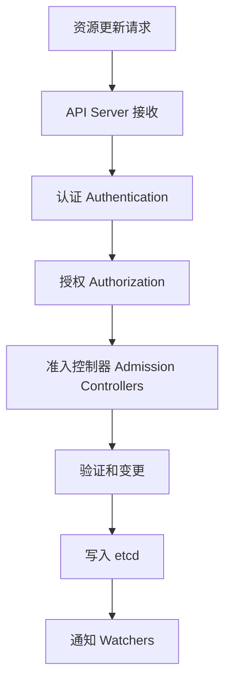
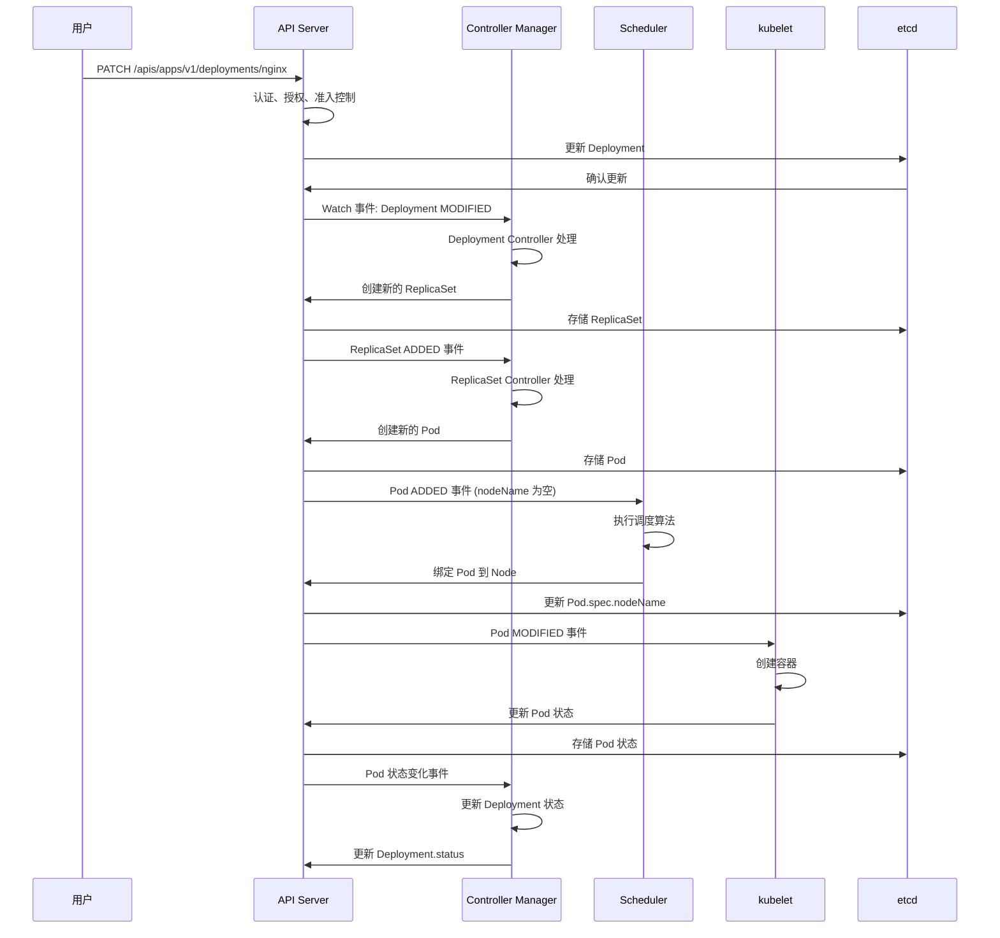
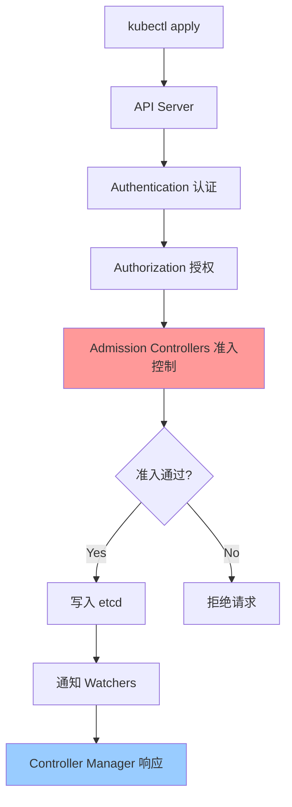
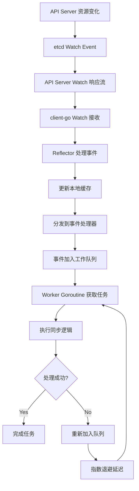
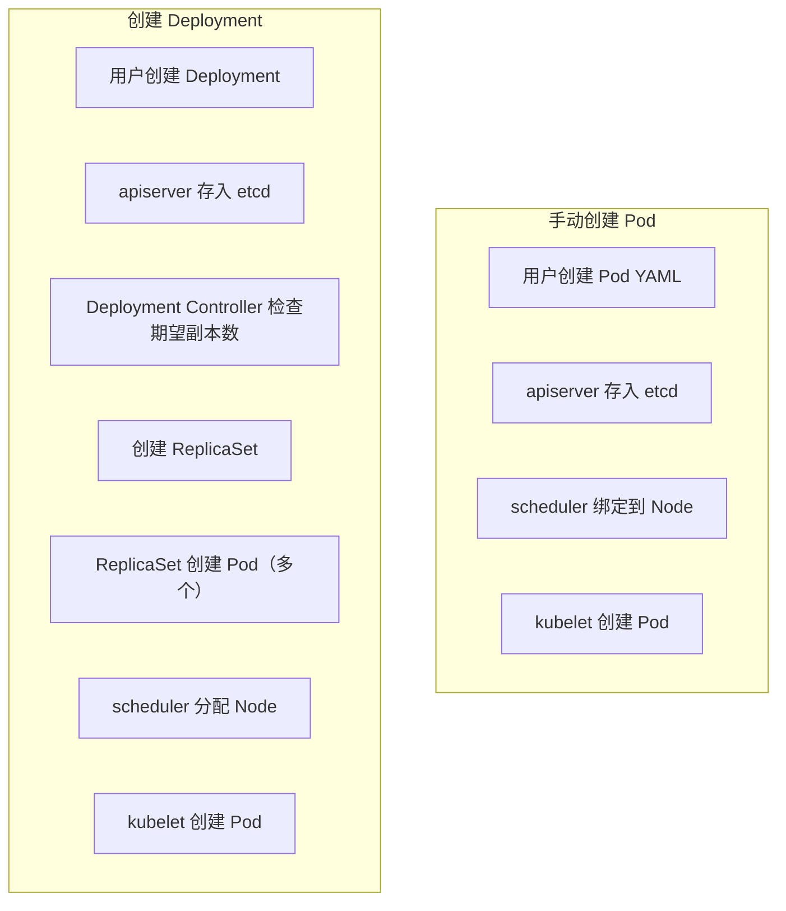

- k8s资源处理

```mermaid
graph TD
    A[资源更新请求] --> B[API Server 接收]
    B --> C[认证 Authentication]
    C --> D[授权 Authorization]
    D --> E[准入控制器 Admission Controllers]
    E --> F[验证和变更]
    F --> G[写入 etcd]
    G --> H[通知 Watchers]
```

- k8s事件传播流程
  - 以deployment为例：`kubectl patch deployment nginx --patch '{"spec":{"replicas":5}}'`

```mermaid
sequenceDiagram
    participant User as 用户
    participant API as API Server
    participant CM as Controller Manager
    participant Sched as Scheduler
    participant kubelet as kubelet
    participant etcd as etcd
    
    User->>API: PATCH /apis/apps/v1/deployments/nginx
    API->>API: 认证、授权、准入控制
    API->>etcd: 更新 Deployment
    etcd->>API: 确认更新
    API->>CM: Watch 事件: Deployment MODIFIED
    
    CM->>CM: Deployment Controller 处理
    CM->>API: 创建新的 ReplicaSet
    API->>etcd: 存储 ReplicaSet
    API->>CM: ReplicaSet ADDED 事件
    
    CM->>CM: ReplicaSet Controller 处理
    CM->>API: 创建新的 Pod
    API->>etcd: 存储 Pod
    API->>Sched: Pod ADDED 事件 (nodeName 为空)
    
    Sched->>Sched: 执行调度算法
    Sched->>API: 绑定 Pod 到 Node
    API->>etcd: 更新 Pod.spec.nodeName
    API->>kubelet: Pod MODIFIED 事件
    
    kubelet->>kubelet: 创建容器
    kubelet->>API: 更新 Pod 状态
    API->>etcd: 存储 Pod 状态
    API->>CM: Pod 状态变化事件
    
    CM->>CM: 更新 Deployment 状态
    CM->>API: 更新 Deployment.status
```

- apiserver中的admission controller

```mermaid
graph TD
    A[kubectl apply] --> B[API Server]
    B --> C[Authentication 认证]
    C --> D[Authorization 授权]
    D --> E[Admission Controllers 准入控制]
    E --> F{准入通过?}
    F -->|Yes| G[写入 etcd]
    F -->|No| H[拒绝请求]
    G --> I[通知 Watchers]
    I --> J[Controller Manager 响应]
    
    style E fill:#ff9999
    style J fill:#99ccff
```

- watch事件处理流程

```mermaid
graph TD
    A[API Server 资源变化] --> B[etcd Watch Event]
    B --> C[API Server Watch 响应流]
    C --> D[client-go Watch 接收]
    D --> E[Reflector 处理事件]
    E --> F[更新本地缓存]
    F --> G[分发到事件处理器]
    G --> H[事件加入工作队列]
    H --> I[Worker Goroutine 获取任务]
    I --> J[执行同步逻辑]
    J --> K{处理成功?}
    K -->|Yes| L[完成任务]
    K -->|No| M[重新加入队列]
    M --> N[指数退避延迟]
    N --> I
```

- 创建pod和创建deployment

```mermaid
flowchart TD
    subgraph 手动创建 Pod
        A1[用户创建 Pod YAML]
        A2[apiserver 存入 etcd]
        A3[scheduler 绑定到 Node]
        A4[kubelet 创建 Pod]
    end

    subgraph 创建 Deployment
        B1[用户创建 Deployment]
        B2[apiserver 存入 etcd]
        B3[Deployment Controller 检查期望副本数]
        B4[创建 ReplicaSet]
        B5[ReplicaSet 创建 Pod（多个）]
        B6[scheduler 分配 Node]
        B7[kubelet 创建 Pod]
    end
```