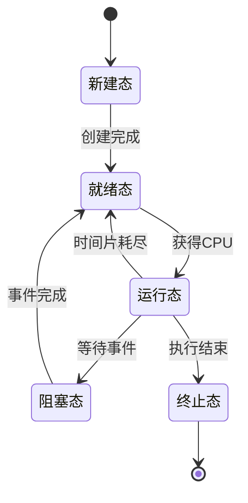

# 硬件结构

## 软中断

**中断**是计算机系统用来响应硬件设备请求的一种机制，操作系统收到中断请求，会打断正在执行的进程，然后调用内核中的中断处理程序来响应请求

中断是一种异步的事件处理机制，可以提供系统的并发处理能力

Linux系统为了解决中断处理程序执行过长和中断丢失的问题，将中断过程分为两个阶段：

- 上半部是硬中断，用来快速处理中断
- 下半部是软中断，用来延迟处理上半部未完成的工作

Linux的软中断包括网络收发、定时、调度、RCU锁等类型，可以通过/proc/softirqs来观察软中断的累积中断次数

每个CPU核心都有各自的软中断内核线程

## 计算机存储小数

计算机对于整数的存储是使用二进制，最高位是符号位，剩余位置用于表示二进制数，对于负数符号位是1，剩余位置是补码表示

对于小数，转换为二进制的方法是乘2取整法，例如0.625转换为二进制就是.101

而对于0.1，转换为二进制就是0.00011001100110011...无限循环，所以0.1是无法用完整的二进制表示的，只能以近似数的方式来保存

计算机中能够精确表示的小数是可以被2除尽的数字

因此计算机中0.1+0.2并不完整等于0.3

# 操作系统结构

## 内核

内核是连接应用程序与硬件设备的桥梁，应用程序只需要与内核交互，不用关心硬件的细节

内核的能力：

- 管理进程、线程，决定哪个进程、线程使用CPU，也就是进程调度的能力
- 管理内存，决定内存的分配和回收，也就是内存管理的能力
- 管理硬件设备，为进程与硬件设备之间提供通信能力，也就是硬件通信能力
- 提供系统调用，如果应用程序要更高权限来运行服务，就需要系统调用，它是用户程序与操作系统之间的接口

大多数操作系统会把内存分为：

- 内核空间，只有内核程序可以访问
- 用户空间，专门给应用程序使用

用户空间的代码只能访问一个局部的内存空间，也就是用户态执行，而内核空间的代码可以访问所有内存空间，也就是内核态执行

## Linux设计

Linux内核设计理念：

- MultiTask，多任务，可以有多个任务并发或并行运行
- SMP，对称多处理，每个CPU的地位都是相等的，每个程序都可以被分配到任意一个CPU上执行
- ELF，可执行文件链接格式，可执行文件的存储格式
- Monolithic Kernel，宏内核，系统内核的所有模块如进程调度、内存管理、文件系统、设备驱动等都在内核态运行，相对应的是微内核，内核只保留基本能力如进程调度、虚拟机内存、中断等，一些应用被放到用户空间如驱动程序、文件系统

# 运行模式

## 用户态和内核态

内核态和用户态是操作系统中的两种运行模式，它们的主要区别在于权限和可执行的操作：

- 内核态（Kernel Mode）：在内核态下，CPU可以执行所有的指令和访问所有的硬件资源，这种模式下的操作有更高的权限，负责进程/线程的调度、内存管理、文件系统、网络协议栈、设备驱动等核心功能
- 用户态（User Mode）：在用户态下，CPU只能执行部分指令集，无法直接访问硬件资源，这种模式下的操作权限较低，主要用于运行用户程序

内核态的底层操作主要包括：内存管理、进程管理、设备驱动程序控制、系统调用等，这些操作涉及到操作系统的核心功能，需要较高的权限来执行

分为内核态和用户态的原因主要有以下几点：

- 安全性：通过对权限的划分，用户程序无法直接访问硬件资源，从而避免了恶意程序对系统资源的破坏
- 稳定性：用户态程序出现问题时，不会影响到整个系统，避免了程序故障导致系统崩溃的风险
- 隔离性：内核态和用户态的划分使得操作系统内核与用户之间有了明确的边界，有利于系统的模块化和维护

总结就是内核态和用户态的划分有助于保证操作系统的安全性、稳定性和易维护性

# 进程管理

## 线程、进程和协程的区别是什么

进程（Process）：

- 进程是一个正在运行的程序实例，是操作系统中进行资源分配的最小单位，拥有独立的内存空间和系统资源
- 进程里包含：独立的地址空间（代码段、堆、栈）、文件描述符、环境变量等
- 进程之间相互隔离，安全性高，因为涉及到内核态，线程创建和切换的成本高

线程（Thread）：

- 线程是操作系统调度执行的最小单位，一个进程可以包含多个线程，多个线程之间共享进程内存，并且各自有独立的栈和寄存器
- 线程比进程更轻量，线程间通信更高效，因为线程共享进程的资源，但是线程之间的隔离性较差，容易引发数据竞争和死锁等问题

协程（Coroutine）：

- 协程是用户态的轻量级线程，由程序自己调度而不是操作系统调度，可以理解为是可被挂起和恢复的函数
- 协程不需要内核态进行切换，因此切换成本低，通常是在程序中控制来协作式调度

| 维度     | 进程    | 线程         | 协程             |
| -------- | ------- | ------------ | ---------------- |
| 调度者   | OS 内核 | OS 内核      | 用户态（运行时） |
| 内存空间 | 独立    | 共享进程内存 | 共享线程内存     |
| 切换成本 | 很高    | 中           | 极低             |
| 创建成本 | 很高    | 中           | 极低             |
| 并行能力 | 真并行  | 真并行       | 依赖线程         |
| 通信方式 | IPC     | 共享内存     | 直接变量         |
| 安全性   | 高      | 中           | 低               |
| 数量级   | 少      | 较多         | 非常多           |

## 进程是如何被创建和退出

在Unix/Linux系统中，除了初始化进程（PID 1）是由内核直接创建外，其他用户进程都是由已有的进程通过系统调用创建的，最常用的创建进程的方法是使用`fork()`和`exec()`系统调用：

- `fork()`：创建一个与当前进程几乎完全相同的子进程，子进程会复制父进程的内存空间、文件描述符等资源
- `exec()`系列函数：用于在当前进程中加载并执行一个新的程序，通常与`fork()`结合使用，先通过`fork()`创建子进程，然后在子进程中调用`exec()`加载新程序

子进程的退出通常通过调用`exit()`系统调用来完成，`exit()`会释放用户态资源，并将退出状态码传递给父进程，然后进入Zombie，父进程可以通过调用`wait()`或`waitpid()`来获取子进程的退出状态并回收其资源

## 为什么进程崩溃不会导致系统崩溃

进程崩溃是因为程序做了非法的事情，比如空指针、野指针、数组越界、访问非法地址、除0等操作

现代操作系统会通过内存隔离+权限隔离+内核保护，把进程的错误掩盖掉：

- 内存隔离：
  - 每个进程都有独立的虚拟地址空间
  - 进程看到的内存地址都是实际物理内存由内核映射的到的
- 用户态/内核态隔离
  - 普通进程运行在用户态，如果出现越界操作会被杀死，不影响内核进程
- 内核保护
  - 系统调用都会检查参数，并且所有内存访问都有边界，从而拒绝错误操作
  - 进程崩溃的时候会回收内存、关闭文件、清理socket

## 进程分配的资源是什么

进程在运行过程中，操作系统为其分配的资源包括：

1. 内存资源
   - 代码段：存放程序的可执行代码
   - 数据段：存放全局变量和静态变量
   - 堆：动态分配内存区域
   - 栈：存放函数调用的局部变量和返回地址
2. CPU时间片：多任务系统的CPU资源是分时复用的，操作系统为每个进程分配的CPU执行时间
3. 文件描述符：进程打开每一个文件、管道或Socket，内核都会分配一个编号进行管理
4. 进程标识
   - PID（Process ID）：系统为每个进程分配的唯一标识符
   - 用户与组ID（UID/GID）：决定了该进程有哪些权限，比如能够读取某个系统文件
5. 通信与同步资源
   - 信号量/锁：用于多个进程或线程之间的协调
   - 消息队列/共享内存：用于进程间的数据交换

## 为什么进程之下还要设计线程

设计线程是为了在保证高效并发的同时，尽可能地降低开销：

1. 降低开销
   - 创建新进程需要操作系统分配独立的内存空间、打开文件句柄、初始化管理数据等，而创建一个线程比创建一个进程快10-100倍，因为线程共享进程的内存空间和资源
   - 并且CPU在进程间切换时，必须刷新缓存并重新加载内存映射，而在同一进程的线程间切换，由于共享内存地址，切换成本更低
2. 共享资源
   - 同一进程下的所有线程共享堆和全局变量，线程间通信更简单高效
   - 一个线程修改了内存中的数据，另一个线程立刻可以看到，便于协同工作，而进程间通信需要IPC机制，开销更大
3. 提高响应速度
   - 多线程可以在一个进程内实现并发处理，比如一个线程处理IO操作，另一个线程处理计算任务，这样可以提高程序的响应速度和资源利用率
4. 资源利用
   - 复杂的计算程序如果只有一个进程一个线程，那么只会跑在一个CPU核心上，其他CPU核的资源无法充分利用
   - 通过多线程机制，操作系统可以将不同线程分发到不同的CPU核上并行运行，提高程序的运行速度

## 多线程对比单线程的优缺点

上面提到的是多线程的优点，其缺点在于：

1. 线程安全与竞态条件：两个线程同时修改同一个变量，如果没有加锁，最终结果可能会出错
2. 死锁：多个线程持有自己的资源不释放并且等待对方的资源，陷入永久等待状态
3. 设计与调度成本高：多线程的问题往往难以复现
4. 资源开销：虽然线程比进程更轻量，但是每个线程仍然需要独立的栈空间和内核管理对象，线程过多会耗尽内存

## 进程切换和线程切换的区别

核心区别在于是否需要切换虚拟内存空间：

- 进程切换
  - 切换也表：操作系统告诉CPU的内存管理单元（MMU）切换到另一个进程的页表
  - 刷新TLB：TLB是CPU内部缓存地址翻译结果的地方，切换进程时需要刷新TLB，清空旧的地址映射，避免访问错误的内存地址
  - 缓存失效：CPU的L1/L2/L3缓存中都是前一个进程的数据，切换到新进程后会有大量的缓存未命中
- 线程切换
  - 同一进程内的线程共享内存地址空间（页表），因此切换开销很小
  - 不换地址空间：线程切换时不需要更改MMU的页表映射，也不需要刷新TLB
  - 只切换上下文：CPU只需要把当前线程的寄存器值（程序计数器、栈指针）保存起来，然后加载新线程的寄存器值即可
  - 缓存命中率高：由于线程共享进程的内存空间，切换后CPU缓存中的数据仍然有效

## 线程切换的过程是什么，上下文怎么保存

线程切换的过程为：

1. 触发切换：线程的CPU时间片用尽，或线程主动放弃CPU（如`yield`或IO阻塞），或更高优先级线程就绪，操作系统内核会触发线程切换
2. 陷入内核态：通过软中断或系统调用，CPU的控制权从用户态转移到操作系统内核
3. 保存当前线程上下文：将CPU寄存器中的实时数据保存到该线程私有的TCB（线程控制块）或其内核栈中，包括：
   - 程序计数器（PC）：指向下一条要执行的指令
   - 栈指针（SP）：指向当前线程的栈顶位置
   - 通用寄存器：保存线程的临时数据
4. 调度决策：操作系统调度器根据调度算法从就绪队列选择下一个要运行的线程
5. 恢复新线程上下文：从新线程的TCB中读取之前保存的数据，重新装填到CPU寄存器中
6. 返回用户态：CPU跳转到新线程上次停下的指令位置（PC寄存器指向的位置）继续执行

上下文其实就是在线程被切走的时候，CPU内部的快照，用于保存线程的运行状态，以便下次恢复时能继续执行，上下文主要保存在两个地方：

- 线程控制块（TCB）：操作系统为每个线程维护的数据结构，保存线程的状态信息，包括寄存器值、堆栈指针、程序计数器等
- 内核栈：每个线程都有自己的内核栈，用于保存函数

保存的信息包括：

- 硬件状态：
  - 程序计数器（PC）：存储下一条要执行的指令地址
  - 栈指针（SP）：指向当前线程的栈顶位置
  - 通用寄存器：保存线程正在进行的计算中间结果
  - 状态寄存器：保存最近一次运算的标识位（是否溢出、是否为0）
- 软件管理信息（TCB中）：
  - 线程ID：唯一标识该线程
  - 线程状态：运行中、就绪还是阻塞
  - 调度优先级：决定下次什么时候能再次轮到
  - 指向所属进程的PCB的指针：因为线程必须共享进程的资源（打开的文件、内存页表等）

## 进程的状态有哪些，怎么切换

- 新建态（New）：进程刚被创建，操作系统为其分配PCB（进程控制块），还没进入调度队列
- 就绪态（Ready）：进程已经具备运行条件，在就绪队列中等待CPU分配时间片
- 运行态（Running）：正在占用CPU执行指令，同一时刻一个CPU核心只能运行一个进程
- 阻塞态（Blocking/Waiting）：进程暂时无法继续执行，等待某个事件完成（I/O完成、等待锁、sleep、等待信号）
- 终止态（Terminated/Exit）：进程执行完成或异常退出，等待父进程回收资源（`wait()`）

## 僵尸进程和孤儿进程是什么

Zombie进程（僵尸进程）是指已经终止但其父进程尚未调用`wait()`或`waitpid()`函数来回收其退出状态的进程

Zombie进程不会再执行代码也不占用CPU、内存和文件描述符，但会占用一个进程表项（PCB），如果系统中存在大量Zombie进程，可能会耗尽系统的进程表资源，导致无法创建新进程

Zombie是一种退出状态缓存机制，目的是让父进程能够获取子进程的退出状态，而不是立即销毁子进程的资源

孤儿进程（Orphan Process）是指其父进程已经终止，但该进程仍在运行的进程

## 进程的上下文有哪些

进程上下文是进程运行所依赖的全部信息，当CPU切换到新的进程时，操作系统必须保存当前进程的上下文，然后加载新进程的上下文

进程的上下文包括：

- CPU上下文（寄存器状态）让进程从被打断的位置继续运行
  - 通用寄存器：保存进程的临时数据和计算结果
  - 程序计数器（PC）：指向下一条要执行的指令
  - 栈指针（SP）：指向进程的栈顶位置
  - 基址寄存器：栈帧基址，用于函数调用
  - 状态寄存器：保存最近一次运算的标识位（是否溢出、是否为0）
- 内核上下文（内核态信息）
  - 内核栈：每个进程都有自己的内核栈，用于保存内核态下的函数调用信息
  - 进程控制块指针：指向该进程的PCB，保存了当前内核上下文的地址
  - 信号处理器：当前正在处理的信号，阻塞或挂起的信号
  - 等待队列指针：如果进程阻塞，需要记录等待资源的地址
- 进程资源上下文（进程管理信息）主要在PCB中保存
  - 进程标识：PID、PPID、UID/GID
  - 进程状态：运行中、就绪、阻塞等
  - 内存映射：代码段、数据段、堆、栈、mmap文件映射
  - 文件描述符表：进程打开的文件、管道、Socket等
  - 调度信息：优先级、时间片、调度队列指针等
  - 信号处理信息：信号掩码、信号处理函数等
  - 资源使用信息：CPU时间、内存使用量、I/O统计等

进程和线程上下文的区别：

| 维度           | 进程上下文                                                    | 线程上下文                                            |
| -------------- | ------------------------------------------------------------- | ----------------------------------------------------- |
| **调度单位**   | 进程是独立调度单位                                            | 线程是调度单位（在进程内）                            |
| **独立性**     | 完全独立（有自己的地址空间、文件表、堆栈等）                  | 共享进程资源（地址空间、打开的文件）                  |
| **CPU 上下文** | 寄存器、程序计数器、栈指针、状态寄存器                        | 寄存器、程序计数器、栈指针、状态寄存器（私有）        |
| **内核上下文** | 内核栈、信号处理、调度信息（独立）                            | 内核栈（每线程有自己的）、调度信息（独立）            |
| **资源上下文** | 内存空间、文件描述符、环境变量、信号掩码（独立）              | 大部分资源共享，只维护线程 ID、线程局部存储、线程状态 |
| **切换成本**   | 高：切换涉及地址空间切换（TLB flush）、内核栈切换、寄存器保存 | 低：只切换寄存器 + 栈 + 状态，不需要切换整个地址空间  |
| **典型实现**   | PCB（Process Control Block）                                  | TCB（Thread Control Block）                           |

## 进程间通信的方式

根据进程是否共享内存，进程间通信（IPC, Inter-Process Communication）可以分为两类：

1. 共享内存型：
   - 通过共享内存区读写数据，需要同步机制（锁、信号量）
   - 例如：Shared Memory（shm）、内存映射文件（mmap）
2. 消息型（非共享）
   - 进程通过消息传递，由内核负责数据传输
   - 例如：管道（pipe）、命名管道（FIFO）、消息队列（message queue）、信号（signal）、套接字（socket）

常用的IPC方式有：

- 管道（Pipe）：
  - 匿名管道：只能在有亲缘关系的进程间通信（如父子进程）
  - 命名管道（FIFO）：可以在无亲缘关系的进程间通信
- 消息队列（Message Queue）：保存在内核中的消息链表，进程通过发送和接收消息进行通信
- 共享内存（Shared Memory）：速度最快的方式，操作系统将一块内存区域映射到多个进程的虚拟地址空间
  - 信号量（Semaphore）：用于进程间同步，控制对共享资源的访问，本质上是一种计数器
- 信号（Signal）：用于通知进程发生了某个事件，可以中断进程的正常执行
- 套接字（Socket）：可以跨网络、在不同主机的进程间通信的机制，支持多种协议（TCP、UDP）

## 信号和信号量的区别

- 信号（Signal）：
  - 信号是一种异步通知机制，用于通知进程发生了某个事件
  - 进程无法预知信号，当信号发生时，内核会中断进程的正常运行，转而执行信号处理函数，信号的值通常是一个整数（比如9是强制杀死进程）
  - 信号是单向的，发送者无法知道接收者是否处理了信号
  - 主要用于异常处理和进程控制，如终止进程（SIGKILL）、暂停进程（SIGSTOP）、定时器到期（SIGALRM）等
- 信号量（Semaphore）：
  - 信号量是一种同步机制，用于控制多个进程或线程对共享资源的访问
  - 信号量是双向的，进程可以通过信号量的值来判断资源是否可用
  - 信号量本质上是一个计数器，可以用来表示可用资源的数量，在访问共享资源之前，进程必须主动检查和操作信号量（P申请资源，值-1和V释放资源，值+1），如果信号量为0，进程就会休眠等待，直到资源可用，从而实现对资源的互斥访问

## 共享内存怎么实现

## 线程间通信的方式

由于线程共享所属进程的内存地址空间，线程之间的通信相对进程间通信更加简单高效，因为数据是共享的所以线程通信的核心在于同步，常见的线程间通信方式包括：

- 互斥锁（Mutex）：保证同一时刻只有一个线程能访问共享资源，当一个线程加锁后，其他线程必须等待
- 条件变量（Condition Variable）：用于线程间的等待和通知机制，一个线程可以等待某个条件成立，另一个线程可以通知等待的线程
- 读写锁（Read-Write Lock）：允许多个线程同时读取共享资源，但在写入时会独占资源，适用于读多写少的场景
- 信号量（Semaphore）：和进程间通信中的信号量类似，用于控制对共享资源的访问，可以实现资源的计数和限制
- 原子操作（Atomic Operations）：一些基本的数据类型操作是原子的，不会被线程切换打断，适用于简单的计数器等场景

## 进程调度算法有哪些

进程调度算法用于决定哪个进程获得CPU时间片，决定了系统的吞吐量、响应速度和公平性，常见的调度算法包括：

1. 先来先服务（FCFS, First-Come, First-Served）：
   - 按照进程到达的顺序进行调度，简单易实现，但可能导致长进程阻塞短进程（饥饿现象）
2. 短作业优先（SJF, Shortest Job First）：
   - 优先调度估计运行时间最短的进程，能提高系统吞吐量，但需要预知进程的运行时间，且可能导致长进程饥饿
3. 时间片轮转（RR, Round Robin）：
   - 每个进程分配一个固定的时间片，时间片用完后切换到下一个进程，适用于交互式系统，能保证响应时间，但时间片过小会增加切换开销
4. 高响应比优先（HRRN, Highest Response Ratio Next）：
   - 综合考虑进程的等待时间和服务时间，优先调度响应比最高的进程，能平衡短作业和长作业的调度
5. 优先级调度（Priority Scheduling）：
   - 根据进程的优先级进行调度，优先级高的进程先执行，有抢占式和非抢占式，可能导致低优先级进程饥饿
6. 多级反馈队列（MFQ，Multilevel Feedback Queue）：
   - 结合了优先级调度和时间片轮转的特点，进程根据其行为动态调整优先级，适应不同类型的进程需求，提高系统整体性能：
     - 设置多个就绪队列，每个队列有不同的优先级
     - 优先级越高，时间片越短
     - 新进程进入最高优先级队列，如果在时间片内没运行完则降级到下一个优先级队列
     - 只有高优先级队列为空时，才调度低优先级队列的进程

# 锁

## 为什么并发执行线程要加锁

加锁是为了解决竞态条件，由于多线程共享同一块内存空间，如果没有锁，多个线程可能会在同一时刻修改同一个变量，导致数据不一致和不可预测的结果

加锁的底层原因：

1. 操作是非原子性的：大多数操作（如读-改-写）不是原子操作，可能会被线程切换打断，导致其他线程看到中间状态，锁可以保证操作的原子性
2. 内存可见性问题：每个CPU核心有自己的L1/L2缓存，一个线程修改了共享变量，可能只更新到自己的缓存，还没来得及写回主内存，其他线程读取时看到的是旧值，锁可以强制刷新缓存，保证内存可见性
3. 指令重排：编译器和CPU可能会对指令进行重排，导致代码执行顺序与预期不符，锁可以禁止重排，保证代码按顺序执行

加锁的本质是把并发（并行）执行的代码块变成串行（顺序）执行

## 常见的锁有哪些

- 互斥锁（Mutex Lock）：
  - 最常见的锁类型，保证同一时刻只有一个线程能访问共享资源
  - 适用于需要独占访问的场景
- 读写锁（Read-Write Lock）：
  - 允许多个线程同时读取共享资源，但在写入时会独占资源
  - 适用于读多写少的场景，能极大地提高并发性能
- 自旋锁（Spin Lock）：
  - 线程在等待锁时不会休眠，而是不断循环检查锁的状态
  - 适用于临界区很短的场景，避免了线程切换的开销，但是长时间自旋会浪费CPU资源
- 递归锁（Recursive Lock）：
  - 也叫可重入锁，允许同一线程多次获取同一把锁而不会死锁
  - 适用于需要递归调用的场景
- 乐观锁（Optimistic Lock）和悲观锁（Pessimistic Lock）：
  - 是两种对待数据冲突的不同设计思想
  - 乐观锁假设冲突很少，通过版本号等机制来检测冲突，适用于读多写少的场景
  - 悲观锁假设冲突频繁，线程在访问共享资源前会先加锁，适用于写多读少的场景

## 死锁发生的条件是什么

死锁的发生需要满足以下四个条件：

1. 互斥：资源不能共享，同一时间只能被一个进程占用
2. 占有且等待：一个进程已经占有了某些资源，同时又请求其他进程占有的资源
3. 不可抢占：资源一旦被进程占有，不能被强制剥夺，必须由进程自己释放
4. 循环等待：存在一个进程等待链，链中的每个进程都在等待下一个进程占有的资源，形成一个环路

## 如何避免死锁

避免死锁的方法：

1. 破坏循环等待：资源按序申请（给锁编号）
2. 破坏占有等待：一次性申请所有资源
3. 使用超时机制：等待一段时间后放弃资源
4. 死锁检测与恢复：定期检测死锁并终止进程释放资源

## 银行家算法是什么

银行家算法的核心是：在分配资源之前，先测试本次分配是否会导致系统进入不安全状态，如果会进入不安全状态，则不分配资源，直到有足够资源可用

银行家算法可以有效避免死锁，但实现复杂，开销较大，适用于资源有限且进程数量较少的场景

# 内存管理

## 介绍一下操作系统的内存管理

现代操作系统的内存管理主要依靠虚拟内存机制，核心可以概括为：

1. 虚拟地址空间（Virtual Address Space）
   - 操作系统为每个进程虚构了一个连续且独立的内存地址空间，进程看到的地址都是虚拟地址，操作系统通过页表将虚拟地址映射到物理内存地址
2. 分页机制（Paging）
   - 操作系统将虚拟内存和物理内存都划分为固定大小的块：
     - 虚拟内存块称为页（Page），大小通常是4KB
     - 物理内存块称为页框（Frame）
     - 页表记录了虚拟页到物理页框的映射关系
3. 分段机制（Segmentation）
   - 分页是物理上的划分，而分段是逻辑上的划分，操作系统将程序分为不同的段：
     - 代码段（Code）：只读，存放指令
     - 数据段（Data）：存放全局变量
     - 堆（Heap）：动态申请的内存
     - 栈（Stack）：存放局部变量和函数调用
4. 换入换出与缺页中断（Swapping & Page Fault）
   - 请求调页：程序启动时并不把所有内容装入内存，只装入当前需要的
   - 缺页中断：当CPU访问的页不在物理内存时，触发中断，操作系统去磁盘（Swap分区）把数据读进内存
   - 置换算法：如果内存已满，操作系统需要选择一个页进行替换，常见算法有LRU、FIFO等

## 什么是虚拟内存和物理内存

## 什么是页表和段表

- 页表（Page Table）
  - 分页存储的核心，将进程的虚拟地址空间划分为固定大小的页，并将物理内存划分为同样大小的块
  - 分页的大小通常是4KB，逻辑页可以映射到物理内存中不连续的块，解决外部碎片的问题
  - 页表由多个页表项组成，每一项记录了逻辑页号与物理块号的映射关系
- 段表（Segment Table）
  - 分段存储的核心，按照程序的逻辑结构来划分内存
  - 分段的长度不固定，每个段可以有不同的大小，便于进行权限管理和保护
  - 段表由多个段表项组成，每一项记录了段的起始地址、段的长度等信息

## 虚拟地址是怎么转化到物理地址的

## 程序的内存布局是什么样的

## 堆和栈的区别

- 栈（Stack）：
  - 由编译器自动管理，调用函数由系统自动为局部变量分配内存空间，函数返回时释放空间
  - 空间相对较小，一般几MB，是连续的内存区域
  - 分配效率高，通过调整栈指针实现，遵循后进先出（LIFO）原则
  - 存放函数的局部变量、函数参数和返回地址，生命周期非常短，仅限于函数调用期间
- 堆（Heap）：
  - 由开发者手动管理，需要显示地分配和释放内存空间，如果忘记释放会导致内存泄漏
  - 空间较大，受限于系统的虚拟内存，是不连续的内存区域，通过链表管理碎片
  - 分配效率较低，需要遍历空闲内存块，可能导致内存碎片化
  - 存放程序运行过程中动态创建的对象和数据结构，生命周期较长，可以跨函数调用

## fork()会复制哪些东西

## 介绍copy on write（写时复制）

COW是一种资源优化策略，核心思想是如果有多个调用者同时请求相同的资源，先不进行复制，而是让他们共享同一个副本，只有当某个调用者试图修改资源时，才真正执行复制操作，这样可以节省大量的内存和处理时间

例如在`fork()`复制进程时，COW会让父子进程共享同一块内存页，直到其中一个进程尝试写入该页时，操作系统才会为该进程创建该页的私有副本

Docker的分层镜像（Layer）也是利用了COW技术，多个容器可以共享同一基础镜像层，只有在容器内进行写操作时，才会创建该层的私有副本

## copy on write节省了什么资源

## malloc 1KB和1MB有什么区别

Linux中标准C库的`malloc`函数在分配内存时会根据请求的大小选择不同的分配策略：

- 小块内存分配（通常小于128KB）：
  - 使用内存池（Memory Pool）进行管理
  - 内存池将大块内存划分为多个小块，维护一个空闲链表，快速分配和释放小块内存
  - 分配速度快，开销小，但可能会有内存碎片问题
- 大块内存分配（通常大于等于128KB）：
  - 直接通过系统调用（如`mmap`）向操作系统请求内存
  - `mmap`分配的内存是页对齐的，适合大块内存需求
  - 分配和释放开销较大，但避免了内存碎片问题

## 介绍一下brk，mmap

brk和mmap是Linux系统中两种常用的内存分配方式：

- brk（Break）是最传统的内存分配方式，专门用于操作程序的堆内存
  - 通过调整进程的数据段末尾指针（Program Break）来增加或减少堆的大小
  - 适合分配较小且连续的内存块，但不能释放部分内存，只能整体释放
- mmap（Memory Map）不仅可以分配内存，还可以将文件映射到内存中
  - 通过创建内存映射区域，允许进程直接访问文件内容，就像访问内存一样
  - 适合分配大块内存或需要文件I/O的场景，可以释放部分内存，支持共享内存

## 操作系统内存不足的时候会发生什么

当操作系统检测到可用物理内存（RAM）不够时，按照紧急程序会采取以下措施来缓解内存压力：

1. 内存回收（Memory Reclamation）
   - 尝试回收暂时不用的或是可以快速恢复的内存
   - 清理缓存和缓冲区，回收不活跃的内存页
2. 页面置换（Page Swapping）
   - 操作系统将内存中暂时不运行的进程数据页换出到磁盘的交换空间（Swap Space），腾出物理内存给活跃进程使用
   - 选择不常用的页面进行置换，常见算法有LRU、FIFO等
3. 内存压力通知（Memory Pressure）
   - 操作系统会向应用程序发送内存压力信号，提示它们释放不必要的内存
   - 应用程序可以响应这些信号，释放缓存或降低内存使用
4. OOM Killer（Out-Of-Memory Killer）
   - 如果内存压力过大，操作系统可能会启动OOM Killer，强制终止某些进程以释放内存
   - 通常会选择那些占用内存最多或优先级最低的进程进行终止
5. 系统崩溃（Kernel Panic）
   - 在极端情况下，如果内存严重不足且无法通过上述方法缓解，操作系统可能会崩溃，进入内核恐慌状态，保护系统不受进一步损害

## 页面置换有哪些算法

# 中断

## 什么是中断

中断（Interrupt）是一种硬件或软件发出的信号，要求CPU暂停当前正在执行的任务，转而去处理一个更紧急或更重要的事件

中断的作用是提高系统的响应速度和资源利用率，使得CPU能够及时处理外部设备的请求或内部事件，而不需要一直等待

## 中断的流程是什么

## 中断的类型有哪些

## 中断的作用是什么

# 网络I/O

## 了解哪些IO模型

网络I/O模型本质上是为了解决数据什么时候就绪和就绪后谁来拷贝数据的问题，常见的I/O模型包括：

1. 阻塞I/O（Blocking I/O）：
   - 线程在调用I/O操作时会被阻塞，直到数据准备好才能继续执行
   - 简单易用，但吞吐低、并发差，无法充分利用CPU资源
2. 非阻塞I/O（Non-Blocking I/O）：
   - 线程在调用I/O操作时不会被阻塞，如果数据未准备好会立即返回
   - 需要轮询（polling）来检查数据是否就绪，但会造成CPU空转
3. I/O多路复用
   - 核心思想是一个线程监听多个socket，当任意一个socket有数据就绪时，通知线程进行处理
   - 常见的实现有`select`、`poll`、`epoll`
4. 信号驱动I/O（Signal-Driven I/O）：
   - 线程在调用I/O操作后继续执行其他任务，当数据准备好时，内核会发送一个信号通知线程
   - 线程在信号处理函数中处理I/O数据
5. 异步I/O（Asynchronous I/O）：
   - 线程发起I/O操作后立即返回，内核在数据准备好后会通知线程进行处理
   - 线程可以继续执行其他任务，I/O操作完全由内核管理，效率高但编程复杂

## 服务器处理并发请求有哪几种方式

- 多进程模型（Process-based Model）：
  - 每个请求由一个独立的进程处理，进程间相互隔离，安全性高
  - 但进程创建和切换开销大，资源消耗高，适用于并发量较低的场景
- 多线程模型（Thread-based Model）：
  - 每个请求由一个独立的线程处理，线程间共享进程资源，开销较小
  - 但需要处理线程安全和同步问题，适用于中等并发量的场景
- IO多路复用模型（I/O Multiplexing）：
  - 使用单个或少量线程监听多个请求，通过`select`、`poll`、`epoll`等机制实现高效的I/O处理
  - 适用于高并发、I/O密集型的场景，如Nginx、Redis
- 协程模型（Coroutine）：
  - 通过用户态的轻量级线程（协程）实现并发，不涉及硬件层面的上下文切换，性能极高
  - 适用于高并发、I/O密集型的场景，如Go语言的Goroutine、Python的asyncio

## 讲一下IO多路复用

IO多路复用是一种高效的I/O处理机制，允许单个线程同时监听多个I/O通道（如Socket），当任意一个通道有数据就绪时，通知线程进行处理，主要的实现机制有：

1. select
   - 将所有的连接放到一个集合里，每次调用都把这个集合传给内核，内核检查每个连接的状态，返回就绪的连接
   - 缺点是连接数有限制（通常1024），每次调用都需要复制集合，效率较低
2. poll
   - 类似于select，但使用一个数组来存储连接状态，没有连接数限制
   - 仍然需要每次调用时复制整个数组，效率有所提升但仍有限
3. epoll
   - Linux特有的高效I/O多路复用机制，使用事件驱动模型
   - 内核里维护一个红黑树来管理数万个连接，只有就绪的连接才会被通知，避免了不必要的遍历

## select、poll、epoll的区别

## epoll的边缘触发和水平触发的区别

## redis、nginx、netty是怎么实现高性能的

## 零拷贝是什么

零拷贝是一种旨在减少数据在内核空间缓冲区与用户空间缓冲区之间的循环拷贝，以减少CPU上下文切换的技术

传统IO的问题在于，如果要把服务器磁盘的一个文件通过网络发送给客户端，数据需要经历以下几个步骤：

1. 磁盘 -> 内核缓冲区（DMA拷贝）
2. 内核缓冲区 -> 用户空间缓冲区（CPU拷贝）
3. 用户空间缓冲区 -> Socket缓冲区（CPU拷贝）
4. Socket缓冲区 -> 网络设备（DMA拷贝）

以上会发生4次数据拷贝和4次上下文切换（用户态和内核态），非常浪费性能，而零拷贝技术通过减少数据拷贝次数和上下文切换次数来提高性能，常见的零拷贝技术包括：

1. sendfile系统调用
   - 允许直接从文件描述符（磁盘文件）传输数据到Socket描述符，省去了用户空间缓冲区的拷贝
   - 数据流动路径变为：磁盘 -> 内核缓冲区 -> Socket缓冲区 -> 网络设备
2. mmap内存映射
   - 将文件映射到进程的虚拟地址空间，允许进程直接访问文件内容，减少了内核与用户空间之间的拷贝
3. splice系统调用
   - 允许在两个文件描述符之间直接传输数据，避免了用户空间的参与
4. DMA（Direct Memory Access）
   - 通过DMA控制器直接在设备和内存之间传输数据，减少CPU的参与

Kafka能支撑海量吞吐量的一个重要原因就是在发送消息的时候使用了sendfile系统调用，数据直接从磁盘页缓存发到网卡
