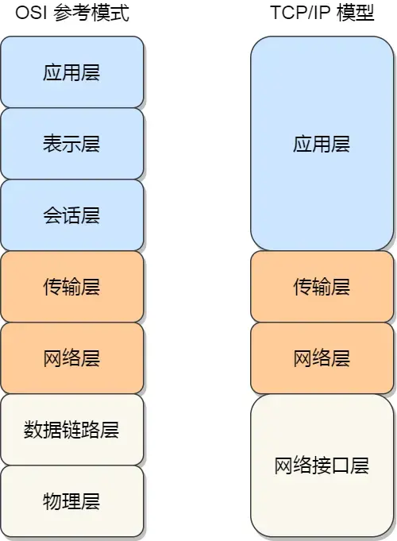

# 网络模型

## OSI七层模型和TCP/IP四层模型

为了使得多种设备可以通过网络相互进行通信，以及解决各种不同的设备在网络互联中的兼容性问题，国际标准化组织制定了开放式系统互联通信参考模型（Open System Interconnection Reference Model），也就是OSI模型，该模型主要有七层：

- 应用层：负责给应用程序提供统一的接口
- 表示层：负责把数据转换成兼容另一个系统能识别的格式
- 会话层：负责建立、管理和终止表示层实体之间的通信会话
- 传输层：负责端到端的数据传输
- 网络层：负责数据的路由、转发、分片
- 数据链路层：负责数据的封帧和差错检验，以及MAC寻址
- 物理层：负责在物理网络中传输数据帧

由于OSI模型比较复杂，实际应用中更常用的是TCP/IP四层模型，该模型将OSI模型的七层简化为四层：

- 应用层：支持HTTP、SMTP等应用协议
- 传输层：处理主机到主机的通信（TCP、UDP）
- 网络层：处理数据包的路由和转发（IP协议）
- 链路层：通过网络和物理介质传输数据帧



## 应用层

### 应用层有哪些协议

### HTTP报文有哪些部分

### HTTP常用的状态码

### 返回状态301和302是什么

### 返回502和504的区别

### HTTP层请求的类型有哪些

### GET和POST使用的场景

### HTTP的长连接是什么

### HTTP默认的端口是什么

### HTTP/1.1怎么对请求做拆包

### HTTP断点续传是怎么实现的

### HTTP为什么不安全

### HTTP和HTTPS的区别

### HTTPS握手过程是什么

### HTTPS是如何防范中间人攻击

### HTTP/1.1和HTTP/2.0的区别

### HTTP进行TCP连接之后什么情况会中断

### HTTP、SOCKET和TCP的区别

### DNS域名解析的工作流程

### DNS的端口是多少

### DNS底层使用的协议是什么

### HTTP是无状态的吗

HTTP是无状态的，因此每个请求都是独立的，服务器不会在多个请求之间保存客户端状态的信息，这样可以减少服务器的压力、便于扩展到任意服务器提供请求处理能力

虽然HTTP本身是无状态的，但是可以通过一些机制来实现状态的管理，比如Cookie、Session和Token等，通过在客户端存储会话信息或状态信息，服务器可以识别和跟踪特定用户的状态，以提供一定程度的状态保持功能，实现Web应用的有状态交互

Cookie是HTTP协议原生支持的机制，但是只是应用层使用HTTP协议的头部实现的一个功能，不能说HTTP协议本身是有状态的，也没有改变HTTP协议无状态的本质

### 什么是Cookie，Session，Token

**Cookie**

- 由服务器发送给浏览器，并保存在本地电脑上的一小段文本文件
- 服务器通过HTTP请求头部的Set-Cookie字段发送Cookie给浏览器，之后每次请求都会自动携带Cookie，即通过HTTP请求头部的Cookie字段发送给服务器

**Session**

- Session代表一个服务器端的会话，因为Cookie保存在客户端不安全（容易被篡改或窃取），重要的信息一般放在服务器的数据库中
- 工作方式为：
  1. 登录之后服务器在内存创建一个Session，并生成一个唯一的Session ID
  2. 服务器通过Set-Cookie把Session ID发送给浏览器
  3. 浏览器每次请求都会携带这个Session ID，服务器通过Session ID找到对应的Session，从而识别用户身份

**Token**

- 通常指JWT（JSON Web Token），是服务器加密后的一段字符串，包含了用户的身份信息和一些元数据，保存在客户端
- 工作方式为：
  1. 登录之后服务器把用户ID、过期时间等信息打包、加密、签名，生成一个Token发送给浏览器（通常是通过HTTP响应体）
  2. 下次请求携带Token（通常放在HTTP请求头部的Authorization字段），服务器通过解密和验证签名来识别用户身份

| 特性           | Cookie           | Session                | Token (JWT)            |
| -------------- | ---------------- | ---------------------- | ---------------------- |
| **存储位置**   | 客户端（浏览器） | 服务器                 | 客户端                 |
| **数据大小**   | 很小 (约 4KB)    | 较大                   | 视信息量而定           |
| **安全性**     | 较低（易被伪造） | 高（核心数据在后台）   | 中高（有加密签名）     |
| **服务器开销** | 极低             | 高（需占用服务器内存） | 极低（只需解密计算）   |
| **跨平台/APP** | 仅限浏览器       | 较难                   | 非常友好（移动端首选） |

### 如果客户端禁用Cookie，Session还能用吗

默认情况下不行，因为Session ID是通过Cookie传递的，如果Cookie被禁用，浏览器就不会发送Session ID，服务器无法识别用户的Session

但是可以通过一些技术手段来实现：

- URL重写：在每个URL中附加Session ID作为查询参数，这样即使Cookie被禁用，服务器也能通过URL获取Session ID
- 隐藏字段：在表单中使用隐藏字段传递Session ID，适用于表单提交的场景，并且只限于POST请求

### 如果把数据存到localStorage和Cookie有什么区别

localStorage是HTML5提供的一种在浏览器中存储数据的机制，与Cookie相比有以下区别：

- 使用方式
  - Cookie：自动随每个HTTP请求发送到服务器
  - localStorage：需要通过JavaScript手动读取和发送
- 存储容量
  - Cookie：约4KB
  - localStorage：通常为5MB或更多
- 安全性
  - Cookie：可以设置HttpOnly和Secure标志，防止JavaScript访问和在非HTTPS连接中发送
  - localStorage：任何运行在同一域下的JavaScript都可以访问，容易受到XSS攻击
- 生命周期
  - Cookie：可以设置过期时间，默认会在浏览器关闭时删除
  - localStorage：数据永久存储，除非手动删除浏览器缓存

因此localStorage更适合存储不敏感、大容量的数据，如用户偏好设置、个性化设置、草稿数据等，而Cookie更适合存储需要随请求发送到服务器的小量数据，如会话ID、认证令牌等

### 什么数据应该放到Cookie，什么数据应该放到localStorage

### JWT令牌和传统方式有什么区别

### JWT令牌都有哪些字段

JWT（JSON Web Token）由三部分组成：头部（Header）、负载（Payload）和签名（Signature），每部分都是Base64编码的JSON对象，之间用点`.`分隔

头部（Header）

- 通常包含两部分信息：
  - 令牌的类型`typ`，通常是`JWT`
  - 使用的签名算法`alg`，如`HS256`或`RS256`

  ```json
    {
    "alg": "HS256",
    "typ": "JWT"
    }
  ```

负载（Payload）

- JWT的核心部分，包含声明（Claims），即真正想传输的用户数据，分为三类：
  - 标准声明（Registered Claims）：预定义的字段，如`iss`（签发人r）、`sub`（主题）、`aud`（接收方）、`exp`（过期时间）、`nbf`（生效时间）、`iat`（签发时间）、`jti`（JWT ID）
  - 公共声明（Public Claims）：可以自定义的字段，但应避免冲突
  - 私有声明（Private Claims）：自定义的字段，用于在双方之间传递信息

    ```json
    {
    "sub": "1234567890",
    "name": "John Doe",
    "role": "admin",
    "exp": 1736600000
    }
    ```

- 声明字段可以根据需要添加，但应注意不要存储敏感信息，因为Payload部分是可以被解码查看的

签名（Signature）

- 保证安全性的核心，服务器将编码后的Header、PayLoad，加上一个只有服务器知道的密钥（Secret），通过Header指定的签名算法生成签名

  ```text
  Signature = HMACSHA256(Base64(Header) + "." + Base64(Payload), Secret)
  ```

- JWT验证过程：
  - 服务器接收到JWT后，将其拆分为三段
  - 提取Header和Payload，使用相同的签名算法和Secret重新计算签名
  - 如果计算出的签名与第三段Signature匹配，则验证通过，说明数据未被篡改且来源可信
  - 然后可以解析Payload中的用户信息进行身份验证和授权
- 如果有人篡改了PayLoad的数据，由于没有正确的Secret，签名验证会失败，服务器会拒绝请求，从而保证数据的完整性和真实性
- JWT本身并不加密数据，任何人都可以解码Header和Payload查看内容，因此不适合存储敏感信息

### JWT令牌为什么可以解决集群部署

传统的Session机制通常将用户的会话状态存储在服务器的内存或数据库中，这在单服务器环境下工作良好，但在集群部署时会带来一些挑战：

- 为了确保用户的请求始终被路由到同一台服务器，通常需要使用负载均衡器的会话粘性功能，这增加了系统的复杂性，并且在服务器故障时可能导致会话丢失
- 如果没有会话粘性，用户的请求可能会被路由到不同的服务器，导致无法访问之前存储的Session数据，需要额外的机制（如分布式缓存）来共享Session状态
- 如果使用集中式Session存储（如数据库或分布式缓存），会增加系统的复杂性和延迟
- 如果使用Session复制机制，会增加网络开销和服务器负载

而JWT令牌将用户的身份信息和状态信息存储在客户端（通常是浏览器）中，服务器不需要维护任何会话状态，这使得服务变成了无状态的，无状态的服务可以被任意节点处理请求，不需要Session共享或同步，这正是集群和微服务框架对可扩展性和高可用性的核心要求

无状态服务：任何一个请求到达集群中的任意服务器（使用同一套密钥）都可以独立处理请求，无需依赖其他服务器的状态信息

### JWT的缺点是什么

JWT的缺点在于：

- Token无法主动失效
  - JWT一旦签发，在过期之前就是有效的，完全脱离服务器控制
  - 比如当Token泄漏或用户注销时，无法立即使Token失效，除非等待其自然过期，无法像Session那样通过服务器端销毁来立即失效
  - 通常可以用Redis维护一个黑名单来解决，但这样就破坏了JWT无状态的优势
- 续期问题
  - JWT的续期机制不如Session灵活，在Token生成时过期时间是固定的，过期后需要重新登录获取新的Token
  - 通常需要在Token快过期时重新签发一个新的Token
- Token体积较大
  - JWT包含了Header、Payload和Signature，通常比传统的Session ID要大，占用更多的网络带宽
  - 对于频繁请求的应用，可能会增加网络开销
- 安全性问题
  - 虽然JWT使用签名来防止篡改，但Payload部分是明文的，任何人都可以解码查看其中的信息
  - 不适合存储敏感数据
  - 如果密钥管理不当，可能导致Token被伪造
- 不支持复杂的会话管理

### 双令牌机制

双令牌机制通常指的是使用两种不同类型的令牌来管理用户的身份验证和会话状态，常见的组合是使用短期有效的访问令牌（Access Token）和长期有效的刷新令牌（Refresh Token）

目的是在保证安全性的同时，提升用户体验，减少频繁登录的需求，同时降低访问令牌泄漏带来的风险：

- 访问令牌（Access Token）
  - 短期有效，通常有效期较短（如几分钟到几小时）
  - 用于访问受保护的资源或API
  - 如果访问令牌泄漏，攻击者只能在短时间内使用它，降低了风险
- 刷新令牌（Refresh Token）
  - 长期有效，通常有效期较长（如几天到几个月）
  - 用于获取新的访问令牌
  - 通常只在访问令牌过期时使用
  - 刷新令牌通常存储在更安全的位置（如HTTP Only Cookie），减少被窃取的风险

当访问令牌过期时，客户端可以使用刷新令牌向认证服务器请求一个新的访问令牌，这个过程的实现是由客户端自动完成的，用户无需重新登录，从而提升了用户体验

### JWT如果泄漏怎么解决

通常会通过在服务器端的Redis中维护一个黑名单（Blacklist），服务器将该JWT的唯一标识（如jti字段）加入黑名单中，并设置过期时间为JWT的剩余寿命，之后每次验证JWT时都会检查该标识是否在黑名单中，如果在则拒绝请求

如果是使用双令牌机制，可以让访问令牌的有效期较短，即使泄漏，攻击者也只能在短时间内使用它，如果是刷新令牌泄漏，服务通过判断刷新令牌的使用频率和来源，发现异常时可以强制用户重新登录，从而减少风险

如果非常严重，可以考虑更换签名密钥（Secret），使得所有现有的JWT都失效，迫使所有用户重新登录获取新的JWT

### 前端如何存储JWT的

### 为什么有HTTP协议还需要RPC

### HTTP长连接与WebSocket的区别

### Nginx有哪些负载均衡算法

### Nginx位于OSI模型的哪一层

## 传输层

### TCP的头部有哪些字段

### TCP的三次握手是什么

### 为什么TCP连接要三次握手

### 三次握手中客户端第三次发送的ACK报文丢失会怎么样

### 服务端发送第二个报文后连接进入什么状态

### 三次握手和accept是什么关系，accept做了什么

### 客户端发送的第一个sync报文丢失会怎么样

### TCP的四次挥手是什么

### 为什么TCP连接要四次挥手

### 为什么四次挥手最后要等TIME_WAIT

### 服务端出现大量的time_wait有哪些原因

### TCP和UDP的区别

### TCP如何保证数据可靠传输

### 怎么用UDP实现HTTP

### TCP粘包怎么解决

### TCP的拥塞控制是什么

## 网络场景

### 描述一下网页打开后发生了什么

### 网页非常慢的时候，要定位问题需要从哪些角度

### 如何判断两个服务器正常连接，出错怎么办

### 服务端正常启动但是客户端无法连接，可能的原因有哪些

### 服务器ping不同但是HTTP可以请求成功，会出现吗，原因是什么

## 网络攻击

### 什么是DDoS攻击，如何防范

### SQL注入是什么

### CSRF攻击是什么

### XSS攻击是什么

### DNS劫持是什么
