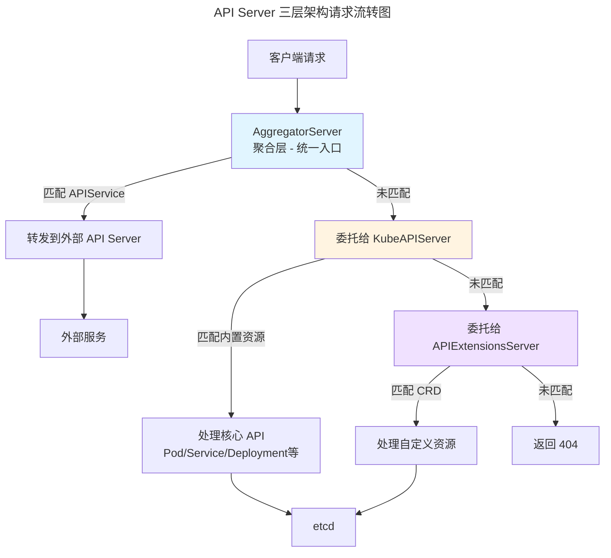
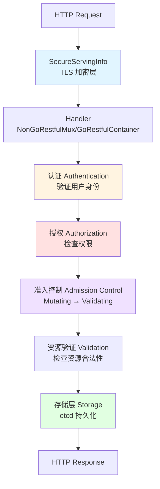

# Kubernetes API Server 关键机制与源码阅读指南

## 一、核心机制概览

### 1. 启动流程（Initialization）

**入口**：

- [cmd/kube-apiserver/apiserver.go](cmd/kube-apiserver/apiserver.go#L33-L35)
- **命令构建**：[cmd/kube-apiserver/app/server.go](cmd/kube-apiserver/app/server.go#L71) `NewAPIServerCommand()`
- **运行主函数**：[cmd/kube-apiserver/app/server.go](cmd/kube-apiserver/app/server.go#L147) `Run()`

**关键步骤**：

```
main() 
  → NewAPIServerCommand() 
  → cli.Run() 
  → Run(ctx, completedOptions)
  → NewConfig() → Complete() → CreateServerChain() 
  → PrepareRun() 
  → RunWithContext()
```

### 2. 三层服务器架构（Server Chain）

在K8s中，API Server不是一个单一的服务，而是由三个独立的逻辑服务层叠组合而来的，这种设计被称为**委托链模式（Delegation Chain Pattern）**。保证了API Server的高度可扩展性和模块化

```go
// 位于 cmd/kube-apiserver/app/server.go:174
func CreateServerChain(config CompletedConfig) (*aggregatorapiserver.APIAggregator, error) {
    // 1. API Extensions Server (CRD)
    apiExtensionsServer, err := config.ApiExtensions.New(...)
    
    // 2. Kube API Server (核心 API)
    kubeAPIServer, err := config.KubeAPIs.New(apiExtensionsServer.GenericAPIServer)
    
    // 3. Aggregator Server (聚合层)
    aggregatorServer, err := controlplaneapiserver.CreateAggregatorServer(...)
    
    return aggregatorServer, nil
}
```

**AggregatorServer**是API Server的入口，负责管理`apiservices.apiregistration.k8s.io`资源，允许注册外部的Extension API Server，当一个请求的路径（Group/Version）匹配到一个注册好的`APIService`，则将请求转发给后端独立的Service，如果没有匹配到，则将请求委托给下一层的KubeAPIServer处理

KubeAPIServer负责管理Kubernetes的内置核心资源，如`/api/v1`的Pod、Service，`/apis/apps/v1`的Deployment等，会检查请求是否属于内置资源类型，如果是则进行处理，否则将请求继续委托给下一层的APIExtensionsServer

APIExtensionsServer是为了实现CRD（Custom Resource Definition）功能而设计的，它负责管理`customresourcedefinitions.apiextensions.k8s.io`资源，当创建一个CRD时，APIExtensionsServer会动态生成对应的RESTful API接口，供用户通过kubectl或API调用访问这些自定义资源

如果请求既不是聚合API，也不是内置资源，那么会检查是否匹配到某个CRD，如果都不是则返回404错误



### 3. 通用API Server（GenericAPIServer）

GenericAPIServer不是具体的服务，而是一个通用的结构体/基础类，其作用是为了实现代码复用，因为无论是KubeAPIServer、APIExtensionsServer还是AggregatorServer，它们都有很多重复的需求：

- 都要监听HTTPS端口
- 都要处理身份认证（Authentication）和鉴权（Authorization）
- 都要支持准入控制（Admission Control）
- 都要支持RESTful API请求处理

于是把这些通用的逻辑抽离出来封装成GenericAPIServer，供具体的API Server实例化和使用

**核心结构**：[staging/src/k8s.io/apiserver/pkg/server/genericapiserver.go](staging/src/k8s.io/apiserver/pkg/server/genericapiserver.go#L109)

```go
type GenericAPIServer struct {
    Handler           *APIServerHandler          // HTTP 请求处理器
    SecureServingInfo *SecureServingInfo        // HTTPS 配置
    admissionControl  admission.Interface       // 准入控制
    DiscoveryGroupManager                       // API 发现
    postStartHooks    map[string]postStartHookEntry  // 启动后钩子
    // ... 更多字段
}
```

**PrepareRun**：[staging/src/k8s.io/apiserver/pkg/server/genericapiserver.go](staging/src/k8s.io/apiserver/pkg/server/genericapiserver.go#L440)

- 安装 OpenAPI/Swagger
- 安装健康检查端点 (healthz, livez, readyz)
- 准备服务器启动

**RunWithContext**：[staging/src/k8s.io/apiserver/pkg/server/genericapiserver.go](staging/src/k8s.io/apiserver/pkg/server/genericapiserver.go#L525)

- 启动 HTTP/HTTPS 服务器
- 管理生命周期信号
- 处理优雅关闭

### 4. 请求处理链



### 5. 认证（Authentication）

**关键机制**：

- Token 认证
- 证书认证
- ServiceAccount 认证
- OIDC 认证

**代码位置**：

```
staging/src/k8s.io/apiserver/pkg/authentication/
```

### 6. 授权（Authorization）

**支持模式**：

- RBAC (Role-Based Access Control)
- ABAC (Attribute-Based Access Control)
- Node Authorization
- Webhook Authorization

**代码位置**：

```
staging/src/k8s.io/apiserver/pkg/authorization/
plugin/pkg/auth/authorizer/
```

### 7. 准入控制（Admission Control）

准入控制是一组在请求通过认证和鉴权之后，对象被持久化到etcd之前的拦截点（只拦截变更操作），允许对请求进行修改（Mutating Admission）或验证（Validating Admission），以确保资源符合集群策略和规范

**第一阶段**：Mutating Admission（变更准入）

- 作用是在对象存储到etcd之前，对请求对象进行修改或补充
- 常见场景：
  - 默认值注入：为缺失字段设置默认值，比如imagePullPolicy默认设置为Always
  - 注入Sidecar容器：自动为Pod注入日志收集或监控Sidecar容器

**第二阶段**：Validating Admission（验证准入）

- 作用是验证对象是否符合既定规则，只能返回接受或拒绝，不能修改对象
- 常见场景：
  - 资源配额检查：确保创建的对象不会超出命名空间的资源配额
  - 安全策略验证：确保Pod不使用特权模式或不允许的卷类型

API Server有一组内置的准入控制插件，会在第一阶段或第二阶段发挥作用：

- NamespaceLifecycle
- LimitRanger
- ServiceAccount
- PodSecurityPolicy
- MutatingWebhook
- ValidatingWebhook

此外还支持通过Webhook机制扩展自定义的准入控制逻辑，这种扩展方式可以不用重新编译API Server，只需要运行一个自己的HTTP服务作为Webhook Server：

1. MutatingAdmissionWebhook：接收API Server发送的对象，返回JSON Patch来实现修改
2. ValidatingAdmissionWebhook：接收API Server发送的对象，返回true/false

**代码位置**：

```
plugin/pkg/admission/
staging/src/k8s.io/apiserver/pkg/admission/
```

### 8. 存储层（Storage）

**Registry 模式**：

```go
// pkg/registry/core/pod/storage/storage.go
type PodStorage struct {
    Pod         *REST         // 标准 CRUD
    Status      *StatusREST   // 状态子资源
    Log         *LogREST      // 日志
    Exec        *ExecREST     // 执行命令
    // ...
}
```

**与etcd交互**：

```
staging/src/k8s.io/apiserver/pkg/storage/
  → etcd3/           # etcd v3 实现
  → storagebackend/  # 存储后端配置
```

### 9. API注册与发现

**资源注册**：

```go
// InstallAPIs 注册 API 组
s.GenericAPIServer.InstallAPIGroups(&apiGroupInfo)
```

**API 发现**：

- `/api` - Legacy API
- `/apis` - API Groups
- `/apis/<group>/<version>` - 特定版本的 API

### 10. 监听与变更通知（Watch）

**Watch Cache 机制**：

- 减少 etcd 压力
- 快速响应客户端 watch 请求
- List-Watch 模式

**代码位置**：

```
staging/src/k8s.io/apiserver/pkg/storage/cacher/
```

---

## 二、源码阅读路径

### 路径 1：启动流程（适合初学者）

#### 1. 主入口

**文件**：[cmd/kube-apiserver/apiserver.go](cmd/kube-apiserver/apiserver.go#L33)

```go
command := app.NewAPIServerCommand()
code := cli.Run(command)
```

#### 2. 命令创建

**文件**：[cmd/kube-apiserver/app/server.go](cmd/kube-apiserver/app/server.go#L71) `NewAPIServerCommand()`

- 创建 `ServerRunOptions`
- 设置命令行参数
- 注册 Feature Gates

#### 3. 运行逻辑

**文件**：[cmd/kube-apiserver/app/server.go](cmd/kube-apiserver/app/server.go#L147) `Run()`

- `NewConfig()` - 创建配置
- `Complete()` - 完成配置
- `CreateServerChain()` - 创建服务器链
- `PrepareRun()` - 准备运行
- `RunWithContext()` - 启动服务器

#### 4. 通用服务器启动

**文件**：[staging/src/k8s.io/apiserver/pkg/server/genericapiserver.go](staging/src/k8s.io/apiserver/pkg/server/genericapiserver.go#L525)

- 启动 HTTP 服务器
- 执行 PostStartHooks
- 处理生命周期信号

### 路径 2：请求处理流程

#### 1. HTTP Handler

**文件**：`staging/src/k8s.io/apiserver/pkg/server/handler.go`

- `APIServerHandler` 处理所有请求

#### 2. 过滤器链

**文件**：`staging/src/k8s.io/apiserver/pkg/endpoints/filters/`

- `authentication.go` - 认证
- `authorization.go` - 授权
- `impersonation.go` - 伪装
- `audit.go` - 审计

#### 3. REST Handler

**文件**：`staging/src/k8s.io/apiserver/pkg/endpoints/`

- `handlers.go` - CRUD 操作处理
- `watch.go` - Watch 请求处理

#### 4. 存储层

**文件**：`staging/src/k8s.io/apiserver/pkg/storage/`

- `interfaces.go` - Storage 接口
- `etcd3/` - etcd 实现

### 路径 3：资源注册（以 Pod 为例）

#### 1. 资源定义

**文件**：`pkg/apis/core/types.go`

- Pod 结构体定义

#### 2. API Schema

**文件**：`pkg/apis/core/register.go`

- 注册 API 版本

#### 3. REST Storage

**文件**：`pkg/registry/core/pod/storage/storage.go`

- 实现 CRUD 接口
- 定义子资源（status, log, exec 等）

#### 4. 安装 API

**文件**：`pkg/controlplane/apiserver/server.go`

- `InstallLegacyAPI()` 安装核心 API

### 路径 4：高级机制

#### 1. Admission Control

- `plugin/pkg/admission/` - 各种准入插件
- `staging/src/k8s.io/apiserver/pkg/admission/plugin/webhook/` - Webhook 实现

#### 2. Watch Cache

- `staging/src/k8s.io/apiserver/pkg/storage/cacher/cacher.go`
- Reflector + Store 模式

#### 3. API Aggregation

- `staging/src/k8s.io/kube-aggregator/`
- 聚合外部 API Server

#### 4. CRD 实现

- `staging/src/k8s.io/apiextensions-apiserver/`
- 动态注册自定义资源

---

## 三、调试建议

### 1. 本地启动 API Server

```bash
# 构建
make WHAT=cmd/kube-apiserver

# 启动 etcd
etcd

# 启动 API Server
_output/bin/kube-apiserver \
  --etcd-servers=http://127.0.0.1:2379 \
  --service-cluster-ip-range=10.0.0.0/24 \
  --v=5
```

### 2. 使用集成测试

查看测试代码理解使用方式：

```
test/integration/apiserver/
test/integration/auth/
```

### 3. 添加日志

在关键路径添加 `klog.Infof()` 跟踪执行流程

### 4. 使用 Delve 调试器

```bash
dlv debug cmd/kube-apiserver/apiserver.go -- --etcd-servers=...
```

---

## 四、关键源码目录结构

```
kubernetes/
├── cmd/kube-apiserver/          # API Server 入口
│   ├── apiserver.go            # main 函数
│   └── app/
│       ├── server.go           # 核心启动逻辑
│       ├── config.go           # 配置管理
│       └── options/            # 命令行选项
├── pkg/
│   ├── apis/                   # API 定义
│   │   └── core/              # 核心资源 (Pod, Service...)
│   ├── registry/              # REST Storage 实现
│   │   └── core/pod/
│   ├── controlplane/          # 控制平面实现
│   └── kubeapiserver/         # API Server 特定逻辑
└── staging/src/k8s.io/
    ├── apiserver/             # 通用 API Server 框架 ⭐
    │   └── pkg/
    │       ├── server/        # GenericAPIServer
    │       ├── endpoints/     # 请求处理
    │       ├── authentication/
    │       ├── authorization/
    │       ├── admission/
    │       └── storage/       # 存储层
    ├── apiextensions-apiserver/  # CRD 实现
    └── kube-aggregator/       # API 聚合
```

---

## 五、学习顺序建议

### 初级（1-2周）

1. ✅ 理解启动流程：从 main 到 HTTP 服务器监听
2. ✅ 跟踪一个简单的 GET 请求（如 GET /api/v1/pods）
3. ✅ 了解三层服务器架构

### 中级（2-3周）

4. ✅ 深入请求处理链：认证→授权→准入
2. ✅ 理解 REST Storage 和 Registry 模式
3. ✅ 学习 Watch 机制

### 高级（持续学习）

7. ✅ Admission Webhook 实现
2. ✅ CRD 和 API Aggregation
3. ✅ 性能优化机制（Watch Cache、Caching）
4. ✅ 安全机制深入

---

## 六、重要概念解释

### CLI 启动 vs API 调用

#### CLI 启动（启动 API Server 进程）

```bash
# 这是启动 API Server 的方式
kube-apiserver --secure-port=6443 --etcd-servers=...
```

#### API 调用（使用 API Server）

```bash
# 方式一：kubectl
kubectl get pods

# 方式二：HTTP 请求
curl -X GET https://apiserver:6443/api/v1/pods \
  --header "Authorization: Bearer ${TOKEN}"

# 方式三：客户端库
# 使用 client-go 库通过 HTTP 调用 API
```

**区别**：

- ❌ API Server 不能通过 CLI 方式调用
- ✅ CLI 只是启动方式
- ✅ 调用 API Server 使用 HTTP API（通过 kubectl、curl 或客户端库）

### 架构图

```
┌─────────────────────────────────────────┐
│  启动阶段（只执行一次）                      │
│  $ kube-apiserver --flags...           │
│     ↓                                   │
│  CLI 解析参数、初始化、启动 HTTP 服务器      │
└─────────────────────────────────────────┘
                   ↓
┌─────────────────────────────────────────┐
│  运行阶段（持续运行，监听端口）               │
│  API Server (HTTP/HTTPS)                │
│  监听: 0.0.0.0:6443                      │
└─────────────────────────────────────────┘
         ↑         ↑         ↑
         │         │         │
    ┌────┘    ┌────┘    ┌────┘
    │         │         │
┌───┴───┐ ┌──┴────┐ ┌──┴─────┐
│kubectl│ │ curl  │ │ client │
│(CLI)  │ │(HTTP) │ │ libs   │
└───────┘ └───────┘ └────────┘
  用户调用 API Server 的方式
```

---

## 七、常见问题

### Q1: 为什么 API Server 用 CLI 方式启动？

**答**：

- **符合 Unix/Linux 哲学**：一切皆程序，通过命令行参数控制
- **统一管理**：所有 k8s 组件使用相同启动模式
- **灵活配置**：支持命令行参数、配置文件、环境变量
- **容器友好**：易于容器化部署
- **标准生命周期**：支持信号处理、优雅关闭

### Q2: API Server 是不是 API 服务？

**答**：是的！虽然用 CLI 启动，但：

- **启动方式**：CLI（命令行程序）
- **运行形态**：长期运行的 API 服务器
- **对外接口**：RESTful API（监听端口 6443 等）

### Q3: 三层服务器的作用是什么？

**答**：

- **AggregatorServer**：聚合第三方 API Server、Metrics Server
- **KubeAPIServer**：处理核心 Kubernetes 资源
- **APIExtensionsServer**：处理 CRD（自定义资源）

采用委托链模式，请求从上到下传递，找不到才传给下一层。

---

## 八、推荐学习资源

### 官方文档

- [Kubernetes API 概念](https://kubernetes.io/docs/reference/using-api/)
- [API Server 架构](https://kubernetes.io/docs/concepts/overview/kubernetes-api/)

### 源码分析博客

- Kubernetes 源码分析系列
- CNCF 博客文章

### 相关书籍

- 《Kubernetes 源码剖析》
- 《Programming Kubernetes》

---

**最后建议**：边看代码边运行调试，在实践中学习效果更好！
