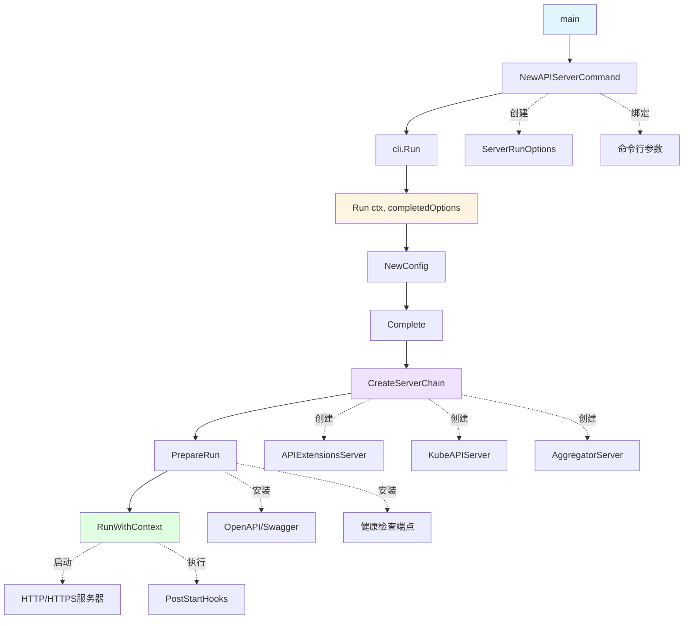
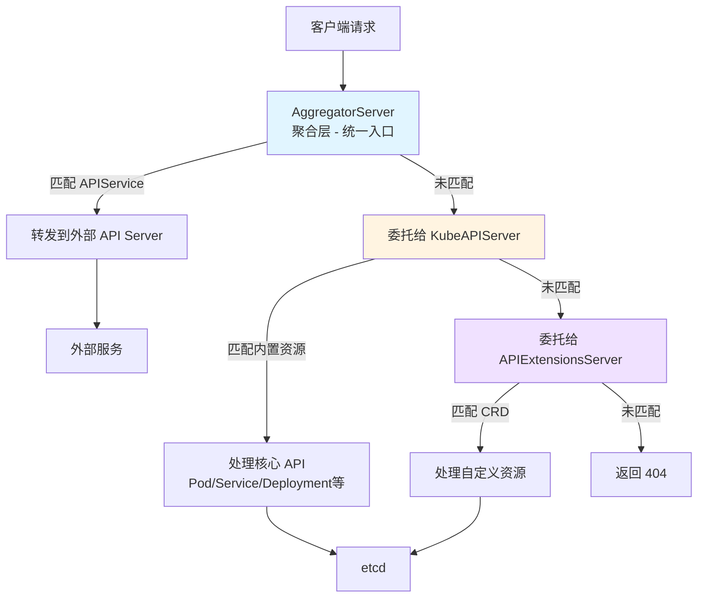
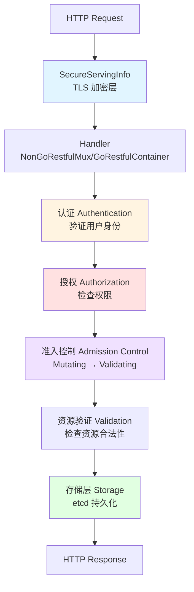
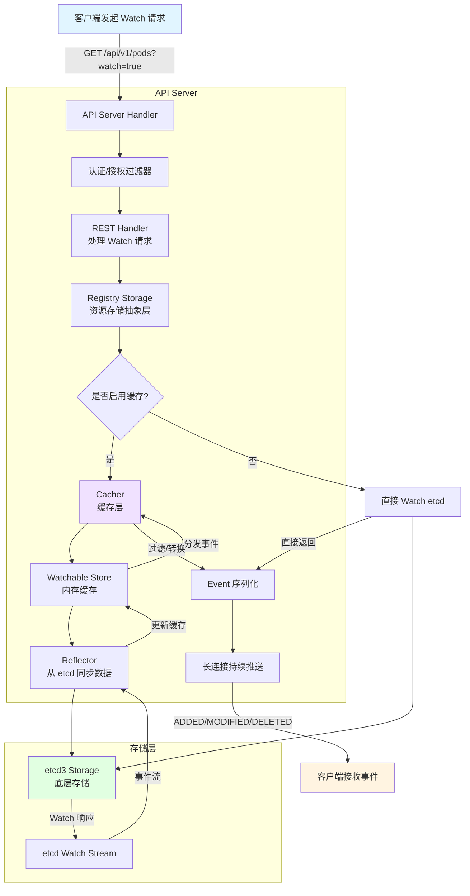

# Kubernetes API Server 关键机制与源码阅读指南

## K8s项目结构

```text
kubernetes/
├── api/                          # OpenAPI 规范和 API 规则
│   ├── api-rules/                # API 约定检查规则
│   └── openapi-spec/             # 生成的 OpenAPI 规范文件
│
├── build/                        # 构建脚本和配置
│   ├── pause/                    # pause 容器镜像构建
│   └── ...                       # 各种构建工具脚本
│
├── cluster/                      # 集群部署相关脚本（已逐步废弃）
│
├── cmd/                          # 🔑 各组件的 main 入口
│   ├── kube-apiserver/           # API Server 入口
│   ├── kube-controller-manager/  # Controller Manager 入口
│   ├── kube-scheduler/           # Scheduler 入口
│   ├── kubelet/                  # Kubelet 入口
│   ├── kube-proxy/               # Kube-Proxy 入口
│   ├── kubectl/                  # kubectl CLI 入口
│   └── kubeadm/                  # kubeadm 工具入口
│
├── docs/                         # 项目文档（设计提案已迁移到 k/enhancements）
│
├── hack/                         # 开发/测试/CI 脚本
│   ├── make-rules/               # Makefile 规则
│   ├── verify-*.sh               # 各种校验脚本
│   └── update-*.sh               # 代码生成更新脚本
│
├── logo/                         # Kubernetes logo 资源
│
├── pkg/                          # 🔑 核心实现代码
│   ├── api/                      # core group 的内部工具/策略/校验
│   │   ├── service/              # Service 相关工具函数
│   │   ├── pod/                  # Pod 相关工具函数
│   │   └── ...
│   │
│   ├── apis/                     # 🔑 内部 API 类型定义 + 版本转换
│   │   ├── core/                 # core group 内部版本（无版本号）
│   │   │   ├── types.go          # 内部类型定义
│   │   │   ├── validation/       # 校验逻辑
│   │   │   └── v1/               # v1 版本转换/默认值
│   │   ├── apps/                 # apps group 内部版本
│   │   │   ├── types.go
│   │   │   ├── v1/               # apps/v1 转换
│   │   │   └── v1beta2/          # apps/v1beta2 转换
│   │   ├── batch/                # batch group
│   │   ├── networking/           # networking.k8s.io group
│   │   ├── storage/              # storage.k8s.io group
│   │   └── ...                   # 其他 API groups
│   │
│   ├── registry/                 # 🔑 REST 存储实现（GVR → etcd）
│   │   ├── core/                 # core group 的 REST 存储
│   │   │   ├── pod/              # Pod REST 实现
│   │   │   ├── service/          # Service REST 实现
│   │   │   ├── node/             # Node REST 实现
│   │   │   └── ...
│   │   ├── apps/                 # apps group 的 REST 存储
│   │   │   ├── deployment/       # Deployment REST
│   │   │   ├── statefulset/      # StatefulSet REST
│   │   │   └── rest/             # StorageProvider 注册
│   │   └── ...
│   │
│   ├── controlplane/             # 🔑 API Server 控制面逻辑
│   │   ├── instance.go           # API 资源注册入口
│   │   └── apiserver/            # API Server 配置
│   │
│   ├── controller/               # 🔑 各种内置控制器实现
│   │   ├── deployment/           # Deployment 控制器
│   │   ├── replicaset/           # ReplicaSet 控制器
│   │   ├── job/                  # Job 控制器
│   │   ├── nodelifecycle/        # Node 生命周期控制器
│   │   ├── serviceaccount/       # ServiceAccount 控制器
│   │   └── ...
│   │
│   ├── scheduler/                # 🔑 调度器核心逻辑
│   │   ├── framework/            # 调度框架（插件机制）
│   │   ├── internal/             # 内部实现
│   │   └── apis/                 # 调度器配置 API
│   │
│   ├── kubelet/                  # 🔑 Kubelet 核心逻辑
│   │   ├── apis/                 # Kubelet 配置 API
│   │   ├── cm/                   # Container Manager
│   │   ├── cri/                  # CRI 接口
│   │   ├── images/               # 镜像管理
│   │   ├── pod/                  # Pod 管理
│   │   ├── prober/               # 健康检查
│   │   ├── volumemanager/        # 卷管理
│   │   └── ...
│   │
│   ├── proxy/                    # 🔑 Kube-Proxy 核心逻辑
│   │   ├── iptables/             # iptables 模式
│   │   ├── ipvs/                 # ipvs 模式
│   │   └── nftables/             # nftables 模式
│   │
│   ├── volume/                   # 卷插件实现
│   │   ├── csi/                  # CSI 插件
│   │   ├── configmap/            # ConfigMap 卷
│   │   ├── secret/               # Secret 卷
│   │   └── ...
│   │
│   ├── kubeapiserver/            # API Server 特定逻辑
│   ├── printers/                 # kubectl 输出格式化
│   ├── quota/                    # 资源配额评估器
│   ├── security/                 # 安全相关（PSP/PSA）
│   ├── serviceaccount/           # SA token 生成
│   └── util/                     # 通用工具函数
│
├── plugin/                       # 插件（准入控制等）
│   └── pkg/
│       ├── admission/            # 内置准入控制器
│       │   ├── limitranger/
│       │   ├── resourcequota/
│       │   └── ...
│       └── auth/                 # 认证/授权插件
│
├── staging/                      # 🔑 独立发布的子项目（会同步到独立 repo）
│   └── src/k8s.io/
│       ├── api/                  # 📦 对外 API 类型 (k8s.io/api)
│       │   ├── core/v1/          # core/v1 类型（Pod, Service...）
│       │   ├── apps/v1/          # apps/v1 类型（Deployment...）
│       │   └── ...
│       │
│       ├── apimachinery/         # 📦 API 基础设施 (k8s.io/apimachinery)
│       │   └── pkg/
│       │       ├── apis/meta/v1/ # ObjectMeta, ListMeta 等
│       │       ├── runtime/      # Scheme, 编解码
│       │       └── ...
│       │
│       ├── apiserver/            # 📦 通用 API Server 库
│       │   └── pkg/
│       │       ├── endpoints/    # REST 端点处理
│       │       ├── storage/      # 存储抽象
│       │       ├── registry/     # 通用 REST 存储
│       │       └── ...
│       │
│       ├── client-go/            # 📦 Go 客户端库 (k8s.io/client-go)
│       │   ├── kubernetes/       # Clientset
│       │   ├── informers/        # Informer 工厂
│       │   ├── listers/          # Lister
│       │   ├── tools/cache/      # SharedInformer
│       │   └── ...
│       │
│       ├── code-generator/       # 📦 代码生成工具
│       ├── controller-manager/   # 📦 Controller Manager 框架
│       ├── kubectl/              # 📦 kubectl 核心库
│       ├── kubelet/              # 📦 Kubelet API/配置
│       ├── kube-scheduler/       # 📦 Scheduler 框架
│       ├── cri-api/              # 📦 CRI gRPC 接口定义
│       └── ...                   # 其他 30+ 子项目
│
├── test/                         # 测试代码
│   ├── e2e/                      # 端到端测试
│   ├── integration/              # 集成测试
│   └── ...
│
├── third_party/                  # 第三方依赖（protobuf 等）
│
├── vendor/                       # Go vendor 依赖
│
├── Makefile                      # 构建入口
├── go.mod / go.sum               # Go modules
└── OWNERS                        # 代码 review 规则
```

## Cobra命令行工具简介

Cobra是Go语言中最流行的CLI框架，被广泛应用于Kubernetes及其生态系统中的各种命令行工具

### 1.核心结构体

```go
var rootCmd = &cobra.Command{
    Use:   "appname",           // 命令用法，如 "git clone"
    Short: "简短描述",           // help 输出中的一行描述
    Long:  `详细描述...`,        // 长篇描述
    // 核心执行逻辑
    Run: func(cmd *cobra.Command, args []string) {
        // 命令的逻辑实现
    },
    // 带错误返回的执行逻辑（推荐使用）
    RunE: func(cmd *cobra.Command, args []string) error {
        return nil
    },
}
```

### 2.执行与命令管理

- `Execute()`是Cobra命令的入口方法，用于启动命令行应用程序，解析命令行参数并调用对应的命令逻辑

```go
if err := rootCmd.Execute(); err != nil {
    os.Exit(1)
}
```

- `AddCommand()`用于将子命令添加到父命令中，形成命令树结构

```go
rootCmd.AddCommand(versionCmd)
rootCmd.AddCommand(serverCmd)
```

### 3.参数检查

- Cobra的内置验证器可以在`Args`参数中进行配置：
  - `cobra.NoArgs`：不允许任何参数
  - `cobra.ArbitraryArgs`：允许任意数量的参数
  - `cobra.ExactArgs(n int)`：要求恰好n个参数
  - `cobra.MinimumNArgs(n int)`：要求至少n个参数
  - `cobra.MaximumNArgs(n int)`：要求最多n个参数
  - `cobra.OnlyValidArgs`：只允许预定义的参数列表

```go
var cmd = &cobra.Command{
    Use:  "echo [string to echo]",
    Args: cobra.MinimumNArgs(1), // 至少包含一个参数
    Run:  ...,
}
```

### 4.标志管理

- `PersistentFlags()`：定义全局标志，适用于当前命令及其所有子命令

```go
// 定义一个名为 "config" 的字符串 flag，默认值 ""，绑定到 cfgFile 变量
rootCmd.PersistentFlags().StringVar(&cfgFile, "config", "", "config file path")
```

- `Flags()`：定义局部标志，仅适用于当前命令

```go
// 定义一个名为 "port" 的整型 flag
serverCmd.Flags().IntP("port", "p", 8080, "server port")
```

- 标记必选：

```go
serverCmd.MarkFlagRequired("port")
```

### 5.生命周期钩子

- `PreRun`：在命令执行前调用
- `PostRun`：在命令执行后调用
- `PreRunE`和`PostRunE`：带错误返回的版本
- `PersistentPreRun`和`PersistentPostRun`：适用于当前命令及其子命令
- `PersistentPreRunE`和`PersistentPostRunE`：带错误返回的版本

```go
var cmd = &cobra.Command{
    Use: "example",
    PreRun: func(cmd *cobra.Command, args []string) {
        // 预处理逻辑
    },
    Run: func(cmd *cobra.Command, args []string) {
        // 主逻辑
    },
    PostRun: func(cmd *cobra.Command, args []string) {
        // 清理逻辑
    },
}
```

## K8s的API Group

在K8s的设计中，API Group是API资源的一种逻辑分类和版本管理机制，不同类型的资源有不同规范的API Group：

| 特性           | 核心组 (Core Group)     | 内置扩展组 (Named Groups)        | CRD 组 (Custom Groups)            |
| -------------- | ----------------------- | -------------------------------- | --------------------------------- |
| **URL 前缀**   | `/api/v1`               | `/apis/{group}/{version}`        | `/apis/{group}/{version}`         |
| **Group 字段** | 为空（`""`）            | 简单的单词（如 `apps`, `batch`） | 必须是带点的域名（如 `acme.com`） |
| **代表资源**   | Pod, Service, ConfigMap | Deployment, Job, Ingress         | 你定义的任何 CustomResource       |
| **设计意图**   | 基础构建块，不可缺失    | 逻辑功能模块化，解耦演进         | 开放式扩展，用户自定义逻辑        |

API Group也就是HTTP请求的路径前缀，并且请求完全遵守RESTful设计规范

## 一、核心机制概览

### 1. 服务启动（Initialization）

**入口流程**：

- `main()`方法：[cmd/kube-apiserver/apiserver.go](cmd/kube-apiserver/apiserver.go#L33-L35)

  ```go
  func main() {
    command := app.NewAPIServerCommand()
    code := cli.Run(command)
    os.Exit(code)
  }
  ```

- 命令构建方法`NewAPIServerCommand()`：负责创建命令行工具的入口命令对象
  - 创建一个`*cobra.Command`对象，定义可执行文件的名称（kube-apiserver）、描述信息和命令行参数
  - 初始化结构体`ServerRunOptions`，并与命令行参数进行绑定
  - 配置验证逻辑，检查用户提供的参数是否合法
  - 核心执行逻辑绑定到`Run`函数:
    - Options->Config: 将命令行参数转换为配置对象
    - CompletedConfig：补全缺省配置
    - CreateServerChain：创建三层服务器链
    - PreparedGenericAPIServer：完成运行前的准备工作（健康检查、路由挂载）
    - RunWithContext：启动HTTP服务器，监听请求

- 运行主函数`Run()`：`k8s.io/component-base/cli`的`Run()`方法让所有的K8s组件有统一的启动流程，可以统一提供规范化help信息、处理`pprof`相关参数等：
  - 参数解析：读取终端的命令行参数，并映射到对应的结构体字段
  - 完成日志初始化：设置日志级别、输出格式等
  - 处理配置文件（如果有的话）
  - 执行`Run()`的回调，启动实际的服务逻辑

> `NewAPIServerCommand()`是在画图纸，`Run()`才是真正施工

**关键步骤**：



### 2. 三层服务器架构（Server Chain）

在K8s中，API Server不是一个单一的服务，而是由三个独立的逻辑服务层叠组合而来的，这种设计被称为**委托链模式（Delegation Chain Pattern）**。保证了API Server的高度可扩展性和模块化

```go
// 位于 cmd/kube-apiserver/app/server.go:174
func CreateServerChain(config CompletedConfig) (*aggregatorapiserver.APIAggregator, error) {
    // 1. API Extensions Server (CRD)
    apiExtensionsServer, err := config.ApiExtensions.New(...)
    
    // 2. Kube API Server (核心 API)
    kubeAPIServer, err := config.KubeAPIs.New(apiExtensionsServer.GenericAPIServer)
    
    // 3. Aggregator Server (聚合层)
    aggregatorServer, err := controlplaneapiserver.CreateAggregatorServer(...)
    
    return aggregatorServer, nil
}
```

**AggregatorServer**是API Server的入口，负责管理`apiservices.apiregistration.k8s.io`资源，允许注册外部的Extension API Server，当一个请求的路径（Group/Version）匹配到一个注册好的`APIService`，则将请求转发给后端独立的Service，如果没有匹配到，则将请求委托给下一层的KubeAPIServer处理

**KubeAPIServer**负责管理Kubernetes的内置核心资源，如`/api/v1`的Pod、Service，`/apis/apps/v1`的Deployment等，会检查请求是否属于内置资源类型，如果是则进行处理，否则将请求继续委托给下一层的APIExtensionsServer

**APIExtensionsServer**是为了实现CRD（Custom Resource Definition）功能而设计的，它负责管理`customresourcedefinitions.apiextensions.k8s.io`资源，当创建一个CRD时，APIExtensionsServer会动态生成对应的RESTful API接口，供用户通过kubectl或API调用访问这些自定义资源

如果请求既不是聚合API，也不是内置资源，那么会检查是否匹配到某个CRD，如果都不是则返回404错误



### 3. 通用API Server（GenericAPIServer）

GenericAPIServer不是具体的服务，而是一个通用的结构体/基础类，其作用是为了实现代码复用，因为无论是KubeAPIServer、APIExtensionsServer还是AggregatorServer，它们都有很多重复的需求：

- 都要监听HTTPS端口
- 都要处理身份认证（Authentication）和鉴权（Authorization）
- 都要支持准入控制（Admission Control）
- 都要支持RESTful API请求处理

于是把这些通用的逻辑抽离出来封装成GenericAPIServer，供具体的API Server实例化和使用

**核心结构**：[staging/src/k8s.io/apiserver/pkg/server/genericapiserver.go](staging/src/k8s.io/apiserver/pkg/server/genericapiserver.go#L109)

```go
type GenericAPIServer struct {
    Handler           *APIServerHandler              // HTTP 请求处理器
    SecureServingInfo *SecureServingInfo             // HTTPS 配置
    admissionControl  admission.Interface            // 准入控制
    DiscoveryGroupManager                            // API 发现
    postStartHooks    map[string]postStartHookEntry  // 启动后钩子
    // ... 更多字段
}
```

**PrepareRun**：[staging/src/k8s.io/apiserver/pkg/server/genericapiserver.go](staging/src/k8s.io/apiserver/pkg/server/genericapiserver.go#L440)

- 安装 OpenAPI/Swagger
- 安装健康检查端点 (healthz, livez, readyz)
- 准备服务器启动

**RunWithContext**：[staging/src/k8s.io/apiserver/pkg/server/genericapiserver.go](staging/src/k8s.io/apiserver/pkg/server/genericapiserver.go#L525)

- 启动 HTTP/HTTPS 服务器
- 管理生命周期信号
- 处理优雅关闭

### 4. 请求处理链



### 5. 认证和鉴权

API Server本质是一个HTTP服务器，认证（Authentication）和鉴权（Authorization）是包裹在核心处理逻辑外层的两个关键过滤器（Filter），它们确保每个请求都是来自合法用户，并且该用户有权限执行对应的操作

```go
// 构建过滤器链
func DefaultBuildHandlerChain(apiHandler http.Handler, c *Config) http.Handler {
    handler := apiHandler
    // ... 其他过滤器 ...
    
    // 3. 鉴权 (Authorization)
    handler = genericapifilters.WithAuthorization(handler, c.Authorization.Authorizer, c.Serializer)
    
    // ... 其他过滤器 ...
    
    // 2. 认证 (Authentication)
    handler = genericapifilters.WithAuthentication(handler, c.Authentication.Authenticator, failedHandler, c.Authentication.APIAudiences)
    
    // ...
    return handler
}
```

当请求进来时，会先经过`WithAuthorization`过滤器，调用配置好的鉴权模块检查用户是否有权限访问指定的资源和操作，如果没有权限则返回403错误；如果有权限，则会把用户信息注入到`context`中，然后传递给下一个过滤器`WithAuthentication`，调用认证模块验证用户身份

在**认证**逻辑中，所有的认证方式都实现了接口`authenticator.Request`：

```go
type Request interface {
    AuthenticateRequest(req *http.Request) (*Response, bool, error)
}
```

API Sever会把多种认证方式（证书、Token、Basic）组合成一个联合认证器`union.Authenticator`，在`WithAuthentication`过滤器中会依次尝试每种认证器（如`TokenAuthenticator`、`CertAuthenticator`），直到有一种成功则返回用户信息，否则返回401错误

在**鉴权**逻辑中，也有一个关键接口`authorizer.Authorizer`：

```go
type Authorizer interface {
    Authorize(ctx context.Context, a Attributes) (authorized Decision, reason string, err error)
}

// 决策结果
const (
    DecisionDeny Decision = iota
    DecisionAllow
    DecisionNoOpinion // 无意见（交给下一个鉴权器）
)
```

鉴权是在认证之后进行的，鉴权器会从`context`中获取`UserInfo`，然后在`WithAuthorization`过滤器中，根据启动参数（如`--authorization-mode=RBAC,Node`）按顺序检查：

- RBAC（Role-Based Access Control）：最常用的鉴权器，会查找集群中的Role和RoleBinding资源，判断用户是否有权限执行对应的操作
- Node：专门用于Kubelet的鉴权
- Webhook：调用外部HTTP服务进行鉴权

如果有一个鉴权器返回`DecisionAllow`，则允许访问；如果所有鉴权器都返回`DecisionDeny`，则拒绝访问；如果都返回`DecisionNoOpinion`，则默认拒绝

### 6. RBAC鉴权

鉴权中的RBAC机制是Kubernetes中最重要的权限控制方式，单独拿出来说下

RBAC机制建立在四种资源对象上：

- Role：定义一组权限规则（Rules），作用于命名空间内的资源
- ClusterRole：定义一组权限规则，作用于集群范围的资源
- RoleBinding：将Role绑定到用户或用户组，作用于命名空间内
- ClusterRoleBinding：将ClusterRole绑定到用户或用户组，作用于集群范围

在RBAC鉴权过程中，核心逻辑封装在`RBACAuthorizer`（实现了接口`authorizer.Authorizer`）结构体的`Authorize()`方法中：

```go
// plugin/pkg/auth/authorizer/rbac/rbac.go
func (r *RBACAuthorizer) Authorize(ctx context.Context, attr authorizer.Attributes) (authorizer.Decision, string, error) {
    // 1. 创建访问者对象 (Visitor)
    // 源码中使用 authorizingVisitor 结构体来封装匹配逻辑和结果状态
    ruleCheckingVisitor := &authorizingVisitor{requestAttributes: attr}

    // 2. 核心遍历：查找规则并应用 Visitor
    // VisitRulesFor 负责查找用户绑定的所有 Role/ClusterRole
    // 这里的 ruleCheckingVisitor.visit 是回调方法，实际上执行了 RuleMatches 逻辑
    r.authorizationRuleResolver.VisitRulesFor(ctx, attr.GetUser(), attr.GetNamespace(), ruleCheckingVisitor.visit)

    // 3. 检查 Visitor 的结果
    if ruleCheckingVisitor.allowed {
        return authorizer.DecisionAllow, ruleCheckingVisitor.reason, nil
    }

    // ......

    // 4. 默认无意见 (RBAC 白名单机制)
    return authorizer.DecisionNoOpinion, "", nil
}

// authorizingVisitor.visit
func (v *authorizingVisitor) visit(source fmt.Stringer, rule *rbacv1.PolicyRule, err error) bool {
    // 1. 如果获取到了规则，且规则允许该请求 (RuleAllows 是核心匹配函数)
    if rule != nil && RuleAllows(v.requestAttributes, rule) {
        v.allowed = true
        v.reason = fmt.Sprintf("RBAC: allowed by %s", source.String())
        return false // 返回 false 停止遍历 (找到一个允许的规则即可)
    }

    // 2. 如果获取规则出错，收集错误但不中断遍历
    if err != nil {
        v.errors = append(v.errors, err)
    }
    
    // 3. 返回 true 继续遍历下一个规则
    return true
}
```

`RuleAllows`方法是RBAC鉴权的核心匹配逻辑，它会通过检查三个维度来决定是否允许访问：

1. Verb（动词）匹配：检查请求的操作类型（get、list、create、update等）是否在规则的Verbs列表中
2. API Group和Resource匹配：请求的是pods、deployment、configmaps等资源，需要检查资源名称、子资源以及API Group是否匹配
3. ResourceName匹配：如果Rule限定了`resourceName`，则会进一步校验请求的具体资源名称是否在允许列表中

RBAC的规则是叠加的，只要有一个规则允许访问，就会最终允许该请求，这样保证了灵活性和可扩展性，并且用到了Informer缓存机制，提升了性能

### 7. 准入控制（Admission Control）

准入控制是一组在请求通过认证和鉴权之后，对象被持久化到etcd之前的拦截点（只拦截变更操作），允许对请求进行修改（Mutating Admission）或验证（Validating Admission），以确保资源符合集群策略和规范

**第一阶段**：Mutating Admission（变更准入）

- 作用是在对象存储到etcd之前，对请求对象进行修改或补充
- 常见场景：
  - 默认值注入：为缺失字段设置默认值，比如imagePullPolicy默认设置为Always
  - 注入Sidecar容器：自动为Pod注入日志收集或监控Sidecar容器

**第二阶段**：Validating Admission（验证准入）

- 作用是验证对象是否符合既定规则，只能返回接受或拒绝，不能修改对象
- 常见场景：
  - 资源配额检查：确保创建的对象不会超出命名空间的资源配额
  - 安全策略验证：确保Pod不使用特权模式或不允许的卷类型

API Server有一组内置的准入控制插件，会在第一阶段或第二阶段发挥作用：

- NamespaceLifecycle
- LimitRanger
- ServiceAccount
- PodSecurityPolicy
- MutatingWebhook
- ValidatingWebhook

此外还支持通过Webhook机制扩展自定义的准入控制逻辑，这种扩展方式可以不用重新编译API Server，只需要运行一个自己的HTTP服务作为Webhook Server：

1. MutatingAdmissionWebhook：接收API Server发送的对象，返回JSON Patch来实现修改
2. ValidatingAdmissionWebhook：接收API Server发送的对象，返回true/false

**代码位置**：

```
plugin/pkg/admission/
staging/src/k8s.io/apiserver/pkg/admission/
```

### 8. 存储层（Storage）

**Registry 模式**：

```go
// pkg/registry/core/pod/storage/storage.go
type PodStorage struct {
    Pod         *REST         // 标准 CRUD
    Status      *StatusREST   // 状态子资源
    Log         *LogREST      // 日志
    Exec        *ExecREST     // 执行命令
    // ...
}
```

**与etcd交互**：

```text
staging/src/k8s.io/apiserver/pkg/storage/
  → etcd3/           # etcd v3 实现
  → storagebackend/  # 存储后端配置
```

### 9. API注册

Kubernetes的内置资源和CRD资源都可以通过API Server暴露RESTful API接口，但它们的实现机制有所不同：对于内置资源，API Server不是手动定义路由规则，而是通过APIGroup/Resource的install机制把资源的Storage动态挂载到统一的URL规则上；而CRD资源则是在运行时根据CustomResourceDefinition动态生成一套Storage并挂载到`/apis/<Group>/<Version>/<Plural>`路径下

#### 内置资源（Static Strategy）

内置资源（如Pod、Service）的统一URL规则是由genericAPIServer提供的，并且基本路径是固定的：

- 核心组：`/api/v1/...`
- 非核心组：`/apis/<group>/<version>/...`

在注册路由之前，API Server必须知道如何处理资源，每个内置资源会在对应的`registry`包中定义自己的`Storage`实现，`rest.Storage`可以理解为一个资源，定义了创建新对象和销毁存储的基本方法，`rest.StandardStorage`接口底层嵌入的是`rest.Storage`接口

`genericregistry.Store`是一个实现了`rest.StandardStorage`接口的通用存储结构体，封装了与etcd交互的所有通用逻辑（Get、List、Create、Update、Patch、Watch等），开发者只需要定义好资源的结构体嵌入`genericregistry.Store`并实现Strategy（校验逻辑）

```go
// staging/src/k8s.io/apiserver/pkg/registry/rest/rest.go:58
type Storage interface {
    New() runtime.Object
    Destroy()
}

// staging/src/k8s.io/apiserver/pkg/registry/rest/rest.go:303
type StandardStorage interface {
    Getter
    Lister
    CreaterUpdater
    GracefulDeleter
    CollectionDeleter
    Watcher
    Destroy()
}

// staging/src/k8s.io/apiserver/pkg/registry/generic/registry/store.go:100
type Store struct {
    NewFunc func() runtime.Object // 构造函数，创建空对象
    NewListFunc func() runtime.Object // 列表构造函数
    
    CreateStrategy rest.RESTCreateStrategy // 创建时的策略（校验、默认值）
    UpdateStrategy rest.RESTUpdateStrategy // 更新时的策略
    Decorator      rest.StorageDecorator   // 装饰器（如缓存）
    
    // ... 继承了与 etcd 交互的所有通用逻辑 (Get, List, Create, Update, Patch, Watch)
}
```

在组装阶段，API Server需要知道这些资源属于哪个API group和version，因此会使用[`APIGroupInfo`](staging/src/k8s.io/apiserver/pkg/server/genericapiserver.go:71)来管理，将各个资源的Storage实例封装进一个Map中

```go
// 简化逻辑
storage := map[string]rest.Storage{
    "pods":             podStorage,
    "pods/status":      podStatusStorage,
    "pods/log":         podLogStorage,
    "services":         serviceStorage,
    // ...
}

// 将Map封装进APIGroupInfo
apiGroupInfo := genericapiserver.APIGroupInfo{
    PrioritizedVersions: []schema.GroupVersion{{Group: "", Version: "v1"}},
    VersionedResourcesStorageMap: map[string]map[string]rest.Storage{
        "v1": storage,
    },
    // ...
}
```

然后API Server使用go-restful框架来将Storage转换成HTTP路由，调用`GenericAPIServer`的安装方法：

- core group：[`InstallLegacyAPIGroup()`](staging/src/k8s.io/apiserver/pkg/server/genericapiserver.go:848)方法
- 非core group：[`InstallAPIGroups()`](staging/src/k8s.io/apiserver/pkg/server/genericapiserver.go:876)方法

底层调用的核心方法是`APIInstaller`结构体的[`Install()`](staging/src/k8s.io/apiserver/pkg/endpoints/installer.go:195)方法，其中又调用了方法`registerResourceHandlers`来扫描Storage Map中的每个资源，并生成对应的HTTP路由

```go
func (a *APIInstaller) registerResourceHandlers(path string, storage rest.Storage, ...) {
    // 1. 获取资源的基础信息
    resource, subresource, err := splitSubresource(path) // 例如 "pods"
    // ......

    // 2. 探测接口并分配具体的 HTTP Handler
    // 检查是否实现了 rest.Creater (对应 POST /pods)
    creater, isCreater := storage.(rest.Creater)

    // 检查是否实现了 rest.Lister (对应 GET /pods)
    lister, isLister := storage.(rest.Lister)
    
    // 检查是否实现了 rest.Getter (对应 GET /pods/{name})
    getter, isGetter := storage.(rest.Getter)
    // ......

    // 3. 伪代码：循环遍历所有可能的操作（Verbs）
    for _, action := range a.group.Storage[path].Actions {
        switch action.Verb {
        case "GET": // 针对单个资源
            handler := restfulGetResource(getter, ...)
            route := ws.GET(path + "/{name}").To(handler)
            ws.Route(route)
        case "LIST": // 针对集合
            handler := restfulListResource(lister, ...)
            route := ws.GET(path).To(handler)
            ws.Route(route)
        case "POST": // 创建
            handler := restfulCreateResource(creater, ...)
            route := ws.POST(path).To(handler)
            ws.Route(route)
        }
    }
}
```

实际是在对每一个Storage实例做接口断言，检查它实现了哪些接口（如`rest.Creater`、`rest.Lister`、`rest.Getter`等），然后为每个接口生成对应的HTTP Handler，并注册到go-restful的路由容器中

#### CRD资源（Dynamic Strategy）

同样的，对于CRD资源，API Server也是通过类似的机制来注册路由，但不同的是，内置资源是在编译器注册的，而CRD是在运行时动态创建的，因此API Server需要在每次请求时检查CRD的定义，并动态生成对应的Storage实例

正如上面API Server三层架构里提到的，CRD资源是由APIExtensionsServer来管理的，具体的流程为：

1. 建立监听：API Server启动后，APIExtensionsServer会启动一个Informer，监听`CustomResourceDefinition`资源的变更
   - 在[NewCustomResourceDefinitionHandler](staging/src/k8s.io/apiextensions-apiserver/pkg/apiserver/customresource_handler.go:169)里创建crdHandler时，会传入crdInformer
2. 处理CRD事件：[`ServeHTTP`](staging/src/k8s.io/apiextensions-apiserver/pkg/apiserver/customresource_handler.go:228)方法解析并匹配CRD，选择对应版本的storage
   - 获取`RequestInfo`（路径、group/version/resource、verb等）
   - 非资源请求走`*DiscoveryHandler`
   - 资源请求`crdName := requestInfo.Resource + "." + requestInfo.APIGroup`，然后获取CRD
   - 校验scope、版本是否served等
   - [`getOrCreateServingInfoFor`](staging/src/k8s.io/apiextensions-apiserver/pkg/apiserver/customresource_handler.go:300)把一个CRD变成可服务的REST资源，返回`crdInfo`
3. 对外提供服务：当ServeHttp已经定位到storage/scope后，会进入方法[serveResource](staging/src/k8s.io/apiextensions-apiserver/pkg/apiserver/customresource_handler.go:352)，按verb（get、create、update等）分发到通用的handler

总结就是CRD自定义资源不是通过APIInstaller静态注册出来一堆路由，而是所有请求先到`crdHandler`，由`crdHandler`来动态选择storage+scope，再复用通用的Handlers处理

### 10. 监听与变更通知（Watch）

K8s资源监听与变更通知是其申明式架构的基石，资源监听机制的核心是创建一个长连接，将etcd发生的变更实时推送给客户端，为了应对海量的请求，API Server没有让每个客户端都直接watch etcd，而是引入了Cacher来分发事件，核心的架构流程是：



当客户端发起HTTP请求，如`GET /api/v1/pods?watch=true`时，请求首先进入Endpoints层，

核心方法`ListResource`是处理请求的入口，根据`watch`参数来判断是简单的数据库查询还是长连接，并且

```go
// staging/src/k8s.io/apiserver/pkg/endpoints/handlers/get.go:170
func ListResource(r rest.Lister, rw rest.Watcher, ...) { // rw 就是资源存储接口，传入的实例通常是genericregistry.Store
    // ...
    // 判断是否是Watch请求或者强制 Watch
    if opts.Watch || forceWatch {
        // ...

        // 关键点：这里调用了后端存储的 Watch 方法，的到一个带缓冲的管道控制器，实现订阅行为
        watcher, err := rw.Watch(ctx, &opts) 
        
        // 把上面拿到的 watcher 传给 handleWatch
        serveWatchHandler(watcher, ...)

    }
    // ...
}

// staging/src/k8s.io/apiserver/pkg/registry/generic/registry/store.go:1417
func (e *Store) Watch(...) {
    // e.Storage 在 APIServer 启动时被注入，如果开启缓存，这里 e.Storage 就是 Cacher 对象
    return e.Storage.Watch(ctx, key, ...)
}

// staging/src/k8s.io/apiserver/pkg/storage/cacher/cacher.go:507
func (c *Cacher) Watch(...) (watch.Interface, error) {
    // 1. 创建一个新的 cacheWatcher 结构体
    watcher := newCacheWatcher(..., c.watchCache, ...)
    
    // 2. 将这个 watcher 加入到 Cacher 的内部维护列表中
    //    以后 Cacher 收到 Etcd 的事件，就会分发给这个 watcher
    
    // 3. 返回这个 watcher
    return watcher, nil
}
```

上面的`watch()`最终返回了一个实现了`watch.Interface`接口的`cacheWatcher`对象：

- 如果客户端请求的`resourceVersion`落后最新版本，`cacheCwatcher`会从环形缓冲区里读取历史事件并发送给客户端
- 当请求追平到最新版本后，`Cacher`收到etcd的新事件时，会把事件分发给所有注册的`cacheWatcher`，然后通过`ResultChan`方法返回给客户端

---

然后在`ListResource`中调用了serveWatchHandler方法来处理Watch请求：

```go
// ...existing code...
func serveWatchHandler(watcher watch.Interface, scope *RequestScope, ...) (http.Handler, error) {
    // ...existing code...
    // 使用的到的watcher，创建WatchServer对象
    server := &WatchServer{
        Watching: watcher,
        // ...
    }

    if wsstream.IsWebSocketRequest(req) {
        return websocket.Handler(server.HandleWS), nil
    }
    // 返回一个 http.HandlerFunc，它调用 server.HandleHTTP
    return http.HandlerFunc(server.HandleHTTP), nil
}
```

这里传入的`watcher`对象实现了`watch.Interface`接口，底层实际上是一个Cacher实例，它会从etcd获取变更事件，并通过ResultChan方法返回一个事件通道

```go
// ...existing code...
// staging/src/k8s.io/apiserver/pkg/endpoints/handlers/watch.go:232
func (s *WatchServer) HandleHTTP(w http.ResponseWriter, req *http.Request) {
    // ...
    // 1. 获取 Flusher：这允许服务器在 Handler 返回之前，手动把缓冲区的内容推给客户端
    flusher, ok := w.(http.Flusher)
    // ...

    // 2. 设置 HTTP 响应头
    w.Header().Set("Transfer-Encoding", "chunked") // 告诉客户端：内容长度未知，我会一块一块发给你
    w.WriteHeader(http.StatusOK)
    flusher.Flush() // 立即发送 Header，连接建立成功，但 Response Body 还没结束

    // ...
    ch := s.Watching.ResultChan() // 使用前面的watcher拿到事件通道
    // ... 进入 for 循环 ...
        case event, ok := <-ch:       // 从通道里读数据
}
```

正常的HTTP请求服务器发送完数据之后就关闭连接，设置了`chunked`之后，服务器可以保持连接打开，持续向响应流（Response Body）中写入数据块

---

## 二、源码阅读路径

### 路径 1：启动流程（适合初学者）

#### 1. 主入口

**文件**：[cmd/kube-apiserver/apiserver.go](cmd/kube-apiserver/apiserver.go#L33)

```go
command := app.NewAPIServerCommand()
code := cli.Run(command)
```

#### 2. 命令创建

**文件**：[cmd/kube-apiserver/app/server.go](cmd/kube-apiserver/app/server.go#L71) `NewAPIServerCommand()`

- 创建 `ServerRunOptions`
- 设置命令行参数
- 注册 Feature Gates

#### 3. 运行逻辑

**文件**：[cmd/kube-apiserver/app/server.go](cmd/kube-apiserver/app/server.go#L147) `Run()`

- `NewConfig()` - 创建配置
- `Complete()` - 完成配置
- `CreateServerChain()` - 创建服务器链
- `PrepareRun()` - 准备运行
- `RunWithContext()` - 启动服务器

#### 4. 通用服务器启动

**文件**：[staging/src/k8s.io/apiserver/pkg/server/genericapiserver.go](staging/src/k8s.io/apiserver/pkg/server/genericapiserver.go#L525)

- 启动 HTTP 服务器
- 执行 PostStartHooks
- 处理生命周期信号

### 路径 2：请求处理流程

#### 1. HTTP Handler

**文件**：`staging/src/k8s.io/apiserver/pkg/server/handler.go`

- `APIServerHandler` 处理所有请求

#### 2. 过滤器链

**文件**：`staging/src/k8s.io/apiserver/pkg/endpoints/filters/`

- `authentication.go` - 认证
- `authorization.go` - 授权
- `impersonation.go` - 伪装
- `audit.go` - 审计

#### 3. REST Handler

**文件**：`staging/src/k8s.io/apiserver/pkg/endpoints/`

- `handlers.go` - CRUD 操作处理
- `watch.go` - Watch 请求处理

#### 4. 存储层

**文件**：`staging/src/k8s.io/apiserver/pkg/storage/`

- `interfaces.go` - Storage 接口
- `etcd3/` - etcd 实现

### 路径 3：资源注册（以 Pod 为例）

#### 1. 资源定义

**文件**：`pkg/apis/core/types.go`

- Pod 结构体定义

#### 2. API Schema

**文件**：`pkg/apis/core/register.go`

- 注册 API 版本

#### 3. REST Storage

**文件**：`pkg/registry/core/pod/storage/storage.go`

- 实现 CRUD 接口
- 定义子资源（status, log, exec 等）

#### 4. 安装 API

**文件**：`pkg/controlplane/apiserver/server.go`

- `InstallLegacyAPI()` 安装核心 API

### 路径 4：高级机制

#### 1. Admission Control

- `plugin/pkg/admission/` - 各种准入插件
- `staging/src/k8s.io/apiserver/pkg/admission/plugin/webhook/` - Webhook 实现

#### 2. Watch Cache

- `staging/src/k8s.io/apiserver/pkg/storage/cacher/cacher.go`
- Reflector + Store 模式

#### 3. API Aggregation

- `staging/src/k8s.io/kube-aggregator/`
- 聚合外部 API Server

#### 4. CRD 实现

- `staging/src/k8s.io/apiextensions-apiserver/`
- 动态注册自定义资源

---

## 三、调试建议

### 1. 本地启动 API Server

```bash
# 构建
make WHAT=cmd/kube-apiserver

# 启动 etcd
etcd

# 启动 API Server
_output/bin/kube-apiserver \
  --etcd-servers=http://127.0.0.1:2379 \
  --service-cluster-ip-range=10.0.0.0/24 \
  --v=5
```

### 2. 使用集成测试

查看测试代码理解使用方式：

```
test/integration/apiserver/
test/integration/auth/
```

### 3. 添加日志

在关键路径添加 `klog.Infof()` 跟踪执行流程

### 4. 使用 Delve 调试器

```bash
dlv debug cmd/kube-apiserver/apiserver.go -- --etcd-servers=...
```

---

## 四、关键源码目录结构

```
kubernetes/
├── cmd/kube-apiserver/          # API Server 入口
│   ├── apiserver.go            # main 函数
│   └── app/
│       ├── server.go           # 核心启动逻辑
│       ├── config.go           # 配置管理
│       └── options/            # 命令行选项
├── pkg/
│   ├── apis/                   # API 定义
│   │   └── core/              # 核心资源 (Pod, Service...)
│   ├── registry/              # REST Storage 实现
│   │   └── core/pod/
│   ├── controlplane/          # 控制平面实现
│   └── kubeapiserver/         # API Server 特定逻辑
└── staging/src/k8s.io/
    ├── apiserver/             # 通用 API Server 框架 ⭐
    │   └── pkg/
    │       ├── server/        # GenericAPIServer
    │       ├── endpoints/     # 请求处理
    │       ├── authentication/
    │       ├── authorization/
    │       ├── admission/
    │       └── storage/       # 存储层
    ├── apiextensions-apiserver/  # CRD 实现
    └── kube-aggregator/       # API 聚合
```

---

## 五、学习顺序建议

### 初级（1-2周）

1. ✅ 理解启动流程：从 main 到 HTTP 服务器监听
2. ✅ 跟踪一个简单的 GET 请求（如 GET /api/v1/pods）
3. ✅ 了解三层服务器架构

### 中级（2-3周）

1. ✅ 深入请求处理链：认证→授权→准入
2. ✅ 理解 REST Storage 和 Registry 模式
3. ✅ 学习 Watch 机制

### 高级（持续学习）

1. ✅ Admission Webhook 实现
2. ✅ CRD 和 API Aggregation
3. ✅ 性能优化机制（Watch Cache、Caching）
4. ✅ 安全机制深入

---

## 六、重要概念解释

### CLI 启动 vs API 调用

#### CLI 启动（启动 API Server 进程）

```bash
# 这是启动 API Server 的方式
kube-apiserver --secure-port=6443 --etcd-servers=...
```

#### API 调用（使用 API Server）

```bash
# 方式一：kubectl
kubectl get pods

# 方式二：HTTP 请求
curl -X GET https://apiserver:6443/api/v1/pods \
  --header "Authorization: Bearer ${TOKEN}"

# 方式三：客户端库
# 使用 client-go 库通过 HTTP 调用 API
```

**区别**：

- ❌ API Server 不能通过 CLI 方式调用
- ✅ CLI 只是启动方式
- ✅ 调用 API Server 使用 HTTP API（通过 kubectl、curl 或客户端库）

### 架构图

```
┌─────────────────────────────────────────┐
│  启动阶段（只执行一次）                      │
│  $ kube-apiserver --flags...           │
│     ↓                                   │
│  CLI 解析参数、初始化、启动 HTTP 服务器      │
└─────────────────────────────────────────┘
                   ↓
┌─────────────────────────────────────────┐
│  运行阶段（持续运行，监听端口）               │
│  API Server (HTTP/HTTPS)                │
│  监听: 0.0.0.0:6443                      │
└─────────────────────────────────────────┘
         ↑         ↑         ↑
         │         │         │
    ┌────┘    ┌────┘    ┌────┘
    │         │         │
┌───┴───┐ ┌──┴────┐ ┌──┴─────┐
│kubectl│ │ curl  │ │ client │
│(CLI)  │ │(HTTP) │ │ libs   │
└───────┘ └───────┘ └────────┘
  用户调用 API Server 的方式
```

---

## 七、常见问题

### Q1: 为什么 API Server 用 CLI 方式启动？

**答**：

- **符合 Unix/Linux 哲学**：一切皆程序，通过命令行参数控制
- **统一管理**：所有 k8s 组件使用相同启动模式
- **灵活配置**：支持命令行参数、配置文件、环境变量
- **容器友好**：易于容器化部署
- **标准生命周期**：支持信号处理、优雅关闭

### Q2: API Server 是不是 API 服务？

**答**：是的！虽然用 CLI 启动，但：

- **启动方式**：CLI（命令行程序）
- **运行形态**：长期运行的 API 服务器
- **对外接口**：RESTful API（监听端口 6443 等）

### Q3: 三层服务器的作用是什么？

**答**：

- **AggregatorServer**：聚合第三方 API Server、Metrics Server
- **KubeAPIServer**：处理核心 Kubernetes 资源
- **APIExtensionsServer**：处理 CRD（自定义资源）

采用委托链模式，请求从上到下传递，找不到才传给下一层。

---

## 八、推荐学习资源

### 官方文档

- [Kubernetes API 概念](https://kubernetes.io/docs/reference/using-api/)
- [API Server 架构](https://kubernetes.io/docs/concepts/overview/kubernetes-api/)

### 源码分析博客

- Kubernetes 源码分析系列
- CNCF 博客文章

### 相关书籍

- 《Kubernetes 源码剖析》
- 《Programming Kubernetes》

---

**最后建议**：边看代码边运行调试，在实践中学习效果更好！
