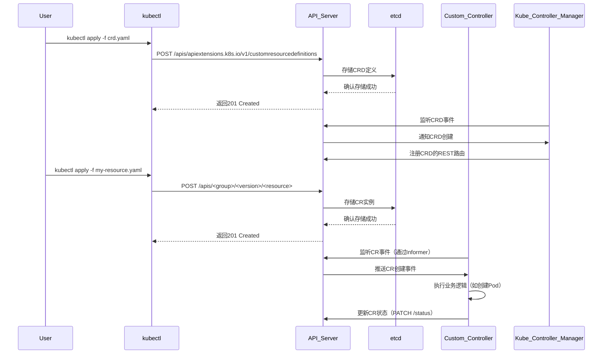
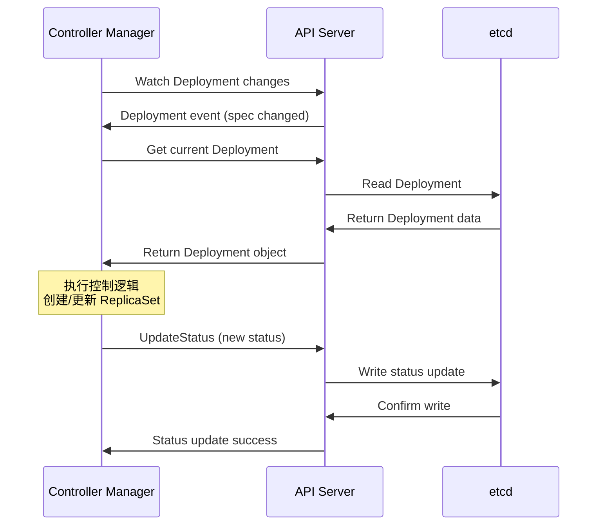

## K8s CRD实现

### 相关组件

1. API Server
集群的唯一入口，所有资源操作的网关
- 接收用户提交的CRD定义
- 验证CRD schema的合法性（字段、OpenAPI v3规范）
- 将CRD资源持久化到etcd
- 提供RESTful API供客户端操作自定义资源

2. etcd
分布式键值存储数据库，保存集群所有状态数据
- 持久化CRD的定义
- 存储用户创建的CR实例数据

3. Controller Manager
运行内置控制器的守护进程（如deployment控制器、namespace控制器）
- 监听CRD的创建/更新事件
- 动态注册CRD到API server的REST API路由
- 管理CRD的finalizers

4. 自定义控制器（custom controller）
开发者编写的程序，监听自定义资源（CR）的变化并执行业务逻辑，使用client-go+controller-runtime（Operator SDK/Kubebuilder基础框架）
- 通过Informer监听CR的增删改查事件（从API Server获取）
- 根据CR的Spec状态，调用业务逻辑
- 更新CR的Status字段，反映操作结果

5. kubectl
命令行工具，用于操作kubernetes资源
- 提交CRD yaml文件到API Server
- 创建/管理CR实例

- CRD定义组件
  - Custom Resource Definition
    - 定义自定义资源的结构和规范
    - 包含openapi schema验证
    - 设置资源的作用域、版本等
  - Code Generation
    - code-generator：生成客户端代码、informer、lister等
    - controller-gen：生成CRD YAML、RBAC等
    - deepcopy-gen：生成deepcopy方法
- 控制器框架
  - controller runtime
    - sigs.k8s.io/controller-runtime：高级控制器框架
    - 简化控制器开发，内置最佳实践
    - 提供manager、controller、reconciler抽象
  - kubebuilder
    - 基于controller runtime的脚手架
    - 快速生成项目结构和代码模板
    - 集成测试和部署配置
- 事件处理组件
  - workqueue
    - 处理事件的工作队列
    - 支持重试、限流、去重
    - 通常使用client-go提供的workqueue
  - event recorder
    - 记录k8s事件
    - 用于调试和状态跟踪

## CRD设计问题

### 为什么要选择使用Operator来管理Redis

> 对比Helm/静态配置的局限性（如故障自愈、配置热更新）

- 使用CRD可以让自定义的资源像K8s原生资源一样集成到K8s中，使用K8s的权限控制、生命周期管理、审计、自动恢复等
- 在operator中可以实现对自定义资源的自动部署、扩容、备份、恢复等复杂的操作，简化资源的部署和运维工作

### 什么场景下应该选择CRD而非API聚合，CRD的局限是什么

> CRD适合资源对象管理，API聚合适合非RESTful接口（如指标查询）
> CRD局限：依赖controller实现业务逻辑，无法处理非资源请求

- 选择CRD的场景：需要对资源进行CRUD和Controller reconcile操作，借助K8s核心机制实现对自定义资源的管理
- 选择聚合K8s API：需要实现非标准的API接口，实现一些自定义的业务逻辑

### CRD的字段怎么设计的

> CRD中如何定义分片数、副本数、资源请求
> 是否有扩展Validation Webhook确保spec.redisVersion符合要求

### 版本兼容问题

> 升级Redis版本的时候，Operator如何实现滚动升级并避免数据丢失

### 升级K8s API的时候，如何保证旧版本CR对象自动转换

> 实现Webhook Conversion或依赖kube-apiserver的storage version migrator
> 在CRD中定义多版本Schema并指定storageVersion

## 控制器逻辑实现

### 网络抖动导致重复调用Reconcile时，如何避免重复创建资源

> Reconcile循环的幂等性
> 所有操作基于Server-Side Apply（字段管理机制）
> 执行前检查资源状态（比如设置deployment.Status.ReadyReplicas为desired表示已经处理）

### 如何处理频繁触发Requeue（如Pod未就绪），如何避免无效协调

> Reconcile循环优化
> 指数退避重试+事件过滤（如仅关注Spec变更）

### .status更新失败导致状态与真实集群不一致，如何修复

> 实现状态重建：定期全量同步真实状态到.status
> 使用Generation机制：metadata.generation变化时触发强制同步

### 如何让用户通过kubectl get直观看到集群状态

> 更新.status.conditions的时机（如主从切换之后）

### 删除实例之后，Operator如何安全清理PV、ConfigMap等依赖资源

> Finalizer的机制
> 实现Reconcile中删除逻辑+清理完成后移除Finalizer

### 删除CR时，如何保证其创建的ConfigMap会被自动删除

> 垃圾回收依赖
> 设置OwnerReference

### Finalizer未移除导致CR对象卡在Terminating状态，如何定位

> 检查finalizer字段的值
> 分析controller日志中删除逻辑的报错

## K8s集成

### 如何生成Pod的StatefulSet模板，如何注入配置文件（比如redis.conf）

> pod模板控制
> 通过ConfigMap挂载配置，使用initContainers动态生成配置（如根据CR字段渲染模板）

### 如何让客户端访问到集群

> 服务发现机制
> Headless server+StatefulSet域名，自定义service实现读写分离

### Operator能否管理其他Namespace的资源，如何避免权限扩散

> 通过clusterRole授权，但限定namespaceSelector
> 在CR中指定目标Namespace（如spec.targetNamespace: prod）

### 如何为每个Redis实例分配持久化存储

> 存储设计
> 是否支持动态卷供应（StorageClass），如何配置本地卷（Local PV）优化性能

### 如何让Redis主节点优先调度到高SSD性能的节点

> 在statefulSet中定义nodeAffinity+自定义节点标签（如disk-type: ssd）
> 扩展调度器实现Binpacking算法

### Operator需要哪些权限，如何避免授予*.*

> RBAC最小权限实践

### 如何追溯是谁修改了CRD配置

> 审计日志追踪
> 启用K8s的审计日志
> 在CRD中标记敏感字段`spec.replicas: {x-kubernetes-audit: "true"}`

## 高可用与数据安全

### 当Redis节点宕机时，Operator如何触发故障转移

> 故障转移（Failover）实现
> 监听Pod的Unhealthy事件，调用Redis CLUSTER FAILOVER命令或通过sentinel切换
> 更新Endpoints指向新的主节点

### 如何实现定时备份Redis RDB文件到S3，恢复流程如何设计

> cronjob执行redis-cli --rdb+aws s3 cp
> 恢复时创建临时Pod挂载备份文件并加载

### 如何在不中断Redis服务的情况下升级Operator

> 金丝雀发布：新版本的Operator逐步接管部分CR对象
> 双写机制：旧版本Controller不退出，直到所有CR迁移完毕

### 修改配置之后，如何让运行中的Pod重新加载配置

## 生产环境运维

### 如何防止Redis内存溢出导致节点崩溃

> 资源限制与QoS
> 使用Resource limit和request

### 如何暴露Redis指标给Prometheus

> Sidecar容器部署redis-operator
> 自动创建ServiceMonitor CR（Prometheus Operator）

### 如何监控Reconcile延迟和错误率

> 集成Prometheus Client Go
> 在/metrics端点暴露数据

### 一次kubectl apply触发多个Operator协调，如何串联全链路日志

> 注入Opentelementry TraceID到CR的Annotation
> 日志库集成Jaeger上报

### 如何保护Redis密码，Operator如何将密码注入Pod

> 通过Secret存储密码
> 环境变量注入：valueFrom.secretKeyRef
> 启用Redis ACL

## 调试与故障排查

### 如何快速定位Reconcile失败的原因

> 结构化日志（如zap库）
> 查看错误日志

### 用户创建CR之后一直处于pending，如何排查

> 自定义资源事件追踪
> kubectl describe rediscluster name  # 查看 Status.Conditions
> kubectl get events --field-selector involvedObject.kind=RedisCluster

## 高级扩展能力

### 如何通过Admission Webhook拦截CR创建请求并验证资源的合法性

> webhook集成
> 比如拒绝replicas < 3不满足高可用，强制replica为奇数，为未填写的字段设置默认值
> 在controller的reconcile中通过Mutating Webhook注入默认值

### Operator能否同时管理多个集群中的Redis，架构如何设计

> 多集群联邦管理
> Hub-Spoke模型：中心集群部署Operator，通过CLuster API管理子集群
> GitOps驱动：子集群的CR状态同步到Git仓库

### 如何支持Redis数据存储在AWS S3/Minio/NFS

> 定义抽象接口StorageProvider
> 实现S3Storage、NFSStorage注册到Controller

## 底层原理

### Operator如何高效监听RedisCluster和Pod的状态变化

> Informers与缓存机制
> 使用Informer建立本地缓存——Workqueue去重事件
> 减少对API server的直接查询

### 多副本的Operator如何避免协调冲突

> Leader Election机制
> 基于ConfigMap或Lease资源实现选主
> 只有Leader执行Reconcile

### Controller重启期间发生Pod删除事件，如何保证数据不丢失

> Informers缓存一致性
> Informer基于ResourceVersion增量同步，通过List+Watch重建缓存

### 当集群有5000+CR对象时，如何优化Operator，如何降低API server的负载

> 大规模集群设计
> informer调优，设置LimitPager分页List
> 事件过滤，使用FieldSelector缩写监听范围
> 批量处理，合并相同资源事件

> Client-Go性能优化
> 调优Informer的ResyncPeriod（设为0禁用定时全量同步）
> 使用Field Selector减少不必要的监听

### Controller如何通过Informer保证本地缓存与集群状态一致，遇到网络分区时会发生什么

> Informer机制的理解（List-watch原理和缓存一致性）
> 对分布式系统故障场景的处理能力（网络分区、状态漂移）
> 为什么watch需要依赖ResourceVersion，不用会怎样
> 重新lits全量数据时，如何避免业务逻辑被错误触发
> 如果网络分区期间发生了1000次事件，重连后Informer如何快速同步

### Reconcile循环如何避免资源冲突

> 乐观锁、冲突解决

### sharedInformer如何减少API server的压力

> 缓存复用、List-Watch优化

### etcd存储CRD数据的结构是什么

> 数据格式、序列化

### 如何验证CRD字段的合法性

> OpenAPI schema、Webhook

### Operator如何应对API server不可用

> Informer自动退避重连（指数退避算法）
> 本地缓存允许只读操作

### 为什么需要设置--max-concurrent-reconciles

> 并发控制
> 避免单个资源协调阻塞整体
> 默认值通常为CPU核心数

### 如何实现Operator的版本热升级

> 零宕机升级
> Leader Election：旧版本释放Leader后新版本接管
> 双活窗口期：新旧版本同时运行直至旧版本无协调中资源

### StatefulSet如何保证Pod网络标识稳定

> Headless service
> 通过PodIdentify机制保留主机名

### 跨节点Pod如何访问Local PV

> 定义StorageClass延迟绑定：`volumeBindingMode: WaitForFirstConsumer`
> 调度器确保Pod运行在PV所在节点

### 如何防止ServiceAccount token泄漏

> 为Operator创建专用的Service Account
> 启用BoundServiceAccountTokenVolume（卷挂载令牌自动轮转）

### Admission Webhook超时导致集群卡顿怎么办

> 调整failurePolicy: Ignore避免阻塞API
> 优化Webhook响应时间（如缓存校验结果）

---

- 准备具体场景的解决思路（某次redis节点的故障恢复）
- 深入理解kubebuilder框架原理（如controller runtime的reconcile原理）
- 强调生产经验（如性能调优、安全审计、灾备方案）
- 如果重新设计这个Operator会改进哪些方面（分层设计、增强可观测性、支持插件化后端存储）