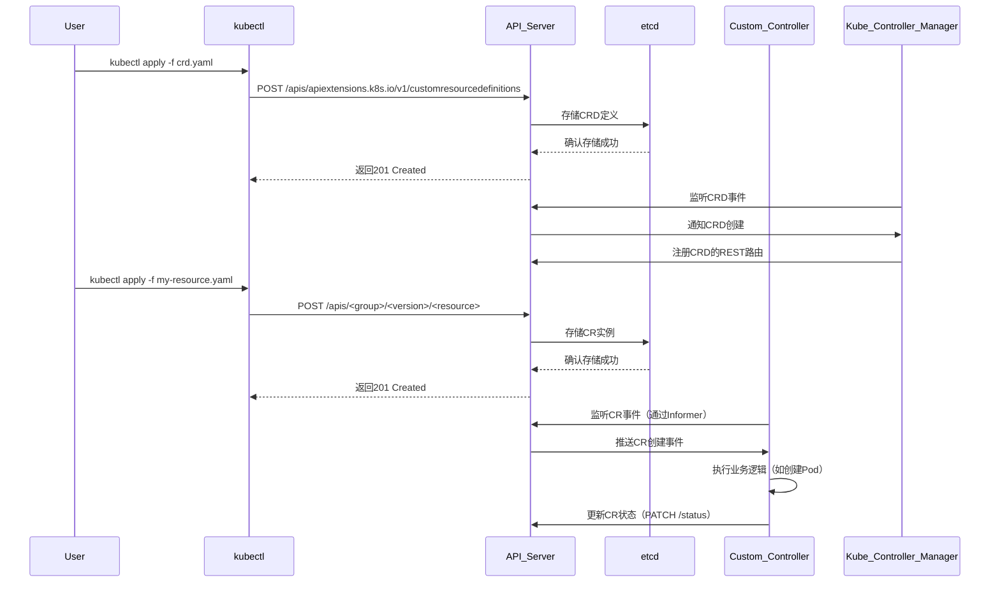
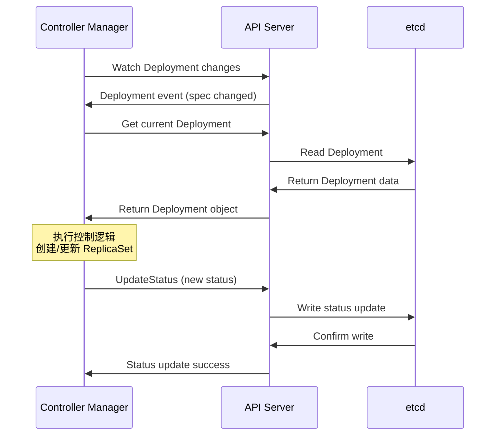

## K8s CRD实现

### 相关组件

1. API Server
集群的唯一入口，所有资源操作的网关
- 接收用户提交的CRD定义
- 验证CRD schema的合法性（字段、OpenAPI v3规范）
- 将CRD资源持久化到etcd
- 提供RESTful API供客户端操作自定义资源

2. etcd
分布式键值存储数据库，保存集群所有状态数据
- 持久化CRD的定义
- 存储用户创建的CR实例数据

3. Controller Manager
运行内置控制器的守护进程（如deployment控制器、namespace控制器）
- 监听CRD的创建/更新事件
- 动态注册CRD到API server的REST API路由
- 管理CRD的finalizers

4. 自定义控制器（custom controller）
开发者编写的程序，监听自定义资源（CR）的变化并执行业务逻辑，使用client-go+controller-runtime（Operator SDK/Kubebuilder基础框架）
- 通过Informer监听CR的增删改查事件（从API Server获取）
- 根据CR的Spec状态，调用业务逻辑
- 更新CR的Status字段，反映操作结果

5. kubectl
命令行工具，用于操作kubernetes资源
- 提交CRD yaml文件到API Server
- 创建/管理CR实例

- CRD定义组件
  - Custom Resource Definition
    - 定义自定义资源的结构和规范
    - 包含openapi schema验证
    - 设置资源的作用域、版本等
  - Code Generation
    - code-generator：生成客户端代码、informer、lister等
    - controller-gen：生成CRD YAML、RBAC等
    - deepcopy-gen：生成deepcopy方法
- 控制器框架
  - controller runtime
    - sigs.k8s.io/controller-runtime：高级控制器框架
    - 简化控制器开发，内置最佳实践
    - 提供manager、controller、reconciler抽象
  - kubebuilder
    - 基于controller runtime的脚手架
    - 快速生成项目结构和代码模板
    - 集成测试和部署配置
- 事件处理组件
  - workqueue
    - 处理事件的工作队列
    - 支持重试、限流、去重
    - 通常使用client-go提供的workqueue
  - event recorder
    - 记录k8s事件
    - 用于调试和状态跟踪

## CRD设计问题

### 为什么要选择使用Operator来管理Redis

> 对比Helm/静态配置的局限性（如故障自愈、配置热更新）

### CRD的字段怎么设计的

> CRD中如何定义分片数、副本数、资源请求
> 是否有扩展Validation Webhook确保spec.redisVersion符合要求

### 版本兼容问题

> 升级Redis版本的时候，Operator如何实现滚动升级并避免数据丢失

## 控制器逻辑实现

### 如何处理频繁触发Requeue（如Pod未就绪），如何避免无效协调

> Reconcile循环优化
> 指数退避重试+事件过滤（如仅关注Spec变更）

### 如何让用户通过kubectl get直观看到集群状态

> 更新.status.conditions的时机（如主从切换之后）

### 删除实例之后，Operator如何安全清理PV、ConfigMap等依赖资源

> Finalizer的机制
> 实现Reconcile中删除逻辑+清理完成后移除Finalizer

## K8s集成

### 如何生成Pod的StatefulSet模板，如何注入配置文件（比如redis.conf）

> pod模板控制
> 通过ConfigMap挂载配置，使用initContainers动态生成配置（如根据CR字段渲染模板）

### 如何让客户端访问到集群

> 服务发现机制
> Headless server+StatefulSet域名，自定义service实现读写分离

### 如何为每个Redis实例分配持久化存储

> 存储设计
> 是否支持动态卷供应（StorageClass），如何配置本地卷（Local PV）优化性能

## 高可用与数据安全

### 当Redis节点宕机时，Operator如何触发故障转移

> 故障转移（Failover）实现
> 监听Pod的Unhealthy事件，调用Redis CLUSTER FAILOVER命令或通过sentinel切换
> 更新Endpoints指向新的主节点

如何实现定时备份Redis RDB文件到S3，恢复流程如何设计

> cronjob执行redis-cli --rdb+aws s3 cp
> 恢复时创建临时Pod挂载备份文件并加载

## 生产环境运维

### 如何防止Redis内存溢出导致节点崩溃

> 资源限制与QoS
> 使用Resource limit和request

### 如何暴露Redis指标给Prometheus

> Sidecar容器部署redis-operator
> 自动创建ServiceMonitor CR（Prometheus Operator）

### 如何保护Redis密码，Operator如何将密码注入Pod

> 通过Secret存储密码
> 环境变量注入：valueFrom.secretKeyRef
> 启用Redis ACL

## 调试与故障排查

### 如何快速定位Reconcile失败的原因

> 结构化日志（如zap库）
> 查看错误日志

### 用户创建CR之后一直处于pending，如何排查

> 自定义资源事件追踪
> kubectl describe rediscluster name  # 查看 Status.Conditions
> kubectl get events --field-selector involvedObject.kind=RedisCluster

## 高级扩展能力

### 如何通过Admission Webhook拦截CR创建请求并验证资源的合法性

> webhook集成
> 比如拒绝replicas < 3不满足高可用

### Operator能否同时管理多个集群中的Redis，架构如何设计

> 实现Cluster API兼容的控制平面
> 每个集群部署Operator Agent

## 底层原理

### Operator如何高效监听RedisCluster和Pod的状态变化

> Informers与缓存机制
> 使用Informer建立本地缓存——Workqueue去重事件
> 减少对API server的直接查询

### 多副本的Operator如何避免协调冲突

> Leader Election机制
> 基于ConfigMap或Lease资源实现选主
> 只有Leader执行Reconcile

---

- 准备具体场景的解决思路（某次redis节点的故障恢复）
- 深入理解kubebuilder框架原理（如controller runtime的reconcile原理）
- 强调生产经验（如性能调优、安全审计、灾备方案）
- 如果重新设计这个Operator会改进哪些方面（分层设计、增强可观测性、支持插件化后端存储）