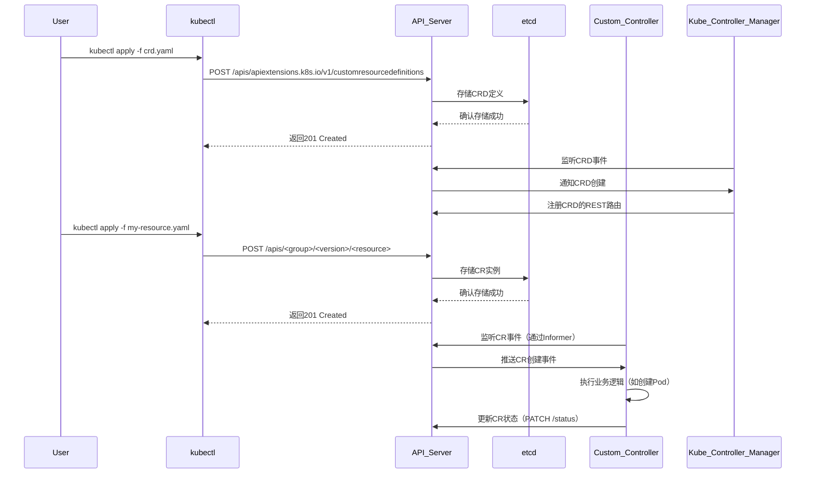
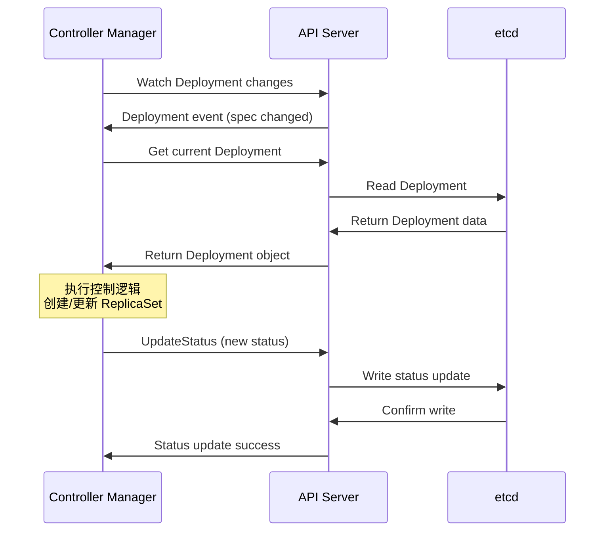

## K8s CRD实现

1. API Server
集群的唯一入口，所有资源操作的网关
- 接收用户提交的CRD定义
- 验证CRD schema的合法性（字段、OpenAPI v3规范）
- 将CRD资源持久化到etcd
- 提供RESTful API供客户端操作自定义资源

2. etcd
分布式键值存储数据库，保存集群所有状态数据
- 持久化CRD的定义
- 存储用户创建的CR实例数据

3. Controller Manager
运行内置控制器的守护进程（如deployment控制器、namespace控制器）
- 监听CRD的创建/更新事件
- 动态注册CRD到API server的REST API路由
- 管理CRD的finalizers

4. 自定义控制器（custom controller）
开发者编写的程序，监听自定义资源（CR）的变化并执行业务逻辑，使用client-go+controller-runtime（Operator SDK/Kubebuilder基础框架）
- 通过Informer监听CR的增删改查事件（从API Server获取）
- 根据CR的Spec状态，调用业务逻辑
- 更新CR的Status字段，反映操作结果

5. kubectl
命令行工具，用于操作kubernetes资源
- 提交CRD yaml文件到API Server
- 创建/管理CR实例

## K8s面试题

### apiserver的作用是什么

apiserver是k8s的核心组件，是唯一直接与etcd直接交互的组件，主要作用是负责接收k8s的请求、鉴权、存储和通知变更信息：
- 统一入口：所有的组件（kubectl、controller、scheduler、kubelet、operator）都是通过apiserver来读写资源对象，apiserver是k8s的REST API服务器
- 鉴权与认证：对接入的请求进行认证、授权、准入控制
- 数据库存储代理：apiserver不直接存储数据，而是作为代理把对象存入etcd，并实现对etcd的封装
- watch通知：对外提供资源变化的watch流，供controller、client-go、kubectl watch等订阅，通知变更事件
- 数据校验和默认值填充：在资源创建时会自动补全默认值和进行字段合法性校验

### apiserver如何保证与其他组件的消息的及时同步

一般来说实现消息同步有两种方式：1.客户端轮询获取最新的状态，2.apiserver通知客户端
list-watch机制可以较低apiserver的请求压力，其本质就是客户端监听k8s资源的变化并执行相应的处理逻辑（生产者消费者），并且需要满足：
- 实时性：当资源变更，相关的组件要尽快感知
- 消息的顺序性：消息要按照先后发生的顺序被发送
- 保证信息不丢失或者可靠的重新获取机制

list-watch机制是k8s中各个组件从apiserver获取资源状态并持续监听变化的标准模式，其中list是通过apiserver获取全部资源，watch是基于list返回结果中资源的resourceVersion请求apiserver并启动持续监听（基于http长连接）

informer是client-go的一个组件，实现了对list-watch的封装用于自动管理资源的监听、缓存和事件分发：
- 初始化阶段：使用list获取所有资源并填充缓存
- 持续监听：通过watch监听后续变化
- 缓存更新：将watch到的事件同步到本地缓存
- 事件分发：触发注册的事件处理方法

### client-go是什么

client-go是k8s官方提供的go语言SDK，用于与k8s apiserver通信的客户端库，是开发k8s应用的标准工具包

client-go提供了完整的k8s交互能力：
- clientset：访问所有k8s资源的客户端集合
- informer：监听资源变化的高级封装
- workqueue：处理事件的工作队列
- restclient：底层http客户端
- discovery client：发现api资源信息

### 实现一个CRD Operator需要用到哪些组件

- CRD定义组件
  - Custom Resource Definition
    - 定义自定义资源的结构和规范
    - 包含openapi schema验证
    - 设置资源的作用域、版本等
  - Code Generation
    - code-generator：生成客户端代码、informer、lister等
    - controller-gen：生成CRD YAML、RBAC等
    - deepcopy-gen：生成deepcopy方法
- 控制器框架
  - controller runtime
    - sigs.k8s.io/controller-runtime：高级控制器框架
    - 简化控制器开发，内置最佳实践
    - 提供manager、controller、reconciler抽象
  - kubebuilder
    - 基于controller runtime的脚手架
    - 快速生成项目结构和代码模板
    - 集成测试和部署配置
- 事件处理组件
  - workqueue
    - 处理事件的工作队列
    - 支持重试、限流、去重
    - 通常使用client-go提供的workqueue
  - event recorder
    - 记录k8s事件
    - 用于调试和状态跟踪

### Pod的创建过程

K8s的pod是最小的调度单元，其中通常运行一个或者多个容器
Pod的创建过程：
1. 用户提交请求（kubectl或者api），请求包含pod中容器的镜像、资源限制、环境变量、存储卷、端口等pod配置
2. apiserver接收到用户的请求后，先进行权限鉴定确保用户有权限创建pod，然后验证配置的正确性并补全默认的配置，最后将pod配置保存到etcd中，状态为pending
3. scheduler通过list-watch监控到未调度的pod（spec.nodeName为空），然后根据调度算法选择合适的node来运行pod,更新spec.nodeName后将pod信息写回apiserver，主要考虑的因素有：
   - 请求资源：pod请求的CPU和memory
   - node资源：node当前的负载和可用资源
   - 亲和性/反亲和性：pod对节点的亲和性和反亲和性规则
   - 污点和容忍度：node是否有污点以及pod能否容忍污点
4. kubelet启动容器：
   - 调度到指定node上后，node上的kubelet通过watch机制监听到分配的pod，从apiserver获取pod配置
   - kubelet调用CNI插件（如calico）为pod分配IP地址并配置网络，根据pod定义来挂载所需的存储卷，创建Pause容器实现pod内网络和存储的共享
   - 拉取容器镜像并启动容器（如果有init容器先启动init容器）
5. 健康检查：通过就绪性探针（readiness probe）检查容器是否准备好接收流量，通过存活性探针（liveness probe）监控容器健康状态，根据探针结果更新pod状态
6. 状态更新：整个过程kubelet持续向apiserver汇报pod状态：
  - pending：pod已经调度但是尚未创建
  - containerCreating：正在拉取镜像和创建容器
  - running：所有容器都已成功启动
  - ready：pod通过了就绪性检查，可以接收流量
7. 服务发现和负载均衡：
   - kubeproxy更新iptables或IPVS规则
   - DNS记录会被更新以包含新的pod ip
   - pod成为server负载均衡的后端endpoint

如果是创建deployment来创建pod，因为deplyment是更高级的抽象，因此会有些不同：
- 单个pod创建没有controller参与，创建deploment时deployment controller会参与调度
- 创建deployment会间接创建replicaset，然后replicaset再创建pod，所以与apiserver的交互次数增多

### Pod的销毁过程

1. 用户通过kubectl或者api发起删除请求
2. apiserver接收到删除请求，验证用户权限和请求合法性，将etcd中pod对象标记为删除状态，设置deletionTimestamp字段，如果pod有finalizers，会等待这些finalizers被清理
3. kubelet监听到删除删除事件，向pod中每个容器发送sigterm信号，开始计算优雅终止时间（默认30s）
4. 容器中的应用程序捕获sigterm信号并开始优雅关闭，完成正在处理的请求，关闭数据库连接、文件句柄等资源，清理临时文件和缓存
5. kubeproxy更新iptables规则，将pod从service的endpoint中移除，新的流量不再路由到该pod
6. 如果优雅终止容器没有自主退出，kubelet发送sigkill信号强制终止容器进程
7. CRI（如containerd）清理容器资源，删除容器系统文件，释放网络资源
8. kubelet卸载pod的存储卷，清理网络配置（如ip地址分配）
9. kubelet向apiserver报告pod已终止，apiserver从etcd删除pod对象记录

### 哪些情况pod删除会被卡住

1. 如果finalizers无法被清理会导致pod无法被删除，比如operator添加了finalizers但是没有正确清理掉
2. PVC卸载失败，比如存储端异常导致PVC无法正常卸载或者存储卷被其他进程占用
3. 应用无法响应sigterm信号，比如忽略了信号，进入死循环或死锁状态，或正在等待外部资源，或是僵尸进程
4. 网络相关问题（CNI插件异常）或者节点问题（kubelet停止运行）

### etcd如何保证数据一致性

k8s的etcd是一个分布式键值存储系统，用于存储整个集群的状态数据，比如节点信息、pod定义、configmap等

Raft是一个用于构建分布式一致性系统的共识算法，目标是在一组节点中保证状态的一致性，及时部分节点宕机或者通信失败，其核心是：
- 领导者选举
- 日志复制
- 日志一致性和故障恢复
Raft中每个节点都处于三种角色之一：Leader、Follower、Candidate，每个etcd节点启动的时候是Follower，超时未收到Leader的心跳（AppendEntries）就会：
- 将自己变为Candidate
- 发起RequestVote请求给其他节点
- 如果获得了多数节点的投票，就成为新的Leader
投票规则是每个任期（term）内，每个节点只能投票一次，并且倾向于投票给日志更完整的节点（term高，index高，日志结构为<term, index. command>）
当Leader被选举出来，客户端的写请求处理流程为：
- Leader将命令追加到自己的日志末尾（uncommitted）
- 通过AppendEntries发送给Follower（心跳携带日志）
- 一旦超过半数的Follower确认日志写入，Leader将提交该日志
- 提交完成Leader再通知Follower

通过Raft算法保证强一致性：
- 多数仲裁（Quorum）机制：任意时刻只要超过半数节点一致，就能保证系统继续运行，即使部分节点宕机，只要多数节点存活，就可以保证一致性
- 写入流程：通过apiserver将写入请求发送到Leader，Leader将操作日志（每次对系统状态变更的操作日志）复制到Followers，当多数Followers确认日志写入，数据才会被Leader提交到key-calue存储并向apiserver返回成功
- 读操作的一致性：默认是从Leader读取，保证强一致性，也可以配置为从Follower读（性能高但是可能不是最新的数据，弱一致性）

### 脑裂是什么

脑裂是指在一个分布式系统中，由于网络分区等原因，集群被分裂成了多个互相无法通信的子集，每个子集都认为自己是唯一的主节点或者主集群，导致数据不一致

Raft协议中规定只有得到半数以上的投票才能成为Leader，当集群被分区，不会出现多个Leader，并且总有一个分区有半数以上的节点（奇数个总节点数），可以选举出Leader

当etcd出现脑裂无法选举出Leader时，etcd集群不可写入数据，从而避免数据不一致，但是可以提供读服务（弱一致性），只有选举出Leader后才能正常提供写服务，当etcd集群恢复后，Followers会自动同步Leader的日志同步

### 复制到Followers的日志有什么作用

- 保证数据一致性
  - Raft协议中，系统状态不是直接同步的，而是通过复制日志来同步的，如果日志不同步，状态也一定不同
  - 所有的状态变更必须先写到日志中，才能被提交和应用
- 容错恢复
  - Leader和Followers有一致的日志副本，当Leader宕机或崩溃，Follower可以快速替换成新的Leader
  - 新的Leader会和落后的Followers对比日志的索引和term，发现冲突就回滚，到一致为止（日志重写）
- 投票选举
  - Raft中日志越完整的节点越有可能成为Leader
  - 选举过程中，每个节点都会告诉其他节点自己最新的日志位置（term和index），每个节点都只会投票给不落后于自己的节点，来保证日志不后退
- 实现线性一致性
  - 日志是有序的操作序列，可以保证所有节点在相同顺序下应用相同的操作，可以得到相同的状态
